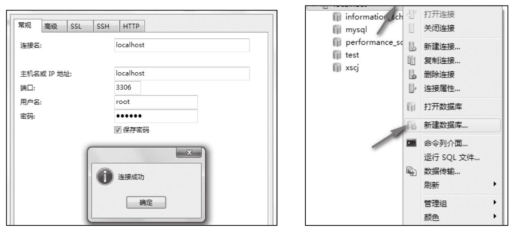
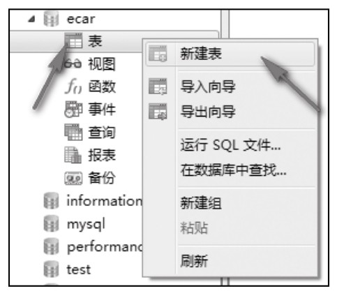
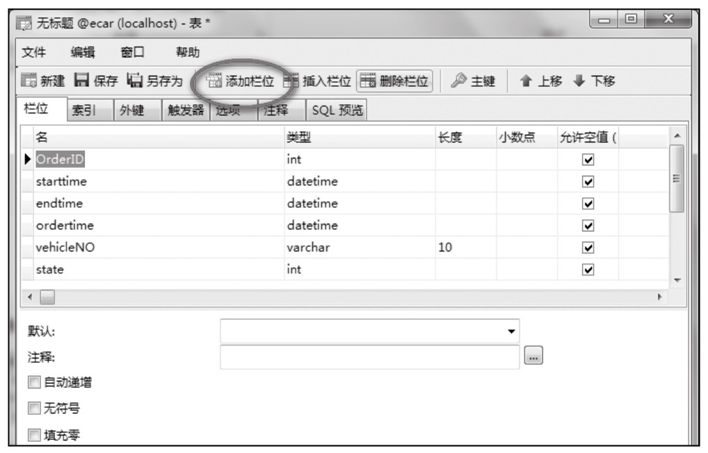
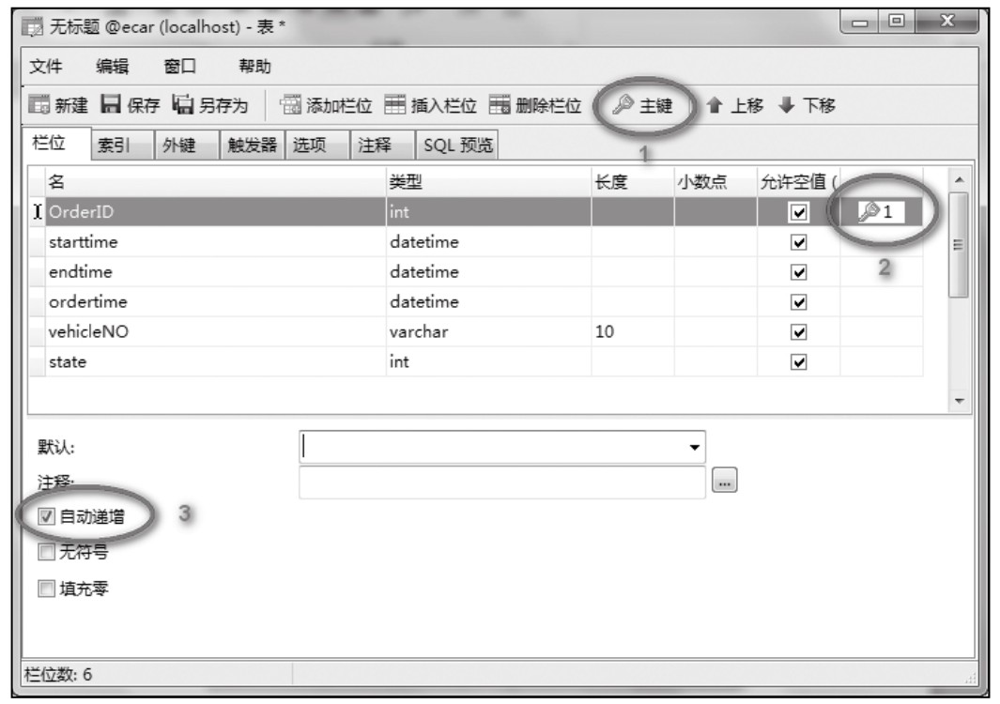
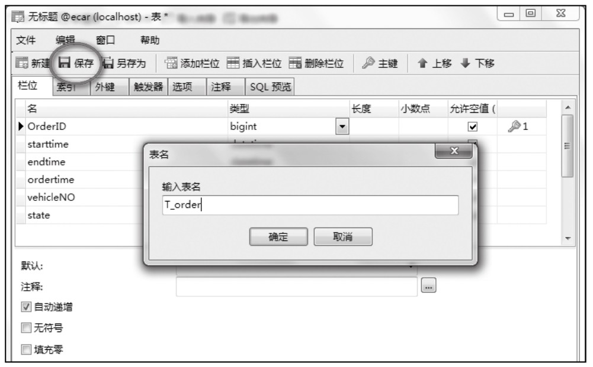
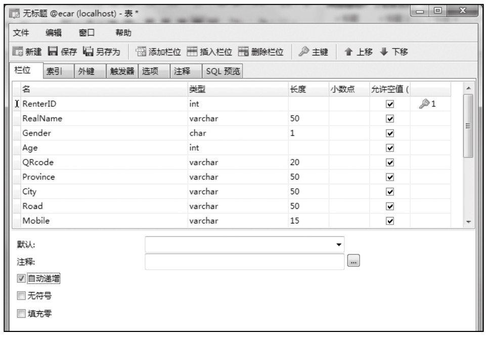
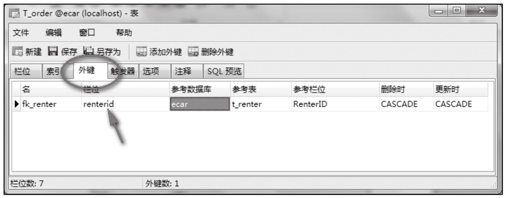

### 
  19.3 分时租用平台的MySQL数据库实现

 本节视频教学录像：7分钟

本节主要讲解如何把设计的结果通过MySQL来实现。这里通过Navicat来完成数据库的创建。打开Navicat，并连接到指定的MySQL服务器上，本例直接连接到本地MySQL服务器上，如左下图所示。

登录成功后，鼠标右键单击左侧“连接树”窗口中的“localhost”，在弹出的菜单中选择“新建数据库菜单”，如右下图所示。弹出的新建数据库对话框，在“数据库名”中输入“ecar”，在“字符集”中输入“utf8 -- UTF-8 Unicode”，“排序规则”默认即可。

经过上面的步骤，就建立“ecar”数据库，接下来完成相应的表和其他数据库对象的建设。

鼠标左键双击ecar数据库，右键单击“表”对象，选择“新建表”菜单，如下图所示。

按照设计的订单表结构，单击“添加栏位”快捷按钮，依次添加表字段，并选择相应的字段类型，如下图所示。

鼠标选中“OrderID”栏位，并设置该栏位为主键，下图中的1，设置成功后会显示下图中的2；用鼠标勾选下图3的“自动递增”复选框，将OrderID字段设置成自动增长类型的。

提示 
 只有当OrderID字段的数据类型设置为整型类型才可以设置自动递增。

单击“保存”，并输入表名称“T_order”，如下图所示。

按照同样的方法参照租用者表结构建立表T_renter，如下图所示。

由于租用者和订单之间存在1∶n的关系，因此需建立两个表之间的参照关系，右键单击“订单表”，即T_order表。选择“设计表”，弹出修改表结构窗口，该窗口和设计表结构窗口类似。

首先应该增加一个字段renterid作为外键，单击“外键”选项卡，如下图所示，并输入外键名称“fk_renter”,栏位选择“renterid”，参考数据库选择“ecar”，参考表选择“t_render”，参考栏位“RenterID”，删除时选择“CASCADE”(表示级联删除)，更新时选择“CASCADE”(表示级联更新)。

技巧 
 新增的字段“renterid”必须和表“T_renter”中的“renterid”类型保持一致。按照同样的方法将设计的表建完即可。

