#### 
  1.2.2 在Windows系统环境下的安装

1.下载

首先从MySQL官网（http://www.mysql.com/downloads/mysql/）下载安装程序，本例中使用的是64位Windows版本（mysql-installer-community-V5.6.21.1.msi）。消费者根据实际情况下载合适的版本。

2.安装

⑴双击运行“mysql-installer-community-V5.6.21.1.msi”，MySQL安装向导启动。

⑵接受许可，并单击“Next”，进入安装类型选择页面。

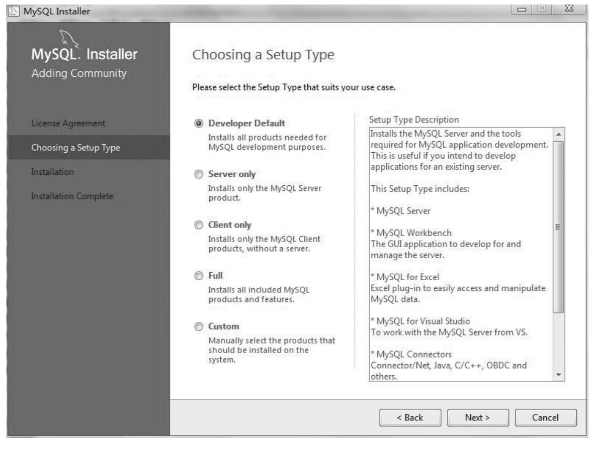
⑶选择安装类型，安装类型共有5种，各项含义为：“Developer Default”是默认安装类型；“Server only”是仅作为服务器；“Client only”是仅作为客户端；“Full”是完全安装；“Custom”是自定义安装类型。我们选择“Custom”。

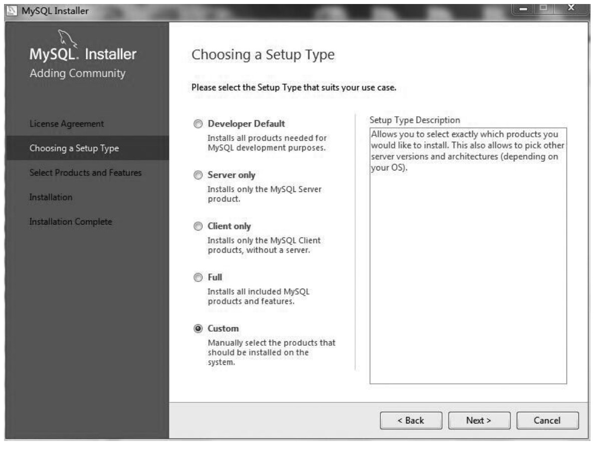
⑷选择安装组件，选中左侧列表显示的是可用的全部组件，右侧列表显示的是被选中将要安装的组件，可以通过向左或向右的箭头添加或删除需要安装的组件。作为初学者可能并不知道将来会用到哪些组件，可以按下图所示，选择安装所有组件。

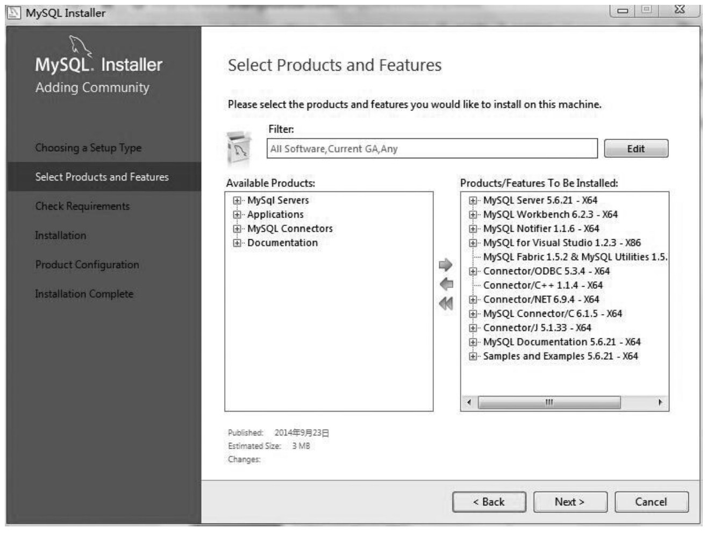
⑸安装条件检查，选择好自己需要的组件，单击“Next”进入安装条件检查页面。根据选择的安装类型，会需要安装一些框架（Framework）。

选择需要安装的框架，单击“Execute”进入到框架安装页面，如下图所示。

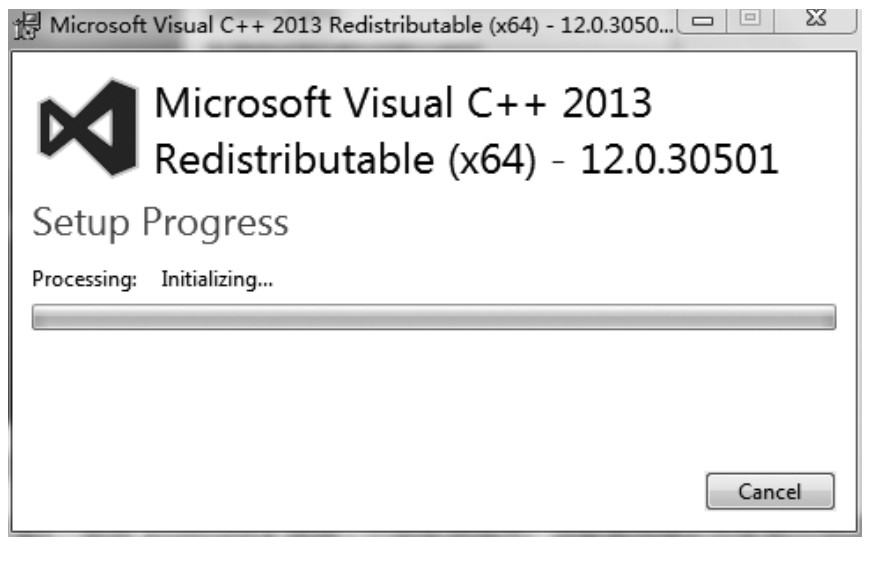
⑹框架安装完成后，单击“Next”进入安装页面。

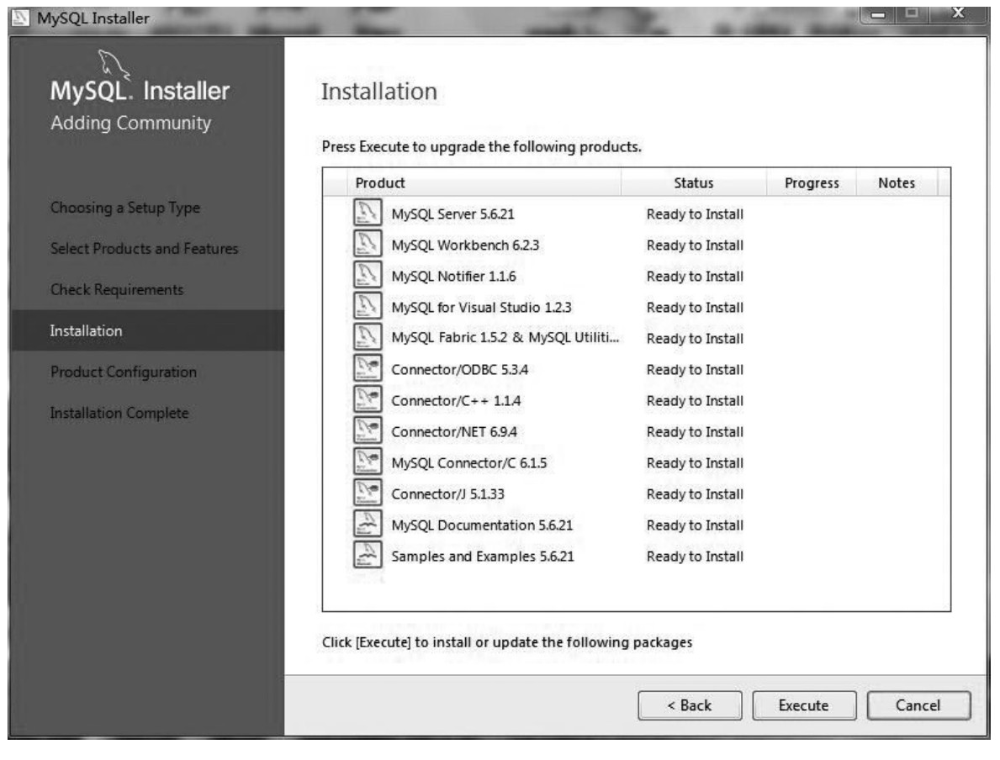
⑺开始安装，单击“Execute”，安装完成如下图所示。

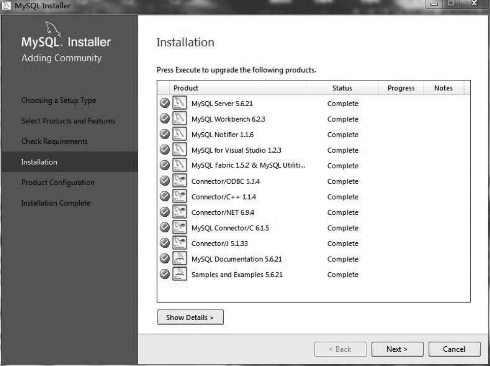
⑻确认配置信息，单击“Next”。

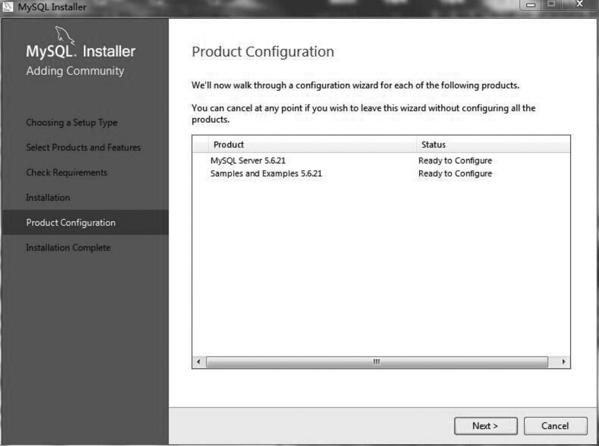
⑼进行服务器配置型选择。“Developer Machine” 选项代表典型个人桌面工作站，在3种类型中，占用最少的内存；“Server Machine”选项代表服务器，MySQL服务器可以同其他应用程序一起运行，例如FTP、E-mail和Web服务器，将MySQL服务器配置成使用适当比例的系统资源，占用内存在3种类型中居中；“ Dedicated MySQL Server Machine” 选项代表只运行MySQL服务的服务器，假定没有运行其他应用程序，将MySQL服务器配置成占用机器全部有效的内存。作为初学者，选择“Developer Machine”（开发者机器）已经足够了，这样占用系统的资源不会很多，默认端口3306也可不做修改，若需修改可以直接在此处修改，但要保证修改的端口号没有被占用，设置完成后，单击“Next”。

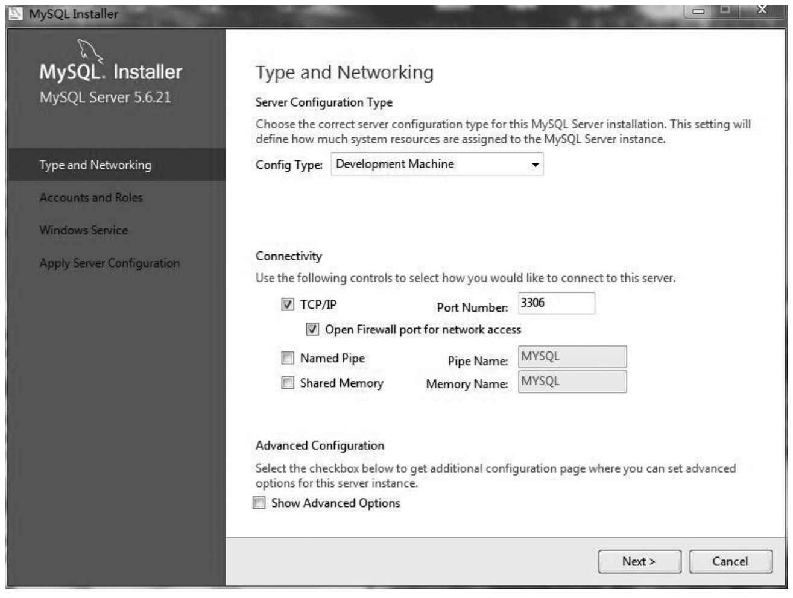
⑽设置管理员密码。如下图所示，选择“Add User”，同时可以创建用户，这里出于对安全性考虑，不添加新用户。

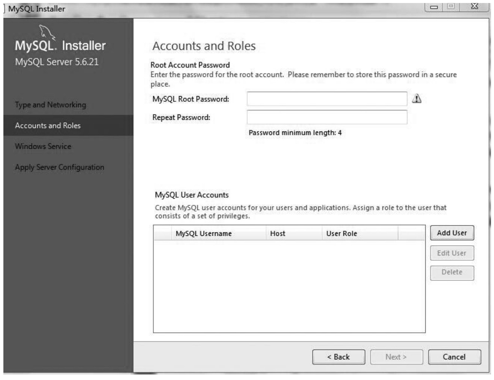
⑾设置系统服务器名称。可以根据自己的需要进行名称设置，这里选择使用默认名称。另外，可以选择是否在系统启动的同时自动启动MySQL数据库服务器，这里按默认设置，单击“Next”。

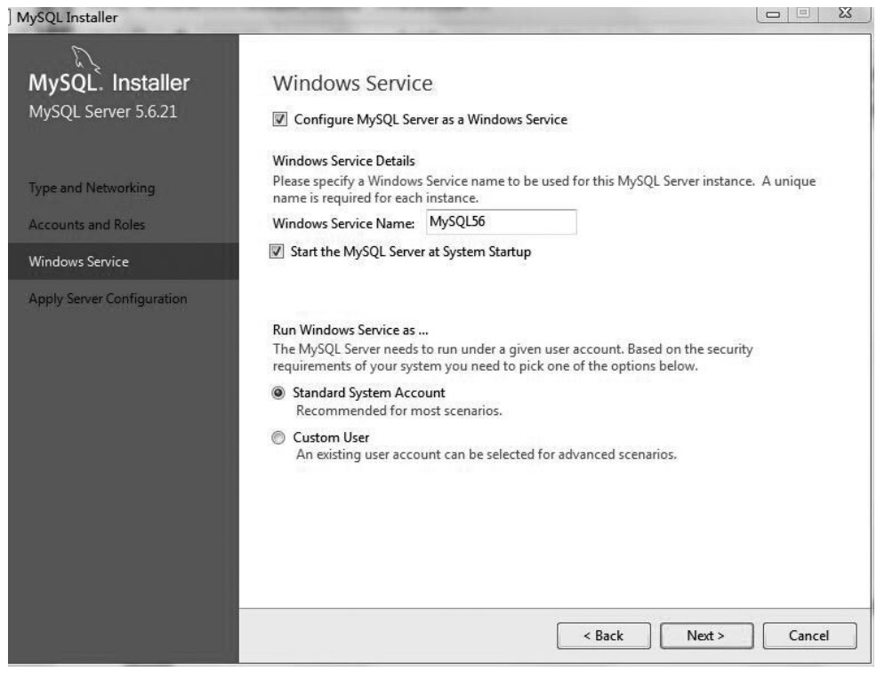
⑿申请服务器配置，执行对服务器配置信息的更改，单击“Execute”。

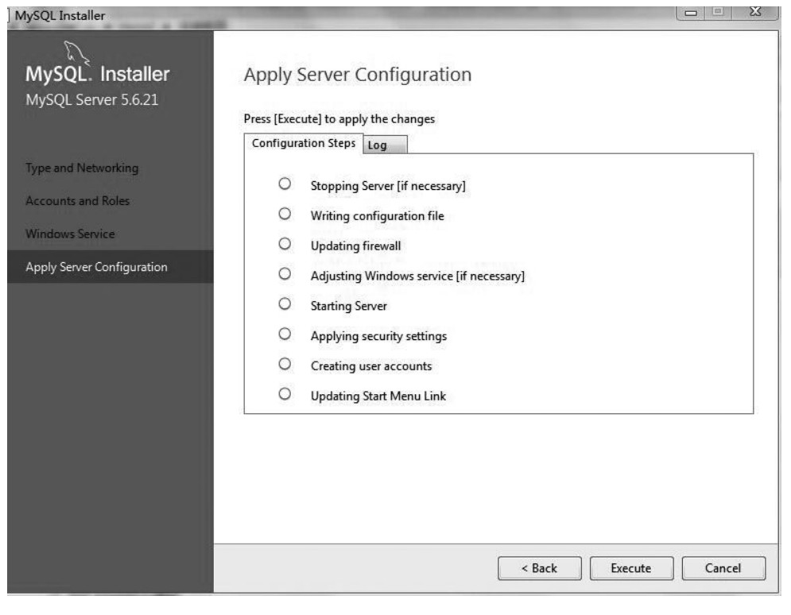
完成之后界面如下图所示。

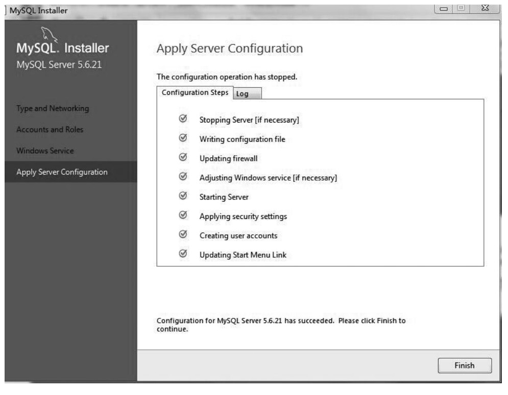
⒀安装完成，勾选中“Start MySQL Workbench after Setup”，可对是否成功安装进行测试，单击“Finish”。

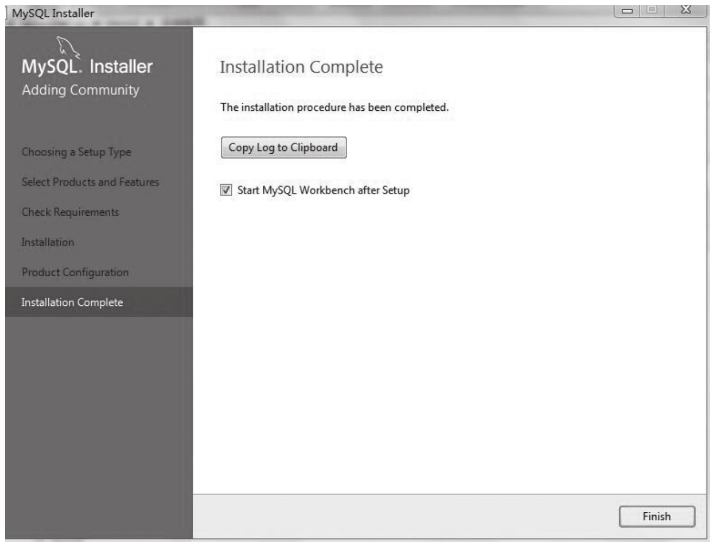
