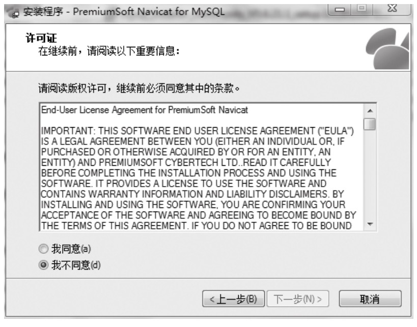
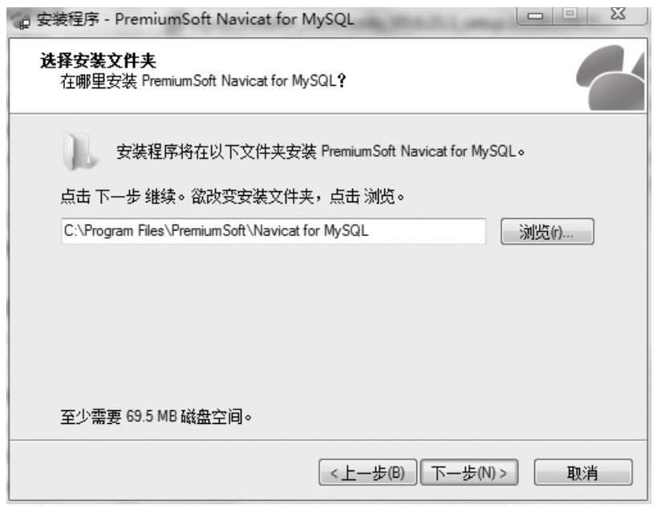
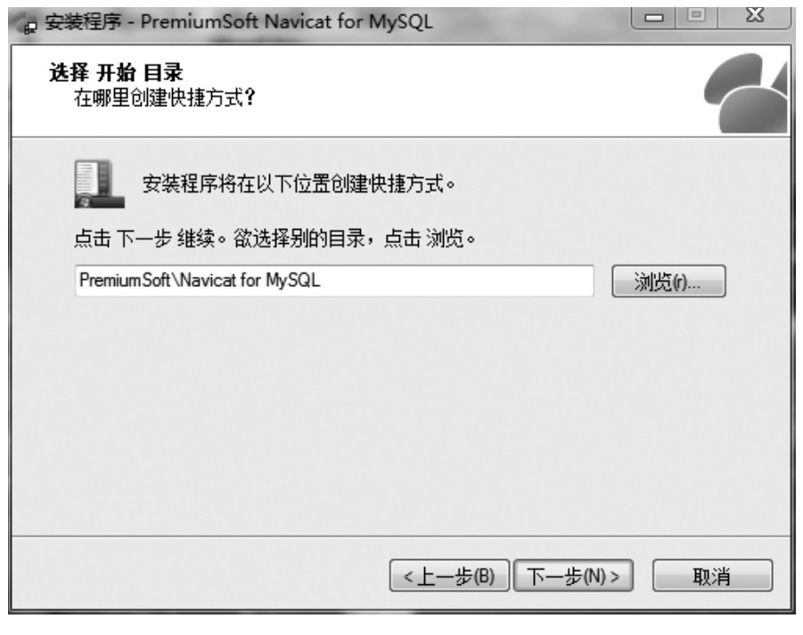
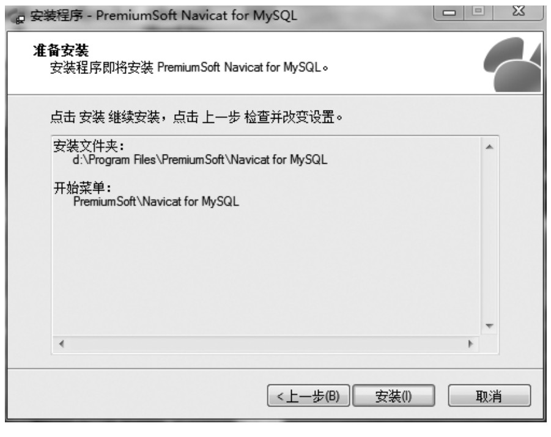
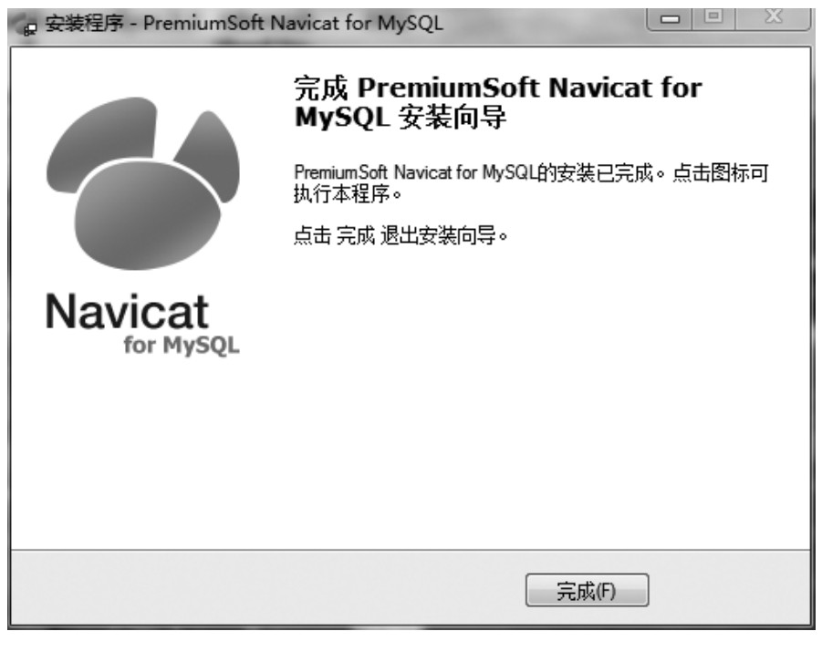
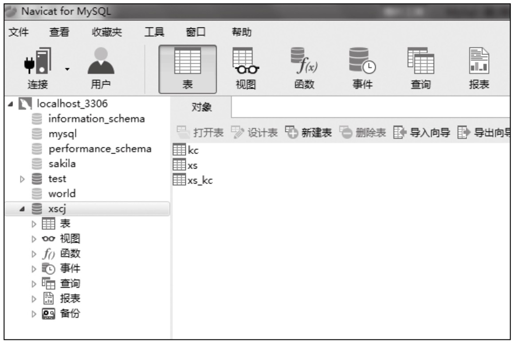

#### 
  1.3.3 在Windows系统环境下的安装

本节选用的Navicat for MySQL版本为navicat111_mysql_cs_x64.exe，官方下载地址：http://www.navicat.com.cn/download/navicat-for-mysql。Windows 7环境下安装比较简单，过程如下。

⑴双击安装程序，单击“下一步”。

许可协议选择“我同意”，单击“下一步”。

⑵如果不想把软件安装在系统盘下，在此可以修改安装目录。

⑶选择是否创建桌面快捷方式。

⑷进入安装页面，单击“安装”。

⑸安装完成，单击“完成”。

⑹打开Navicat for MySQL，使用root连接到本机的MySQL即可执行相关数据库的操作，界面如下所示。

