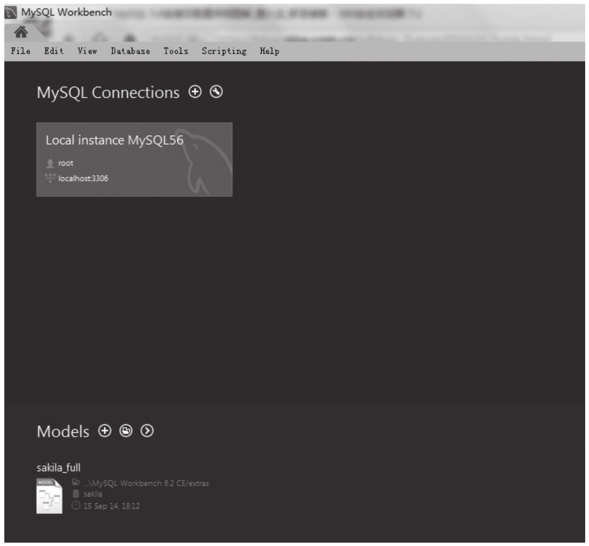
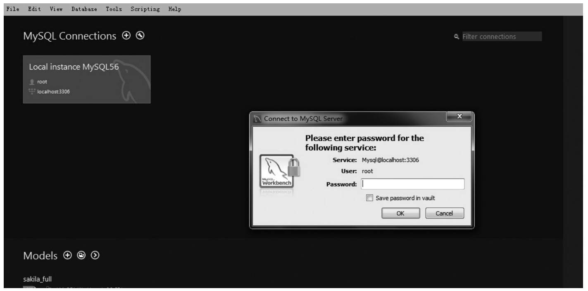
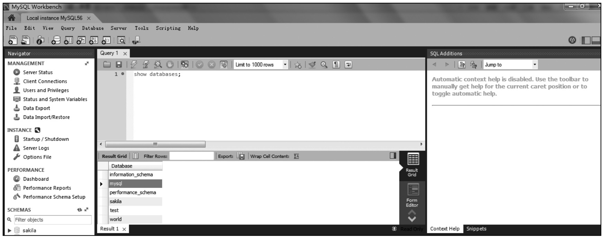
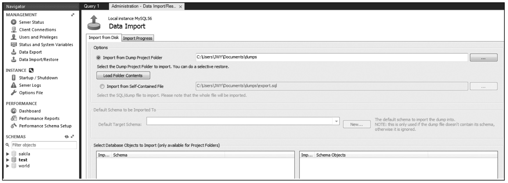
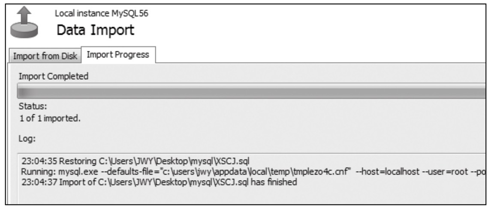
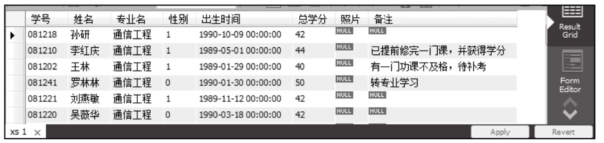

### 
  1.4 测试安装环境

 本节视频教学录像：3分钟

到此MySQL的安装配置已经完成，可以简单地对安装结果做一下测试，如在Windows 7环境下，在“开始”菜单下找到“MySQL“，单击“MySQL Workbench 6.2 CE”打开如下界面。

在界面中单击“root”，弹出登录提示框，如下图所示。

输入安装时设置的密码，即可进入主界面，在此界面可以做关于数据库的相关操作。

下面以导入数据库文件、查询表内容为例，做简单测试。

1.导入数据库

单击“MANAGEMENT”下的“Data Import/Restore”，系统弹出登录验证界面，输入登录密码，进入到导入界面，如下图所示。

在“Options”中选择“Import from Self-Contained File”，找到数据库文件XSCJ.sql，单击“Start Import”，导入成功显示如下。

另外，在左侧列表“SCHEMAS”中执行刷新，会看到导入的数据库。

2.查询

在Query 1窗口中输入相关SQL语句，执行查询，如输入如下语句。

use xscj;

select * from xs;

将查询出XSCJ数据库下xs表中的所有信息，如下图所示。

通过上述的简单操作，证明所安装的MySQL能够正常使用，接下来就可以结合其他开发环境进行项目的开发。

