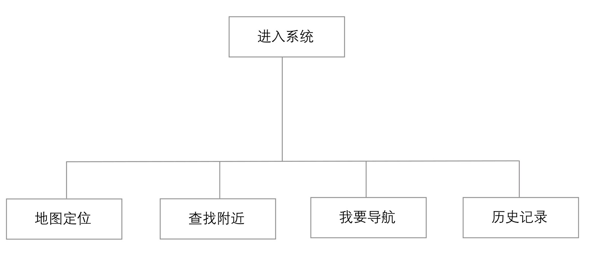

### 
  20.1 需求分析

 本节视频教学录像：7分钟

电动汽车GPS定位系统利用车载终端进行精确定位，通过无线通信方式将数据信息发送至管理中心，管理中心采用电子地图可以精确地对车辆进行管理。

车载终端主要由控制单元、GPS模块等部件组成，以实现卫星数据定位。

无线数据传送方式可以采用公网GSM、CDMA、3G、4G网络等进行车载终端与管理中心的数据传输。

电动车GPS定位系统在对GPS定位数据、电子地图、信息管理进行整合的基础上，本系统总体目标是通过本系统，用户可以在车内实时定位自己的位置信息，不用担心在陌生的地方迷路。另外还可以通过使用该系统查找特定的位置，规划去特定地方的线路，查看过去的记录，并且还可以实现到达特定区域给出系统提示或短信通知。实际应用主要体现在以下几点需求。

⑴车辆定位：借助车载GPS全球卫星定位系统以及电子地图，可以对车辆所处精确位置进行实时显示，并根据实际需求进行缩小、放大或者是换图，此外还可以随目标进行移动。确保目标始终处于屏幕中；不仅如此，多车辆、多窗口的定位也成为当下的需求范围，这样便可以轻松实现车辆实时定位。

⑵地图查询：电动汽车GPS定位系统可以根据用户实际需求，提供对诸如学校、加油站、银行ATM等地方的查询，最终查询数据可以通过百度地图API进行调用。并且每次用户的查询结果都会进入管理中心的数据库，进行用户查询统计，并为查询记录提供数据。

⑶线路导航：设计出行驶线路的导航服务，对于电动汽车GPS定位系统，关键性辅助功能之一就是设计出行线路，用户只需要输入目的地，系统将会自动给出最佳行驶路线，并包含其他备选方案，例如用时最短、避开高速等。根据用户的选择进行实时导航。

另外，为了获得更好的用户体验该系统还应当具备以下特性。

⑴用户界面友好，用户上手简单。

⑵支持4G网络连接，保证定位准确性。

⑶用户个人信息使用SQLite进行存储，方便用户查看。

以上内容对系统需求进行了详细描述，按照软件工程的思想，下面将根据需求进行项目设计。在这个阶段中所形成的文档是为后面的编码做准备的，能够指导程序员进行程序开发。

本系统详细流程图如下图所示。

