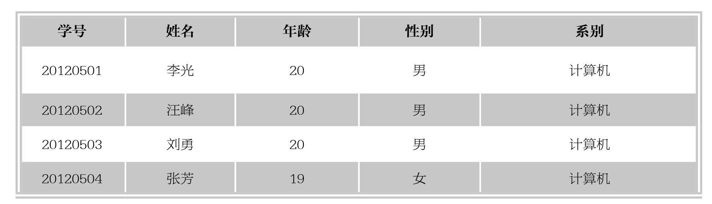

#### 
  2.2.1 关系型数据模型的结构

建立数据库系统离不开数据模型。模型是对现实世界的抽象，在数据库技术中，用模型的概念描述数据库的结构与语义，对现实世界进行抽象。能表示实体类型及实体间联系的模型称为“数据模型”。数据模型的种类很多，目前被广泛使用的可分为两种类型。

一种是独立于计算机系统的数据模型，完全不涉及信息在计算机中的表示，只是用来描述某个特定组织所关心的信息结构，这种模型称为“概念数据模型”。概念模型是按用户的观点对数据建模，强调其语义表达能力，概念应该简单、清晰、易于用户理解，它是对现实世界的第一层抽象，是用户和数据库设计人员之间进行交流的工具。其典型代表就是著名的“实体-关系模型”。

另一种数据模型是直接面向数据库的逻辑结构，它是对现实世界的第二层抽象。这种模型直接与数据库管理系统有关，称为“逻辑数据模型”，包括层次模型、网状模型、关系模型和面向对象模型。逻辑数据模型应该包含数据结构、数据操作和数据完整性约束3个部分，通常有一组严格定义的无二义性语法和语义的数据库语言，人们可以用这种语言来定义、操作数据库中的数据。在逻辑数据模型的4种模型中，层次模型和网状模型已经很少应用，而面向对象模型比较复杂，尚未达到关系模型数据库的普及程度。目前理论成熟、使用普及的模型就是关系模型。

关系模型是由若干个关系模式组成的集合，关系模式的实例称为关系，每个关系实际上是一张二维表格。关系模型用键导航数据，其表格简单，用户只需用简单的查询语句就可以对数据库进行操作，并不涉及存储结构、访问技术等细节。SQL语言是关系数据库的代表性语言，已经得到了广泛的应用。典型的关系数据库产品有DB2、Oracle、Sybase、SQL Server等。

关系数据库是以关系模型为基础的数据库，是一种根据表、元组、字段之间的关系进行组织和访问数据的数据库，它通过若干个表来存取数据，并且通过关系将这些表联系在一起。关系数据库是目前应用最广泛的数据库。关系数据是支持关系模型的数据库，下面先介绍关系数据模型。

目前，在实际数据库系统中支持的数据模型主要有3种：层次模型（Hierarchical Model）、网状模型（Network Model）和关系模型（Relational Model）。20世纪80年代以来，计算机厂商推出的数据库管理系统几乎都是支持关系模型的数据库系统。关系模型已经占领市场主导地位。

关系模型有3个组成部分：数据结构、数据操作和完整性规则。

关系模型建立在严格的数学概念的基础上，它用二维表来描述实体与实体间的联系。下面以学生信息表（如下表所示）为例，介绍关系模型中的一些术语。

⑴关系（Relation）：对应通常所说的一张表。

⑵元组（Tuple）：表中的一行即为一个元组，可以用来标识实体集中的一个实体，表中任意两行（元组）不能相同；

⑶属性（Attribute）：表中的一列即为一个属性，给每个属性起一个名称即属性名，表中的属性名不能相同。

⑷主键（Key）：表中的某个属性组，它可以唯一确定一个元组。

⑸域（Domain）：列的取值范围称为域，同列具有相同的域，不同的列也可以有相同的域。

⑹分量：元组中的一个属性值。

⑺关系模式：对关系的描述。可表示为：关系名（属性1，属性2，…，属性n）。例如上面的关系可以描述为：学生（学号，姓名，年龄，性别，系别）。

一个关系模型是若干个关系模式的集合。在关系模型中，实体以及实体间的联系都是用关系来表示的。例如学生、课程、学生与课程之间的多对多联系在关系模型中可以如下所示。

学生（学号，姓名，年龄，性别，系别）

课程（课程号，课程名，学分）

选修（学号，课程号，成绩）

由于关系模型概念简单、清晰、易懂、易用，并有严密的数学基础以及在此基础上发展起来的关系数据理论，简化了程序开发及数据库建立的工作量，因而迅速获得了广泛的应用，并在数据库系统中占据了统治地位。

尽管关系与传统的二维表格数据文件具有类似之处，但是它们又有区别，严格地说，关系是一种规范化的二维表格，具有如下性质。

⑴属性值具有原子性，不可分解。

⑵没有重复的元组。

⑶理论上没有行序，但是使用时有时可以有行序。在关系数据库中，关键码（简称键）是关系模型的一个重要概念，是用来标识行（元组）的一个或几个列（属性）。如果键是唯一的属性，则称为唯一键；反之由多个属性组成，则称为复合键。

键的主要类型如下。

⑴超键：在一个关系中，能唯一标识元组的属性或属性集称为关系的超键。

⑵候选键：如果一个属性集能唯一标识元组，且又不含有多余的属性，那么这个属性集称为关系的候选键。

⑶主键：如果一个关系中有多个候选键，则选择其中的一个键为关系的主键。用主键可以实现关系定义中“表中任意两行（元组）不能相同”的约束。

例如，在一个数据库图书管理系统中，可将图书明细表中的图书编号列假设是唯一的，因为图书馆管理员是通过该编号对图书进行操作的。因此，把图书编号作为主键是最佳的选择，而如果使用图书名称列作为主键则会存在问题。为此，最好创建一个单独的键将其明确地指定为主键，这种唯一标识符在现实生话中很普遍，例如，身份证号、牌照号、订单号、学生标识号和航班号等。

⑷外键：如果一个关系R中包含另一个关系S的主键所对应的属性组F，则称此属性组F为关系R的外键，并称关系S为参照关系，关系R是依赖关系。为了表示关联，可以将一个关系的主键作为属性放入另外一个关系中，第二个关系中的那些属性就称为外键。

例如，同样是在图书管理系统数据库，有一个出版社表用来描述出版社的各种信息，如电话、地址和网址等，在该表中使用“出版社编号”作为主键。为了表示图书与出版社之间的联系，可以将出版社表中的主键“出版社编号”作为新列添加到图书明细表中。

在这种情况下，图书明细表中的“出版社编号”就被称为外键，因为“出版社编号”是其所在表以外（出版社表）的一个主键。当出现外键时，主键与外键的列名称可以是不同的。但必须要求它们的值集相同，即图书明细表中出现的“出版社编号”一定要和出版社表中的值匹配。

