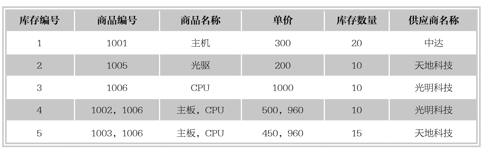
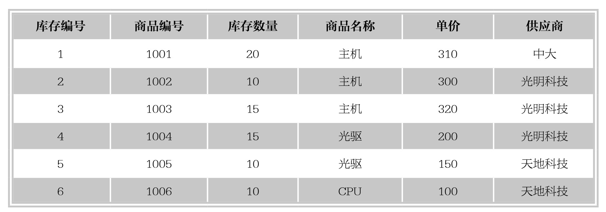
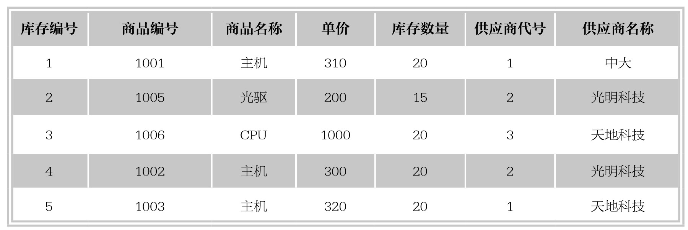

### 
  2.3 关系型数据模型中的数据依赖与范式

 本节视频教学录像：2分钟

在数据库中，数据之间存在着密切的联系。关系数据库由相互联系的一组关系所组成，每个关系包括关系模式和关系值两个方面。关系模式是对关系的抽象定义，给出关系的具体结构；关系的值是关系的具体内容，反映关系在某一时刻的状态。一个关系包含许多元组，每个元组都是符合关系模式结构的一个具体值，并且都分属于相应的属性。在关系数据库中的每个关系都需要进行规范化，使之达到一定的规范化程度，从而提高数据的结构化、共享性、一致性和可操作性。关系模型原理的核心内容就是规范化概念，规范化是把数据库组织成在保持存储数据完整性的同时最小化冗余数据的结构的过程。规范化的数据库必须符合关系模型的范式规则。范式可以防止在使用数据库时出现不一致的数据，并防止数据丢失。关系模型的范式有第一范式、第二范式、第三范式和BCNF范式等多种。在这些定义中，高级范式根据定义属于所有低级的范式。第三范式中的关系属于第二范式，第二范式中的关系属于第一范式。下面介绍规范化的过程。

1.第一范式

第一范式是第二范式和第三范式的基础，是最基本的范式。第一范式包括下列指导原则。

⑴数据组的每个属性只可以包含一个值。

⑵关系中的每个数组必须包含相同数量的值。

⑶关系中的每个数组一定不能相同。

如果关系模式R中的所有属性值都是不可再分解的原子值，那么就称此关系R是第一范式（First Normal Form，1NF）的关系模式。在关系型数据库管理系统中，涉及的研究对象都是满足1NF的规范化关系，不是1NF的关系称为非规范化的关系。例如，下图中的第四和第五行的2、3数组违反了第一范式，因为“商品编号”和“商品名称”属性每个都包含两个值。

如果要将这些数据规范化，就必须创建允许分离数据的附加表，这样才能使每个属性只包含一个值，每个数组包含相同数量的值，并且每个数组各不相同，如下图所示。这时的数据才符合第一范式。

2.第二范式

第二范式（2NF）规定关系必须在第一范式中，并且关系中的所有属性依赖于整个候选键。候选键是一个或多个唯一标识每个数据组的属性集合。例如，在下图所示的关系中，可以将“商品名称”和“供应商”名称指定为候选键。这些值共同唯一标识每个数组。在该图中“，库存编号”属性只依赖于“商品名称”，而不依赖于“供应商名称”属性。

3.第三范式

第三范式（3NF）同2NF一样依赖于关系的候选键。为了遵循3NF的指导原则，关系必须在2NF中，非键属性相互之间必须无关，并且必须依赖于键。例如，在下图所示的关系中，候选键“供应商代号”是属性。“商品名称”和“供应商名称”的属性都依赖于主键“库存编号”，并且相互之间进行关联。“供应商代号”属性依赖于“商品编号”，而不依赖于主键“库存编号”。

对于关系设计，理想的设计目标是按照规范化规则存储数据。但是，在数据库实现的实际工作中，将数据解规范化却是通用的惯例，也就是要专门违反规范化规则，尤其是违反第二范式和第三范式。当过于规范化的结构使实现方式复杂化时，解规范化主要用于提高性能或减少复杂性。尽管如此，规范化的目标仍然是确保数据的完整性，这点在解规范化时应该注意。

