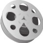

### 
  2.4 常见的关系型数据库管理系统

 本节视频教学录像：4分钟

常见的关系型数据库管理系统产品有Oracle、SQL Server、Sybase、DB2、Access等。

1.Oracle

Oracle是1983年推出的世界上第一个开放式商品化关系型数据库管理系统。它采用标准的结构化查询语言（Structured Query Language，SQL），支持多种数据类型，提供面向对象存储的数据支持，具有第四代语言开发工具，支持UNIX、Windows NT、OS/2、Novell等多种平台。除此之外，它还具有很好的并行处理功能。Oracle产品主要由Oracle服务器产品、Oracle开发工具、Oracle应用软件组成，也有基于微机的数据库产品，主要满足对银行、金融、保险等企业、事业开发大型数据库的需求。

2.SQL Server

SQL Server最早出现在1988年，当时只能在OS/2操作系统上运行。2000年12月微软发布了SQL Server 2000，该软件可以运行于Windows NT/2000/XP等多种操作系统之上，是支持客户机/服务器结构的数据库管理系统，它可以帮助各种规模的企业管理数据。随着用户群的不断增大，SQL Server在易用性、可靠性、可收缩性、支持数据仓库、系统集成等方面日趋完美。特别是SQL Server的数据库搜索引擎，可以在绝大多数的操作系统上运行，并对海量数据的查询进行了优化。目前，SQL Server已经成为应用最广泛的数据库产品之一。由于使用SQL Server不但要掌握SQL Server的操作，而且还要能熟练掌握Windows NT/2000 Server的运行机制，以及SQL语言，所以对非专业人员的学习和使用有一定的难度。

3.Sybase

1987年推出的大型关系型数据库管理系统Sybase，能运行于OS/2、UNIX、Windows NT等多种平台，它支持标准的关系型数据库语言SQL，使用客户机/服务器模式，采用开放体系结构，能实现网络环境下各节点上服务器的数据库互访操作。它技术先进、性能优良，是开发大中型数据库的工具。Sybase产品主要由服务器产品Sybase SQL Server、客户产品Sybase SQL Toolset和接口软件Sybase Client/Server Interface组成，还有著名的数据库应用开发工具PowerBuilder。

4.DB2

DB2是基于SQL的关系型数据库产品。20世纪80年代初期DB2的重点放在大型的主机平台上。到20世纪90年代初，DB2发展到中型机、小型机以及微机平台，DB2适用于各种硬件与软件平台，各种平台上的DB2有共同的应用程序接口，运行在一种平台上的程序可以很容易地移植到其他平台。DB2的用户主要分布在金融、商业、铁路、航空、医院、旅游等各个领域，以金融系统的应用最为突出。

5.Access

Access是在Windows操作系统下工作的关系型数据库管理系统。它采用了Windows程序设计理念，以Windows特有的技术设计查询、用户界面、报表等数据对象，内嵌了VBA（Visual Basic Application）程序设计语言，具有集成的开发环境。Access提供图形化的查询工具和屏幕、报表生成器，用户建立复杂的报表、界面无需编程和了解SQL语言，它会自动生成SQL代码。Access被集成到Office中，具有Office系列软件的一般特点，如菜单、工具栏等。与其他数据库管理系统软件相比，更加简单易学，普通的计算机用户即使没有程序语言基础，仍然可以快速地掌握和使用它。最重要的一点是，Access的功能比较强大，足以应付一般的数据管理及处理需要，适用于中小型企业数据管理的需求。当然，在数据定义、数据安全可靠、数据有效控制等方面,它比前面几种数据库产品要逊色不少。

