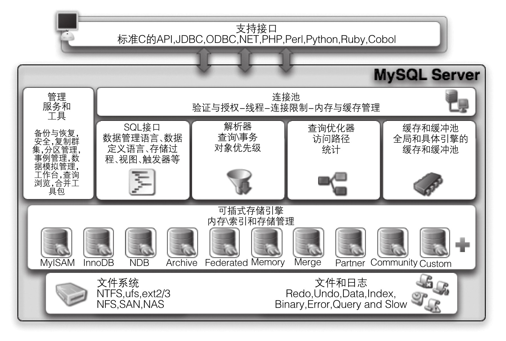

### 
  2.5 MySQL数据库系统的体系结构

 本节视频教学录像：3分钟

了解MySQL必须牢牢记住其体系结构图，MySQL是由SQL接口、解析器、优化器、缓存、存储引擎组成的，如下图所示。

⑴支持接口：是指不同语言中与SQL的交互。

⑵管理服务和工具：系统管理和控制工具。

⑶连接池：管理缓冲用户连接、线程处理等需要缓存的需求。

⑷SQL接口：接受用户的SQL命令，并且返回用户需要查询的结果，如select from就是调用SQL Interface。

⑸解析器：SQL命令传递到解析器的时候会被解析器验证和解析，解析器是由Lex和YACC实现的，是一个很长的脚本，其主要功能如下。

①将SQL语句分解成数据结构，并将这个结构传递到后续步骤，以后SQL语句的传递和处理就是基于这个结构的。

②如果在分解构成中遇到错误，那么就说明这个SQL语句是不合理的。

⑹查询优化器：SQL语句在查询之前会使用查询优化器对查询进行优化。它使用“选取→投影→连接”策略进行查询。用一个例子就可以理解：

select uid,name from user where gender = 1;

这个select 查询先根据where 语句进行选取，而不是先将表全部查询出来以后再进行gender过滤。

这个select查询先根据uid和name进行属性投影，而不是将属性全部取出以后再进行过滤。将这两个查询条件连接起来生成最终查询结果。

⑺缓存和缓冲池：查询缓存。如果查询缓存有命中的查询结果，查询语句就可以直接去查询缓存中取数据。这个缓存机制是由一系列小缓存组成的。比如表缓存、记录缓存、Key缓存、权限缓存等。

⑻存储引擎：存储引擎是MySQL中具体的与文件打交道的子系统。也是MySQL最具有特色的一个地方。从MySQL 5.5之后，InnoDB就是MySQL的默认事务引擎。

