#### 
  3.1.2 管理数据库

MySQL Administrator提供图形界面以帮助用户更方便地管理MySQL数据库。MySQL Administrator的下载安装比较简单，这里不再详述。下面以MySQL Administrator的mysql-gui-tools-5.0-r17-win32版本为例，对其管理数据库的主要功能做详细阐述，如：创建数据库、数据表、添加数据、备份及还原数据库。

1.登录到MySQL服务器

打开MySQL Administrator，弹出登录界面如下图所示，输入登录到MySQL所需的各项参数。

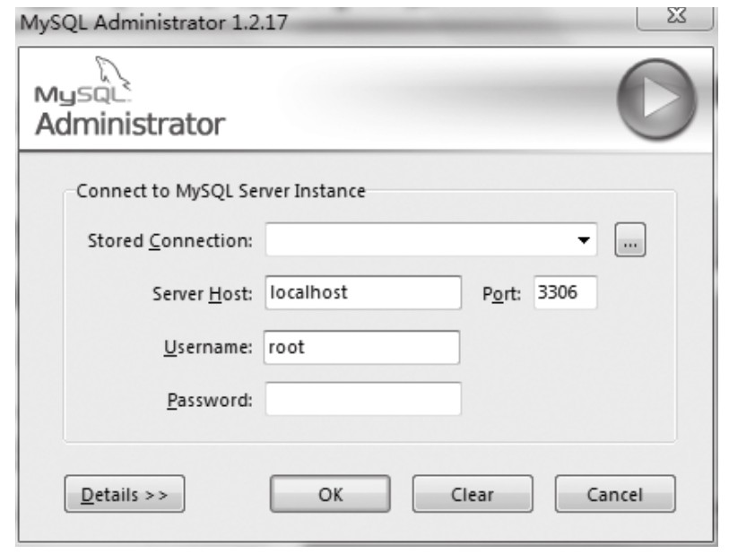
界面各项参数含义如下。

⑴Stored Connection：将本次连接保存到列表中时使用的名称。

⑵Server Host：要连接到的MySQL服务器的主机名或IP地址。

⑶Port：要连接到MySQL服务器所使用的端口，一般默认为3306端口。

⑷Username：连接使用的账户名。

⑸Password：连接使用的密码。

其中，Stored Connection用于为本次连接指定一个名称。MySQL Administrator会将每一次连接保存起来，以方便用户下次使用同样的设置进行登录。可以单击“Stored Connetion”右侧的“…”按钮，选择要使用的登录设置。

输入相关参数单击“OK”，进入MySQL Administrator 的主界面，如下图所示。

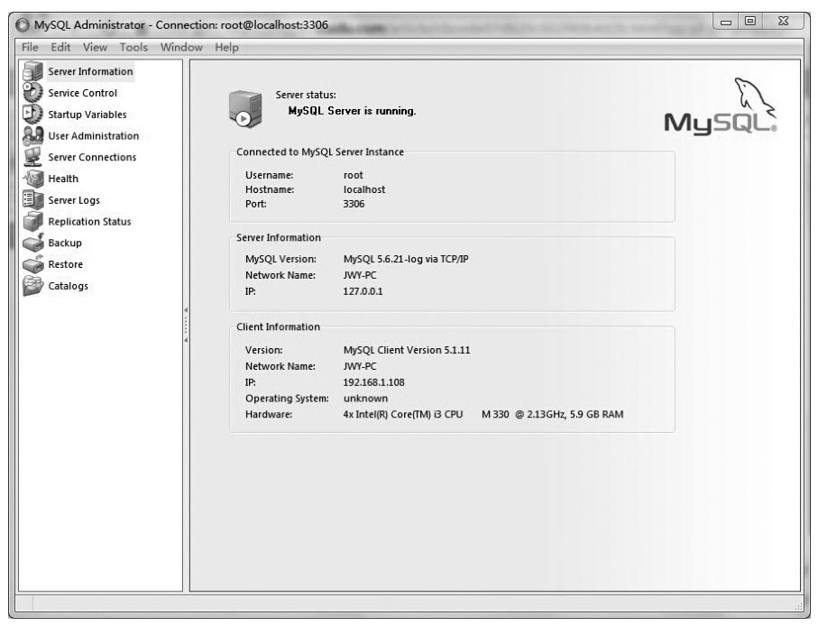
主页面中显示MySQL Administrator所提供的各种管理数据库的功能。

⑴Server Information：服务器信息，包含了当前连接的信息，当前连接到的MySQL服务器的信息，以及客户端的信息。

⑵Service Control：服务管理，用于管理MySQL服务，包括以下内容。

①Start/Stop Service：启动/关闭服务，用于启动或停止MySQL服务，启动或停止服务时的所有消息会显示在下部的文本框内。

②Configure Service：配置MySQL服务，其中，“Launch MySQL Server Automatically”为是否在Windows启动时，自动启动MySQL服务；“Display Name”用于指定服务名称；“Service Description”用于指定服务的描述；“Config Filename”用于指定服务的配置文件位置；“Section Name”用于指定服务所对应的程序名；“Path to Binary”用于选择服务使用的二进制文件。

⑶Startup Variables：启动变量，配置MySQL的启动变量，包括General Parameters（全局变量 )、MyISAM Parameters、InnoDB Parameters、Performance、Log Files、Replication、Advanced Networking、Security、Advanced。

⑷User Administration：用户管理，管理MySQL用户及权限，包括以下内容。

①User Information：用户信息，可以添加、删除和管理MySQL用户。

②Schema Privaleges：管理用户的权限。

⑸Server Connections：连接管理，管理连接到MySQL的线程或用户，包括以下内容。

①Threads：查看或者停止当前连接到MySQL的线程

②User Connections：查看或停止当前连接到MySQL服务器的用户。

⑹Health：状态信息，显示服务器的运行情况，包括以下内容。

①Connection Health：客户端连接情况。

②Memory Health：内存使用情况。

③Status Variables：查看状态变量。

④System Varibales：查看系统变量。

⑺Server Logs：日志信息，查看登录的日志信息，包括以下内容。

①Error Log：MySQL服务器的错误记录，记录服务器的启动和关闭信息，以及运行过程中出现的严重错误的信息。

②Slow Query Log：慢速查询记录。可以通过设置系统参数将MySQL运行在慢速查询模式，此时，服务器执行的所有SQL语句都会被记录下来。

③General Query Log：普通查询记录。

⑻Replication Status：复制状态，复制当前的主服务和子服务状态。

⑼Backup：备份数据库，用于进行计划备份和管理备份，包括以下内容。

①Backup Project：建立备份项目，包括指定备份项目的名称以及需要备份哪些对象。

②Advanced Options：备份的高级选项，更进一步地设置备份的选项，如备份的方案、锁定方法以及备份文件的格式等内容。

③Schedule：对备份进行计划，可用于实现定时备份，便于日志维护。

⑽Restore ：恢复数据库，从一个数据库备份中将数据恢复出来，包括以下内容。

①General：恢复的基本选项，如选择恢复的文件、备份时使用的方法以及字符集等信息。

②Restore Content：可以列出备份数据的目录，从而选择需要恢复的具体对象。这样做可以一次只针对一小部分数据进行恢复。

⑾Catalogs：数据库查看，管理数据库、表、列、约束、索引等对象，包括以下内容。

①Schema Tables：管理数据库中的表，查看表中的数据库等。

②Schema Indices：管理数据库中的索引和约束。

③Views：管理视图。

④Stored procedures：管理存储过程。

由于功能比较多，以下选择比较常用的几个功能进行介绍。

2.创建数据库

⑴运行MySQL Administrator并登录服务器后选择“Catalogs”，然后在管理器的右侧会出现目前服务器上已经有的数据库目录，右键单击“Schemata”窗口的“mysql”，选择“Create New Schema”。

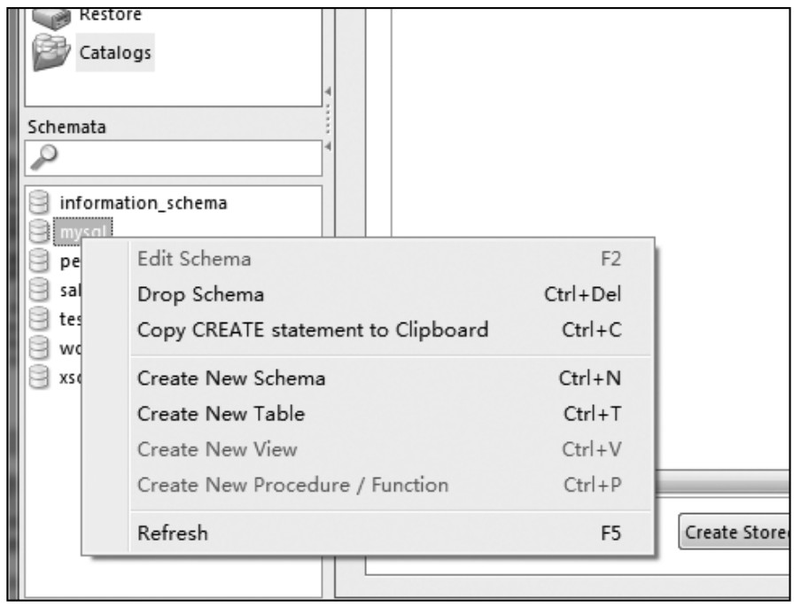
创建一个新的数据库，系统将提示输入数据库的名称，假设这里使用“testdb”。

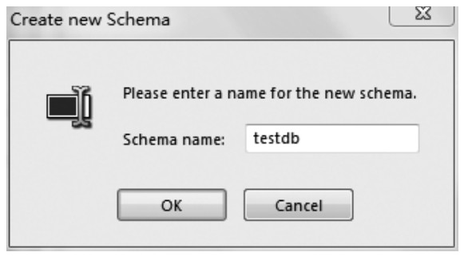
⑵单击“OK”，一旦创建后，新数据库就将与服务器中的其他数据库一起出现在“Schema”窗口，选择它后，在右侧窗口将出现它的详细资料。

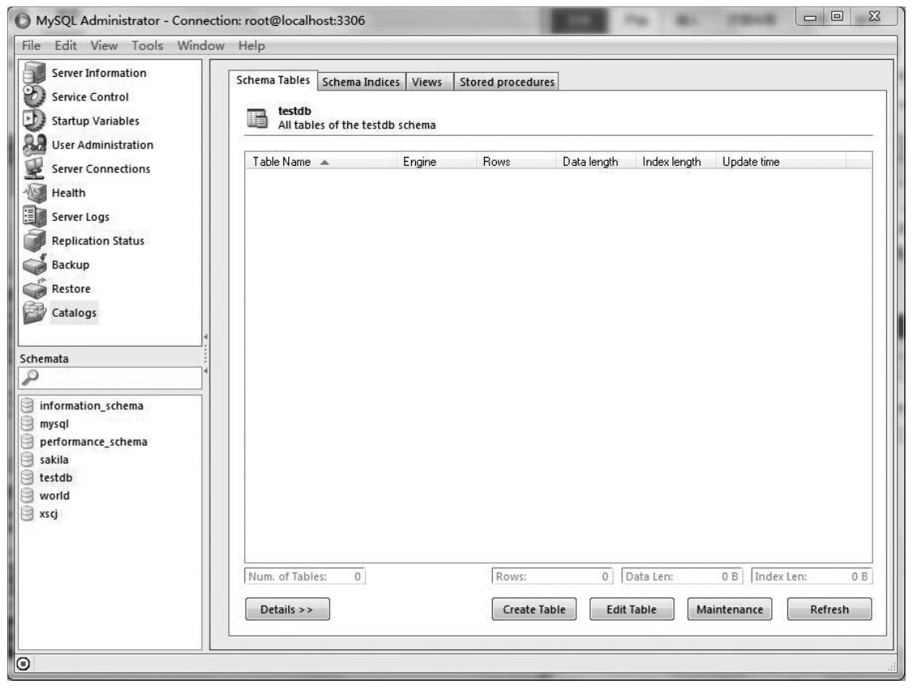
3.创建表

创建表很简单，只需要单击“Create Table”按钮，将出现下图所示的对话框。

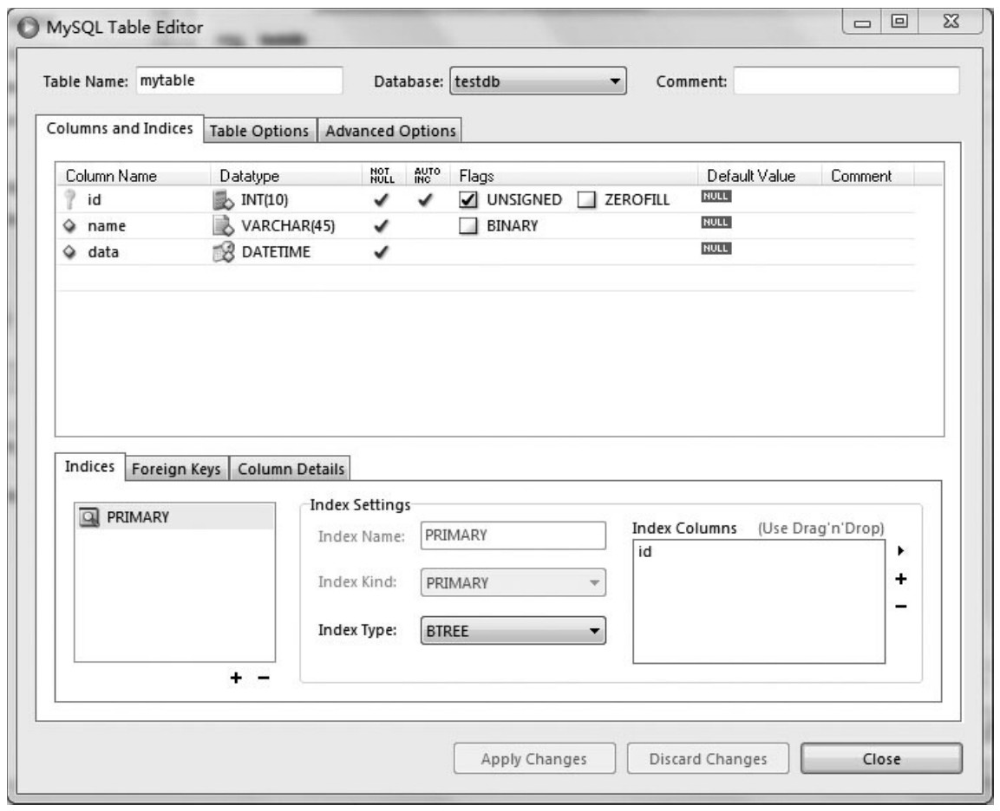
如图所示，已经给表取名为“mytable”，有三个域，分别为id域（为自动增量的主键）、一个文本域和一个时间/日期域。在完成这些后，单击“Apply Changes”按钮，将出现下图所示的窗口，窗口中的内容是创建表的SQL语句，同时询问是否执行，当然单击“Execute”。

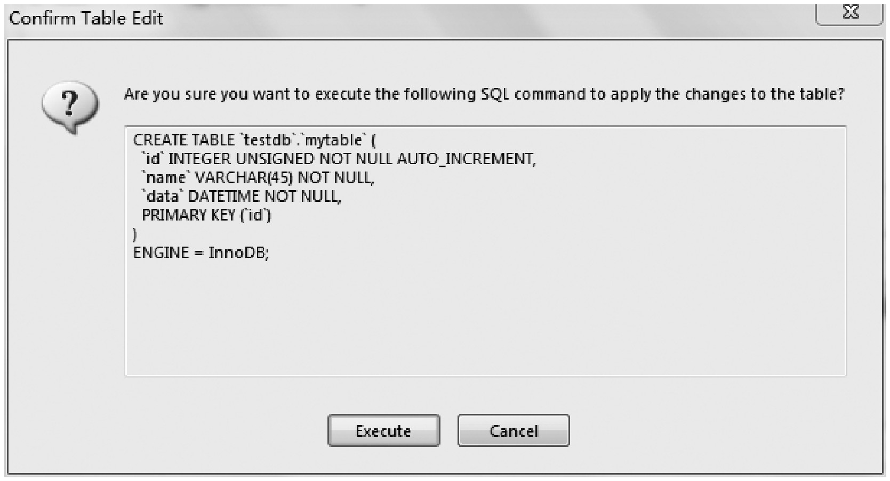
至此，已经创建了一个包含名为“mytable”表的“testdb”的数据库。

4.添加数据

下面要做的就是为数据库添加数据。在实际中，添加数据是通过应用程序来实现的，但现在仅仅是要添加几个样本数据，所以将在MySQL客户端命令中使用SQL语句的insert语句来实现，在MySQL Administrator中，通过菜单“tools”来访问命令行（“Tools”→“MySQL Command Line Client”），或者可以通过开始菜单的MySQL组来访问。添加数据语句如下。

&#13;
    mysql> use testdb;&#13;
    mysql> insert into mytable(name,data)&#13;
    -> values(‘张三','2015-04-01 12:00:00');&#13;

其中，第一行是告诉服务器将使用哪个数据库，第二行和第三行仅仅是简单地向数据库插入数据。

5.查看已创建的表及表中信息

从左栏中选择需要查看的数据库后，右边的窗口中就会显示当前选中的数据库有哪些表以及表的基本情况，类似于“use 数据库名”和“show tables”命令的组合。在显示数据库中表的同时，MySQL Administrator还会显示表的基本情况，如：Engine（表的引擎类型）、Rows（表的列数）、Data length（表中数据占用的空间大小）、Index length（表中的索引占用的空间大小）、Update time（表的更新时间）等。单击“Details”，还会在右边窗口下方看到表状态和行状态的相关信息。

若要查看表中的数据，可以在相应的表上单击鼠标右键，从菜单中选择“Edit Table Data”，如下图所示。

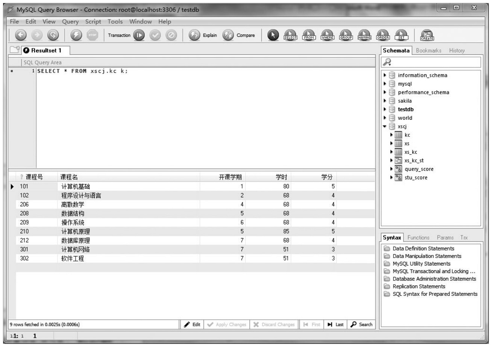
6.备份数据库

备份数据库到本地计算机硬盘，选择“Backup”备份数据库功能，然后单击“New Project”建立新的备份项目，如下图所示。

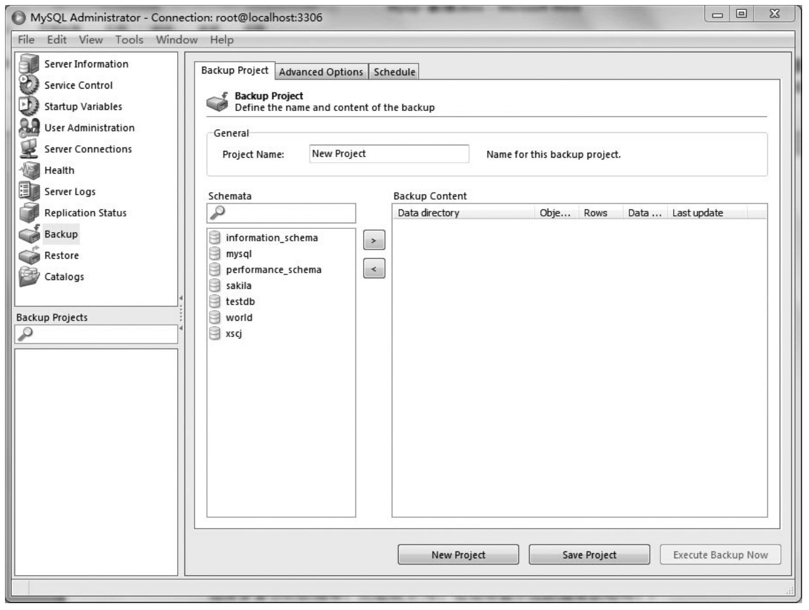
选择要备份的数据库，然后单击“>”号，右边将显示出数据库表结构，如下图所示。

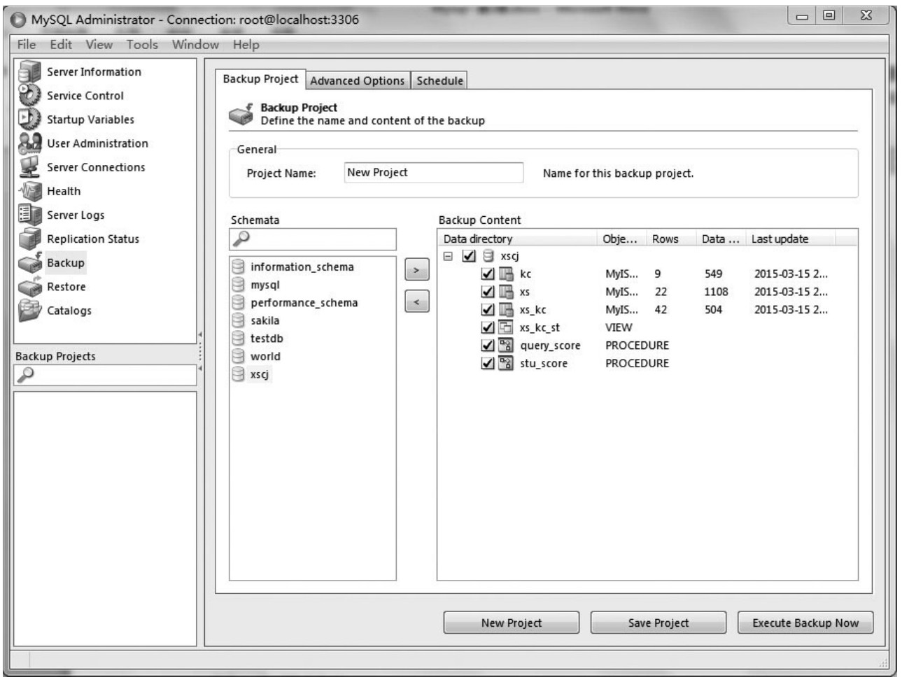
这里将备份的文件取名为“xscjBack”。另外，备份时在“Advanced Options”高级选项中可以进行不同的设置。“Backup Execution Method”中设置选项为：“Normal backup”表示备份的时候选择正常备份；“Complete backup”表示选择完整备份；“InnoDB Online Backup”表示是一种简单的在线备份方式“。Output File Options”中可以设置备份的文件类型，如“Backup Type”备份方式选择为“SQL Files”，单击“Execute Backup Now”，弹出保存路径选择及名字设置选择框，选择完毕开始执行备份。备份完成后将在选择路径下生成一个“xscjBack.sql”的文件。

7.还原数据库

若想还原一个本地硬盘中的数据库文件到MySQL中，单击“Open Backup File”，打开下图所示的界面

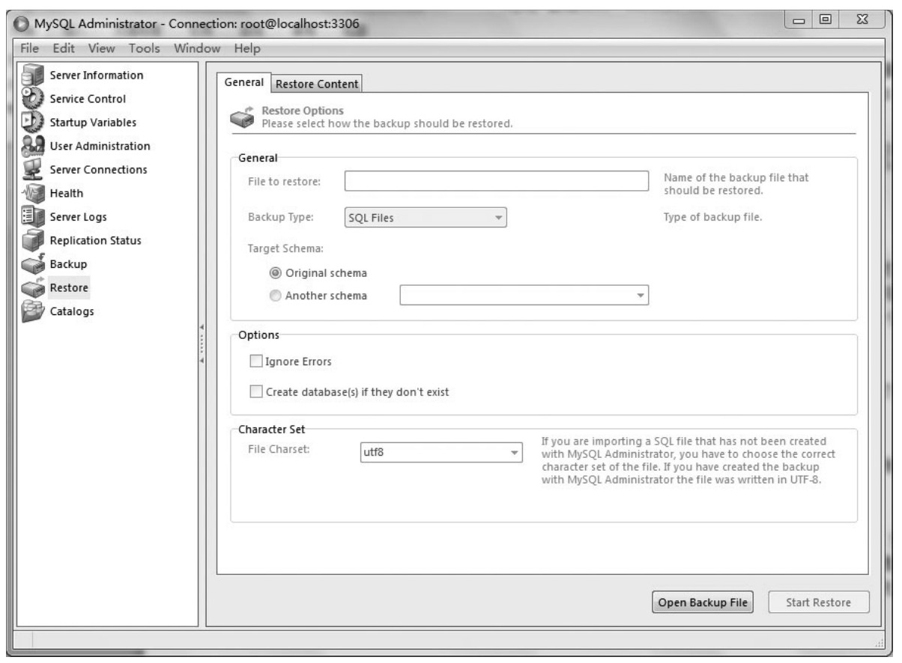
找到之前备份的数据库脚本文件，选择并打开文件，单击“Start Restore”后开始还原，还原成功后在“Catalogs”中可以看到该数据库，可以对它进行相应的操作。

以上对MySQL Administrator的主要功能做了简单介绍，还有很多其他的功能在这不再一一详述。MySQL Administrator将MySQL的管理工作从黑色的DOS屏幕转变到了图形化的环境中来，但是与其他数据库的管理工具相比，MySQL Administrator还有很多不足之处，如视图的图形化管理功能就很有限。目前，除了MySQL Administrator，市场上还有很多其他公司制作的MySQL图形管理工具，下面将对phpMyAdmin做简单介绍。

