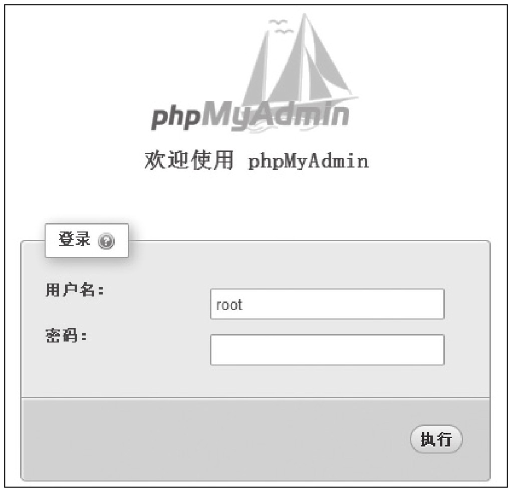

#### 
  3.2.1 基本功能介绍

phpMyAdmin可以运行在各种版本的PHP及MySQL下，可以对数据库进行操作，如创建、修改和删除数据库、数据表及数据等。下面简单介绍phpMyAdmin的基本功能，软件以phpMyAdmin-4.4.3-all-languages为例。输入phpMyAdmin访问地址，如http://localhost:8088/phpmyadmin/，即可打开登录页面，如下图所示。

输入正确的用户名和密码（这里在安装MySQL时，设置MySQL数据库的用户名为root，密码为root123），即可进入phpMyAdmin的主界面，如下图所示。

