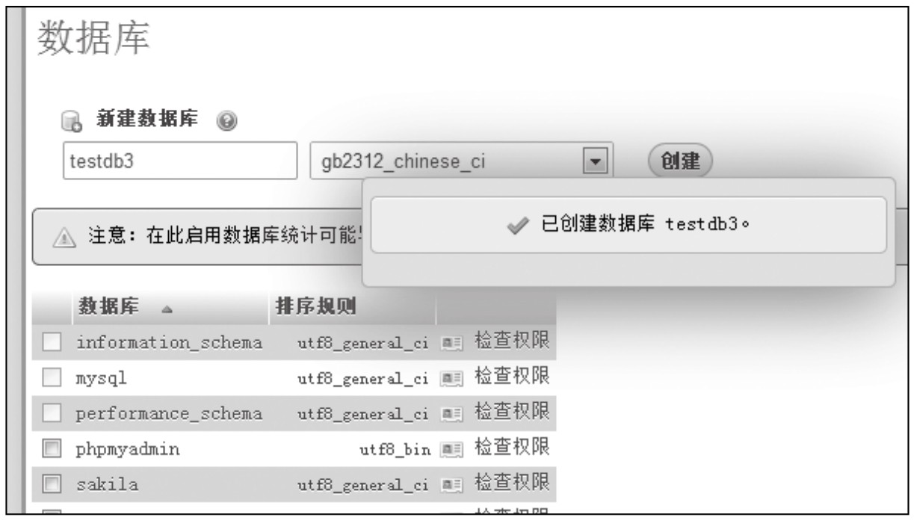
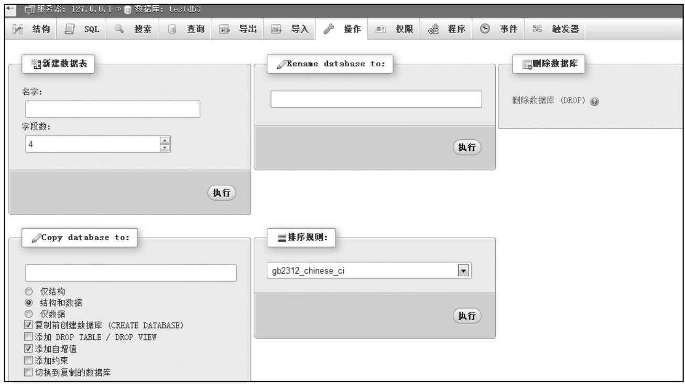
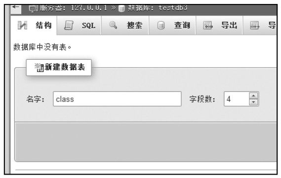
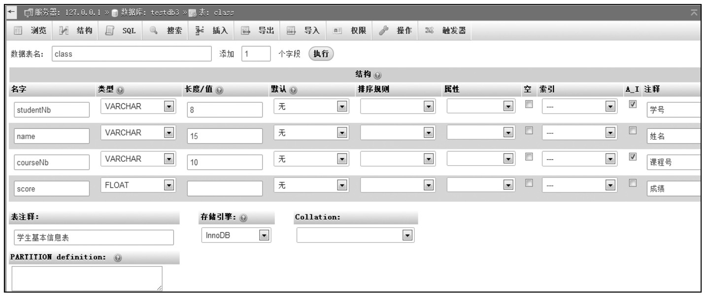
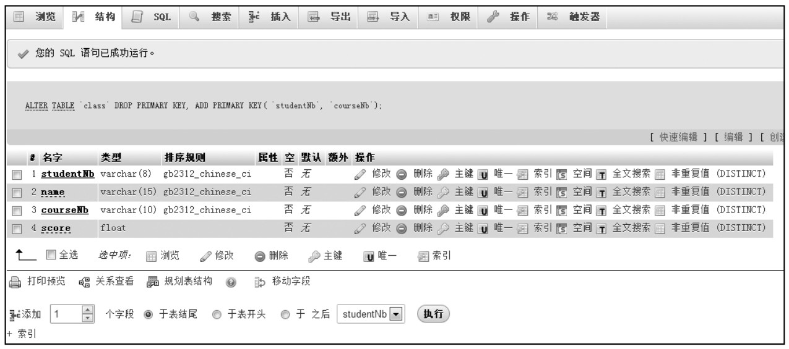
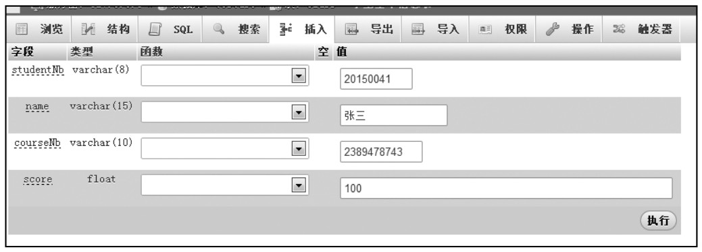
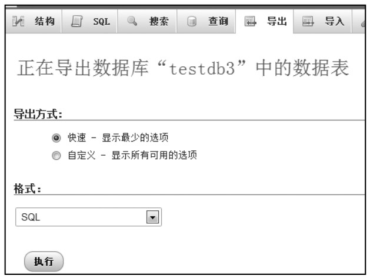
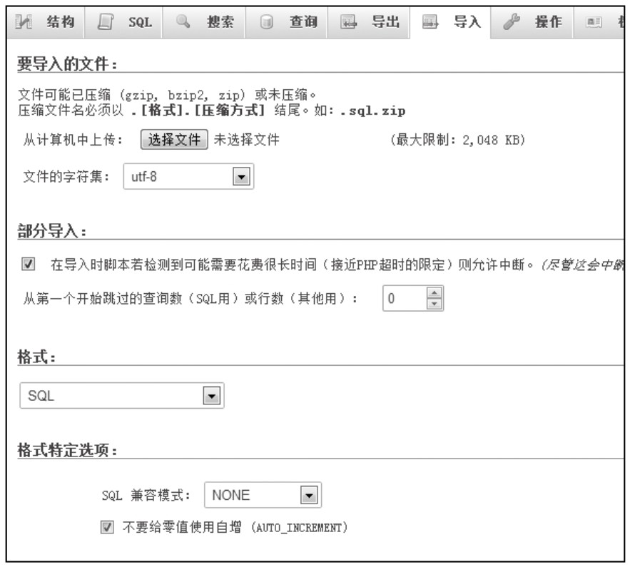

#### 
  3.2.2 管理数据库

1.创建数据库

通过phpMyAdmin创建数据库非常简单，通常有两种方法。第一种方法是在“SQL”页面使用SQL语句创建，第二种方法是在“数据库”页面直接创建数据库。本书采用第二种方法，下面介绍这种创建数据库的方法。

打开主页面，单击“数据库”选项卡，在其“新建数据库”文本框内直接输入要创建的数据库名，如“testdb3”。然后选择编码格式，中文数据库可选择“gb2312_chinese_ci”编码，多语言支持数据库一般选择“utf8_unicode_ci”编码。单击“创建”按钮即完成数据库的创建，如下图所示。

2.删除数据库

若要删除数据库，则在左边结构树中选中该数据库，如“testdb4”，打开其“操作”选项卡，单击最右边红色显示的“删除数据库”按钮即可，如下图所示。

3.创建数据库表

要创建一个完整的数据库，则必须为程序架构所需的数据结构建立数据表。在着手建立数据表时，要先确定所需的数据结构，这将有助于快速建立数据表。假如已经设计好所需的字段，要创建一个“class”数据库表，有4个字段，其中字段名及其类型分别为：（studentNb、varchar（8））、（name、varchar（15））、（courseNb、varchar（10））、（score、float）,主键为studentNb和courseNb。

选中“testdb3”数据，打开其“结构”选项卡，在页面上的“新建数据表”下的“名字：”文本框内输入“class”。“字段数”为所要建立的数据字段，这边因为设计4个字段，所以输入“4”，即完成初步的操作，如下图所示。

填写完后单击“执行”按钮，进入下一界面，把设计好的字段信息填写到该表，单击“保存”按钮，即完成数据库的创建，如下图所示。

4.修改表结构

如果创建完成数据表发现表结构不对，如上例中创建的数据表“calss”没有设置主键，则可以重新设置，如选中表“class”，在右边打开“结构”选项卡，勾选“studentNb”和“courseNb”两行，单击列表下面的“主键”按钮，然后执行，如下图所示。

当然也可以在这里修改表的其他结构，如：添加删除字段、修改字段的类型、创建索引等。

5.插入数据

向数据表中添加数据，直接单击“插入”按钮，一次可以插入两个数据。填写完要插入的数据后单击“执行”按钮即可完成插入数据操作，如下图所示。

6.导出数据表

为了避免发生意外而导致数据库文件损坏，要经常对数据库进行备份。使用phpMyAdmin能够轻而易举地完成数据库备份。下面具体介绍备份数据库的步骤。选择数据表所在的数据库，在右侧窗口中单击“导出”按钮，即可见到导出数据表的页面，如下图所示。

在该页面可以设置“导出方式”和“格式”，格式是选择要备份的格式，默认为“SQL”，也可选择其他格式。设置完成单击“执行”按钮，弹出保存路径，选择好保存路径，设置好保存的名字，保存即可。至此数据备份完成。

7.导入数据

导入和导出MySQL数据库脚本是互逆的两个操作。导入是执行.sql文件，将数据导入到数据库中；导出是将数据表结构、表记录存储为.sql脚本文件。通过导入和导出的操作可以实现数据库的备份和还原。前面已经讲过导出数据，在这里看一下导入数据的操作，打开“导入”选项卡，如下图所示。

单击“选择文件”找到要导入的数据文件，设置“格式”“格式特定选项”等，单击“执行”即可导入需要的数据。

以上就是对phpMyAdmin的简单介绍，上述介绍的操作都可以使用SQL语句来完成，语法规则后续会有详细介绍，本节不一一讲解。

