#### 
  3.3.2 基本应用

本节将介绍Navicat for MySQL的基本应用，以navicat111_mysql_cs_x64为例，在本书第1章已经介绍过该软件的安装，这里不再详述。

使用Navicat for MySQL管理数据库对象首先要创建数据库连接，MySQL启动成功后, 打开Navicat for MySQL，显示的主界面如下图所示。

单击“文件”菜单,选择“新建连接→MySQL…”，或者选择左上角“连接”按钮，打开新建连接界面，如下图所示。

填入相应的连接信息，连接名称可以自定义，可以单击“连接测试”来测试一下当前连接是否成功。“保存密码”可选框的作用是如果本次连接成功，则下次就无需输入密码，直接进入管理界面。进入到主界面如下图所示。

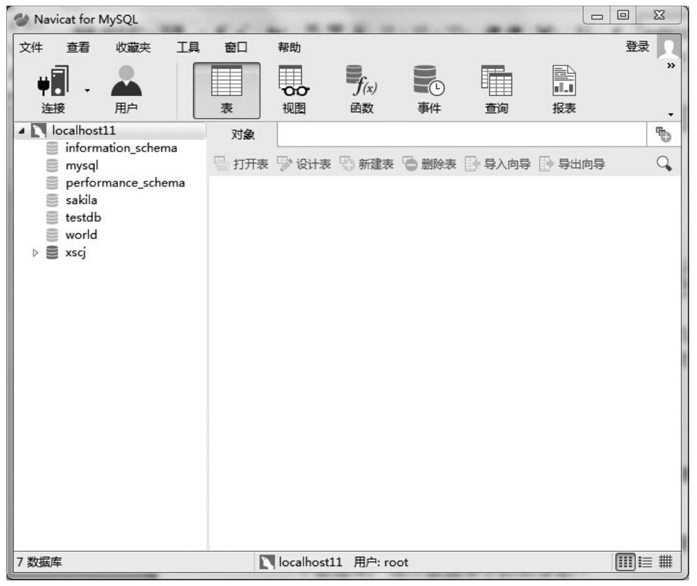
连接成功后，左边的树型目录中会出现此连接。注意在Navicat for MySQL中，每个数据库的信息是单独获取的，没有获取的数据库的图标会显示为灰色。而一旦Navicat for MySQL执行了某些操作，获取了数据库信息后，相应的图标就会显示成彩色。如上图中，只获取了xscj数据库的信息，其他数据库并没获取。这样做可以提高Navicat for MySQL的运行速度，因为它只打开需要使用的内容。

Navicat for MySQL的界面与SQL Server的数据库管理工具非常相似，左边是树型目录，用于查看数据库中的对象。每一个数据库的树型目录下都有表、视图、存储过程、查询、报表、备份和计划任务等节点，单击节点可以对该对象进行管理。

下面就Navicat for MySQL的基本功能，如创建数据库、创建数据表、备份数据库、还原数据库等做进一步的介绍。

1.创建数据库

在左边列表中空白处右键选择“新建数据库”，弹出新建页面，这里将数据库名称命名为“testdb2”，如下图所示。

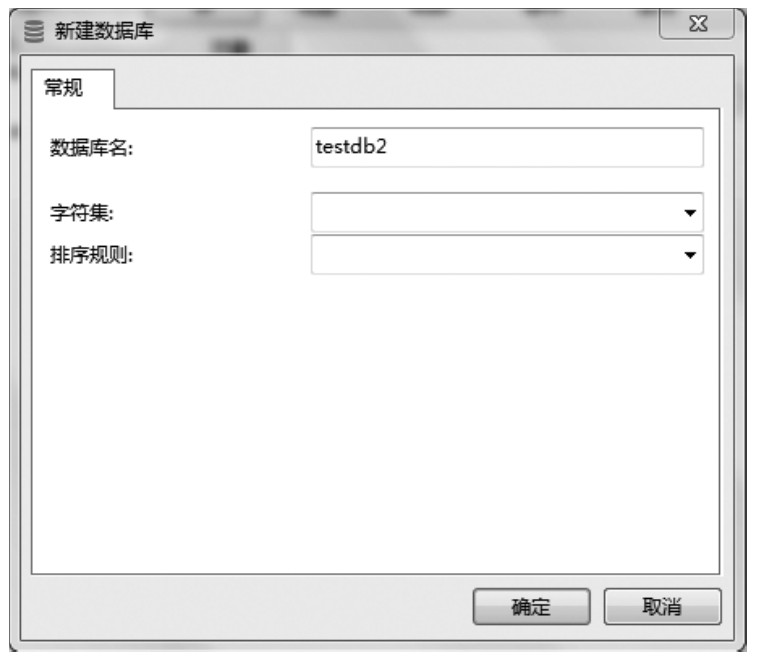
确定后成功创建一个数据库，如下图所示，接下来可以在该数据库中创建表、视图等。

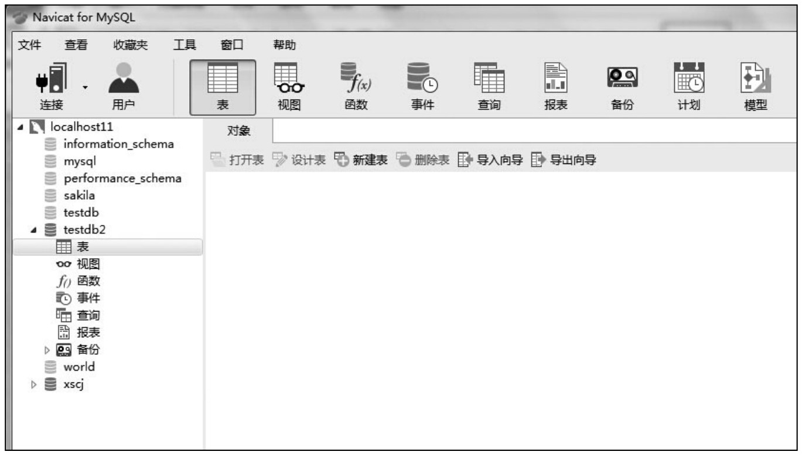
2.创建表

在窗口上方工具栏里选择“表”，然后选择“新建表”按钮，进入到创建表的页面，如下图所示。

在创建表过程中有一个地方要特别注意，就是“栏位”，对于初次使用Navicat for MySQL的新手来说比较陌生，其含义是我们通常所说的“字段”，工具栏中的“添加栏位”即添加字段的意思，添加完所有的字段以后要根据需求设置相应的“主键”。

可以使用工具栏中的工具进行栏位的添加、主键的设置、调整栏位的顺序等操作。

在这里创建了一个包含三个栏位、名为“test”的表，其中，“id”为主键，如下图所示。

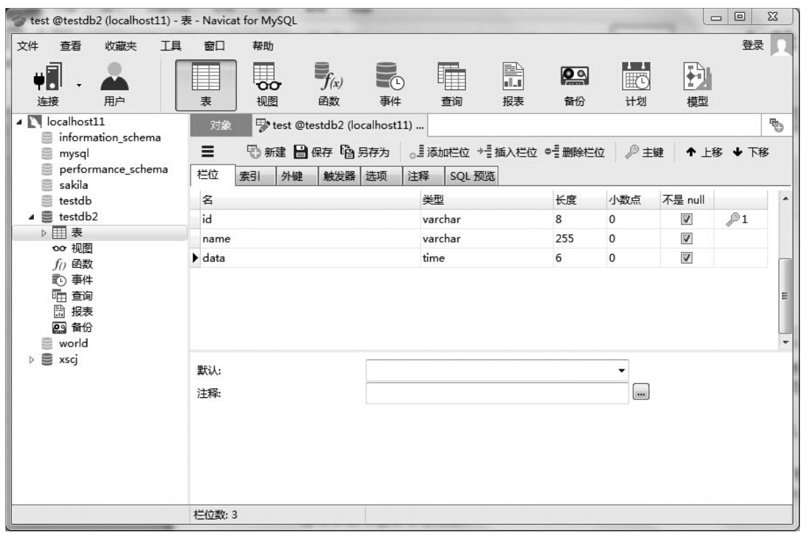
如果数据库比较复杂还可以根据需求继续做相关的设置，在“栏位”选项卡中还有索引、外键、触发器供调用，在“SQL预览”标签下是SQL语句。如果需要对表结构进行修改，在工具栏中选择“表”，然后选中要修改的表，选择“设计表”按钮。

3.添加数据

在左边结构树中单击“表”，找到要添加数据的表，如“test”，双击。或者在工具栏中选择“表”，然后选中要插入数据的表，选择“打开表”按钮。在窗口右边打开添加数据的页面，如下图所示，可以直接输入相关数据。

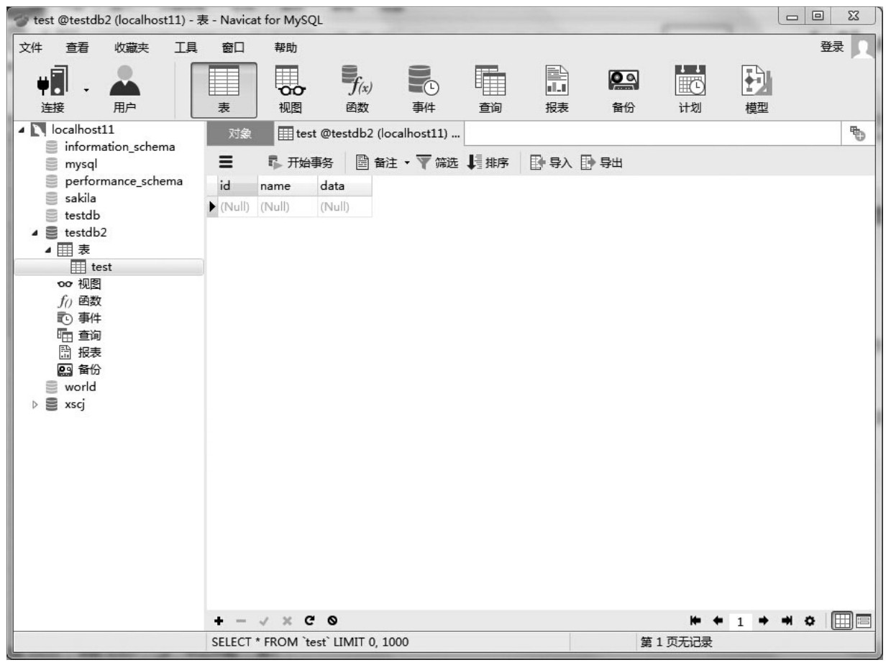
4.数据库备份及还原

备份数据库有以下两种方式：①在窗口上方工具栏中选择“备份”按钮；②在左边结构树中，选择要备份数据库下的“备份”按钮，打开备份页面，如下图所示。

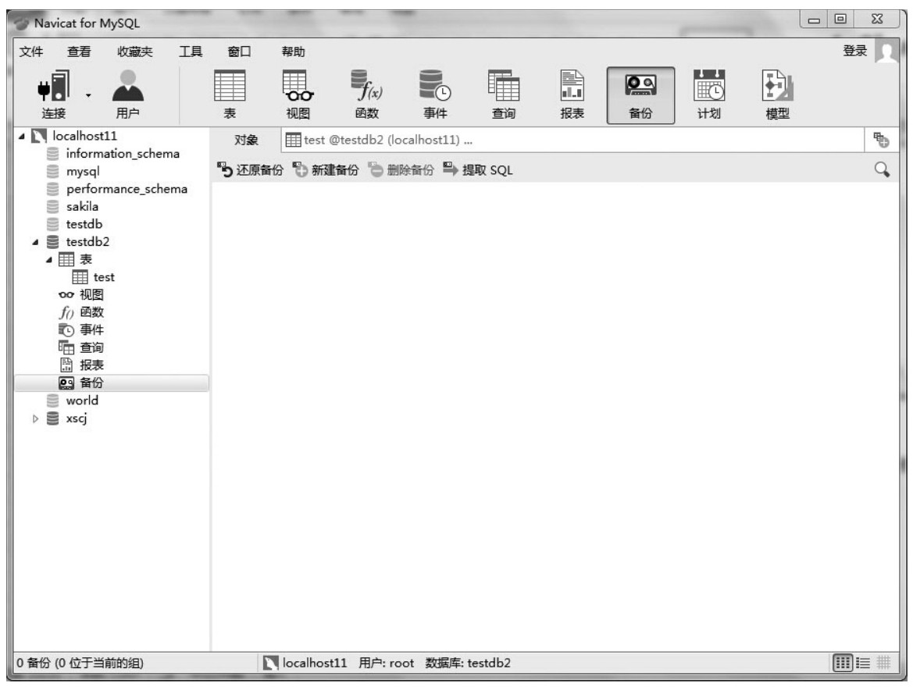
选择“新建备份”按钮，打开新建备份窗口，如下图所示。

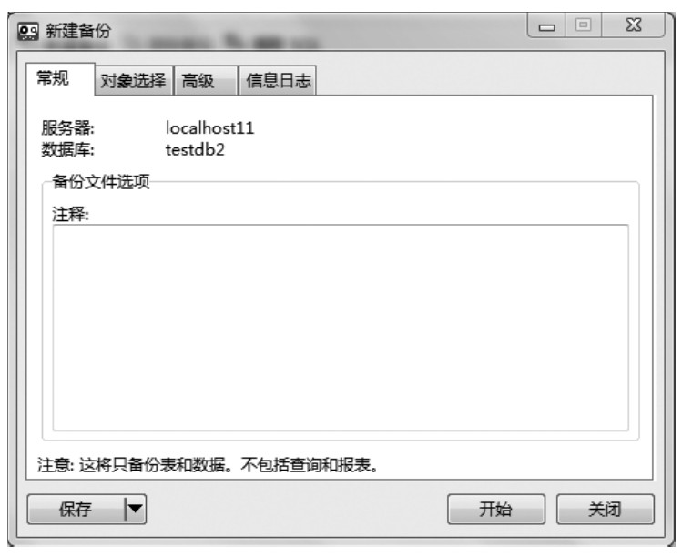
设置相关信息，如在“常规”选项卡中添加注释信息；在“对象”选项卡中选择要备份的表有哪些；在“高级”选项卡中选择是否压缩、是否使用指定文件名等；在“信息日志”选项卡中显示备份过程。设置完成后，单击“开始”，最后单击“保存”，弹出保存界面，如下图所示。

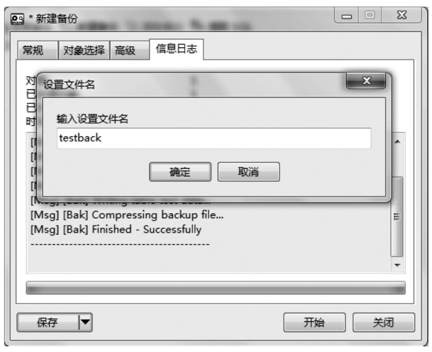
备份结束之后产生备份文件，数据库发生新的变化需要再次备份，双击“testback”重新进行“对象选择”后，进行备份。经过多次备份后会产生多个不同时期的备份文件。

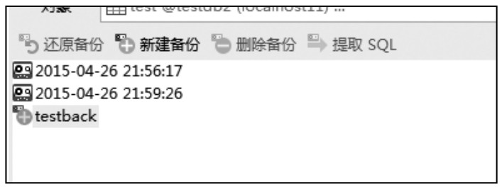
当需要将数据库还原到某个时间点时，选择时间，单击“还原备份”即可，界面如下图所示。

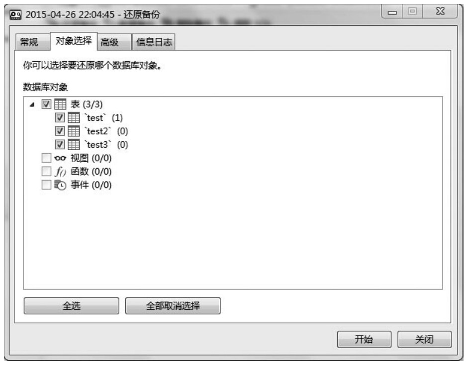
5.视图管理

在MySQL Administrator中管理视图时，只能对其SQL代码进行管理，功能十分有限。在Navicat for MySQL中，视图的管理功能要强得多，且更接近于SQL Server的管理界面。

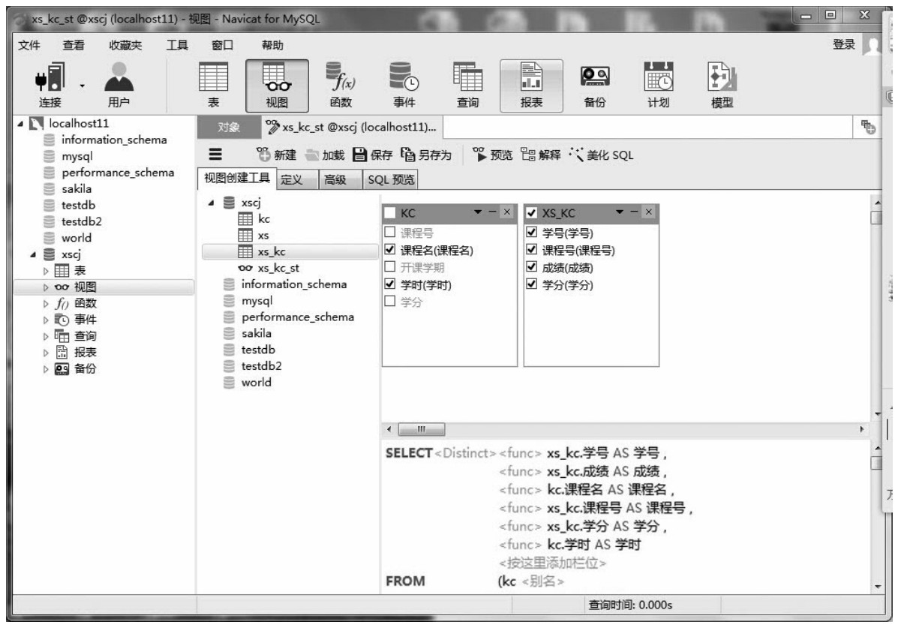
①加入视图有关的表，可以从左边的树型目录中，直接拖放到右边的表格区。

②选择要显示的列，可以将需显示的列前面的复选框选中。

③要选择一个表的所有列，可以直接选择表名旁的复选框。

④要取消选择一个表，可以单击表右上角的关闭按钮。

⑤在多个表之间建立连接，可以将需要连接的列从一个表中拖放到另一张表的对应列上。

6.查询

这里简单介绍一下查询的命令行功能，单击窗口上方工具栏中“查询”按钮，然后单击“新建查询”，打开新建窗口如下图所示。

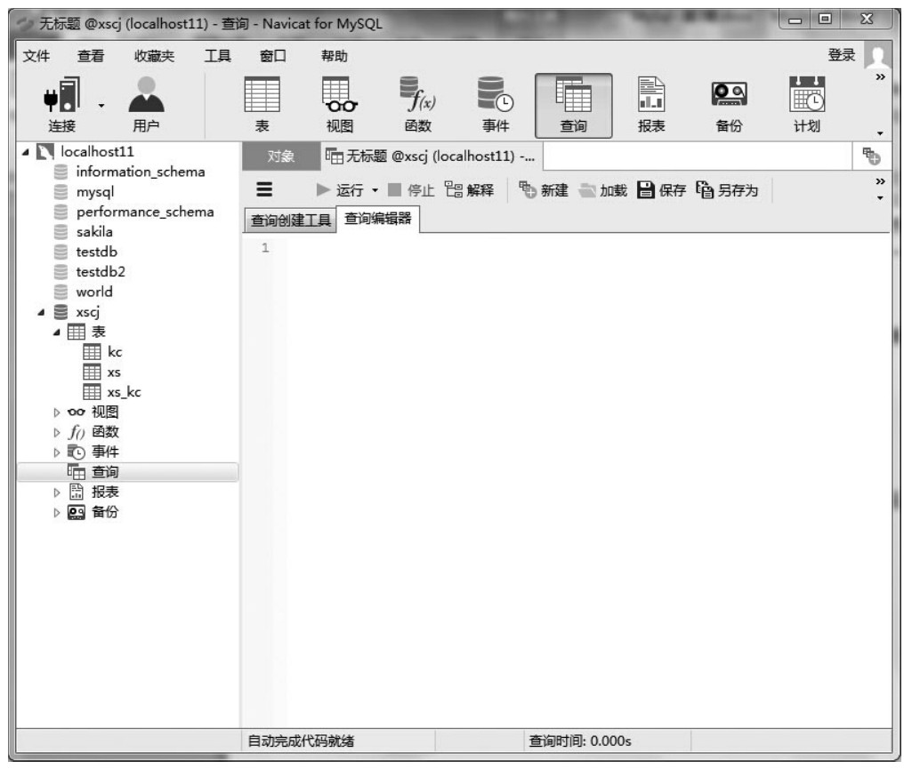
在“查询编辑器”中输入要执行的SQL语句，单击“运行”，在窗口下方显示结果、信息、概况等信息，如下图所示。

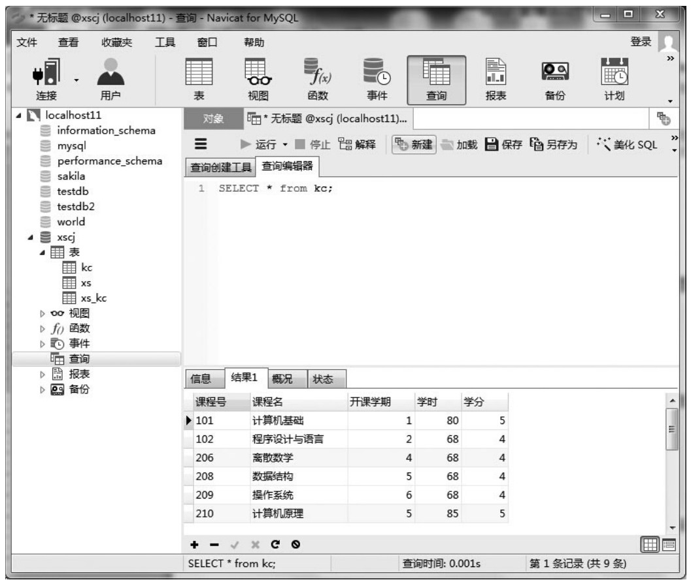
另外，也可以在”查询创建工具”页面中，通过表和字段选择的方式自动生成SQL语句, 还可以看到“select”的语法帮助，如下图所示。

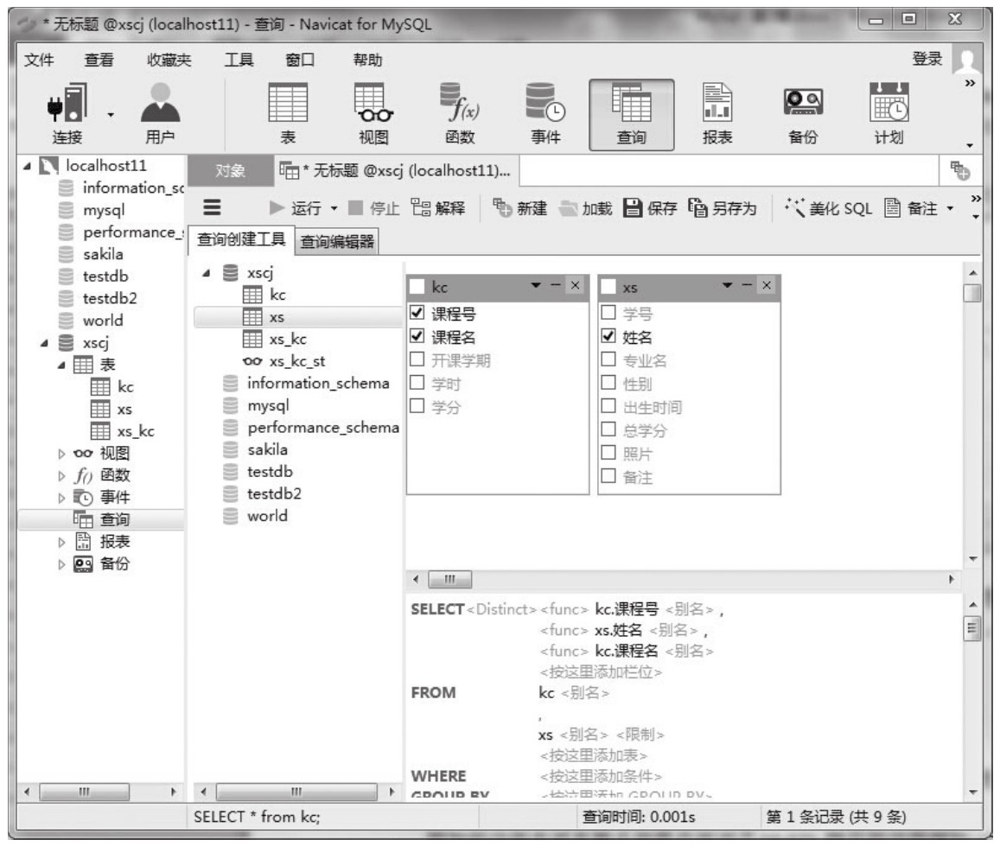
以上是对Navicat for MySQL的简单介绍，目前市场上有很多其他公司开发的MySQL图形管理工具，但其中做得最成功的应该属于Navicat for MySQL。

