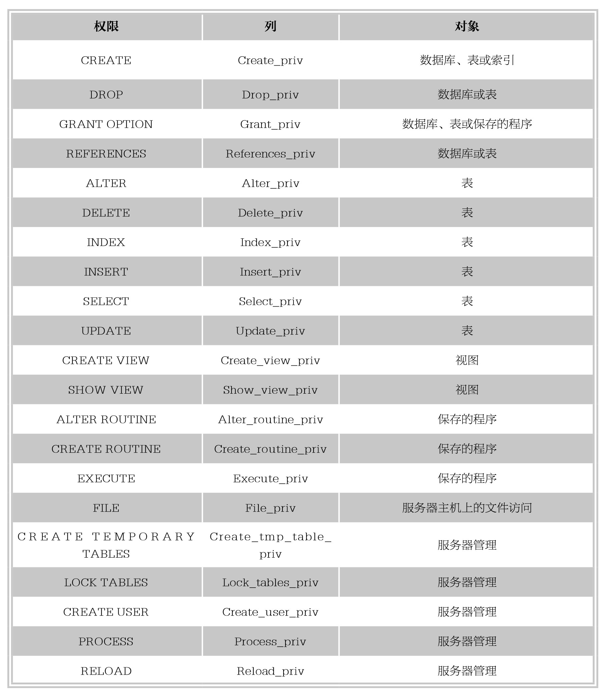
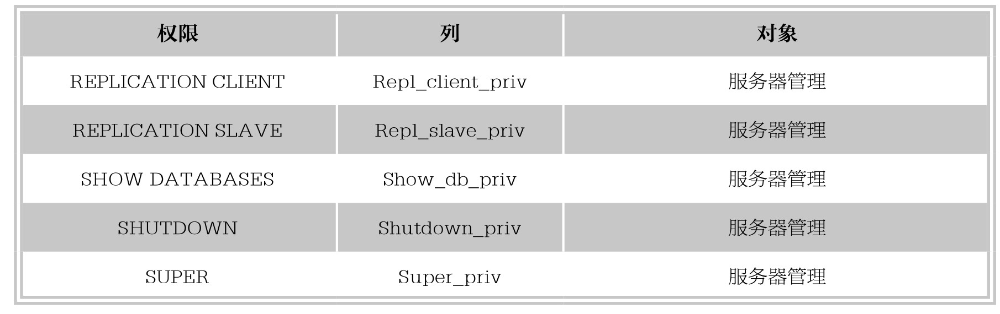
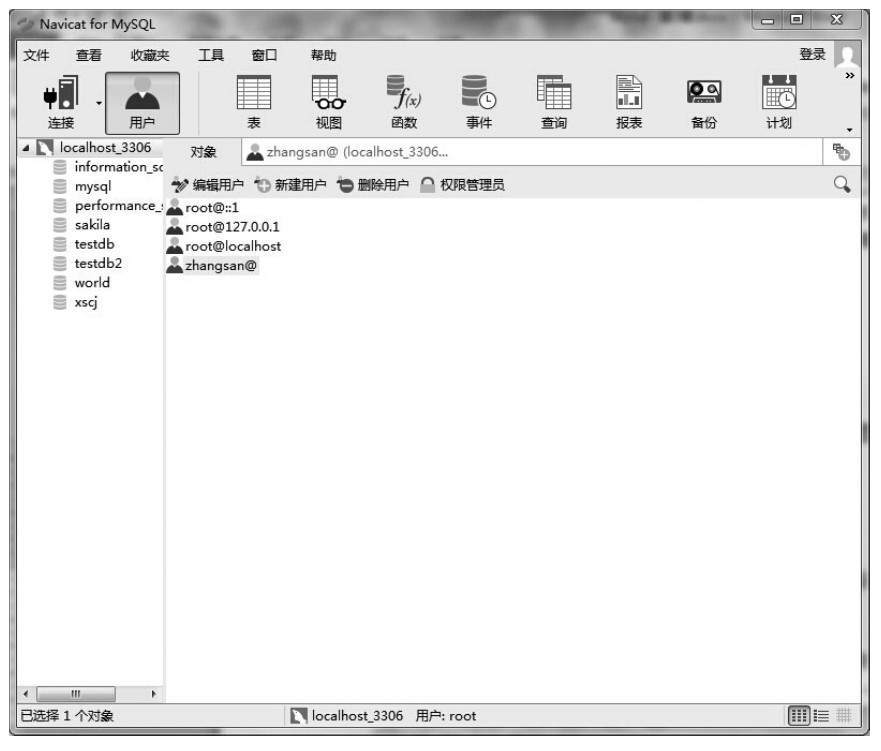
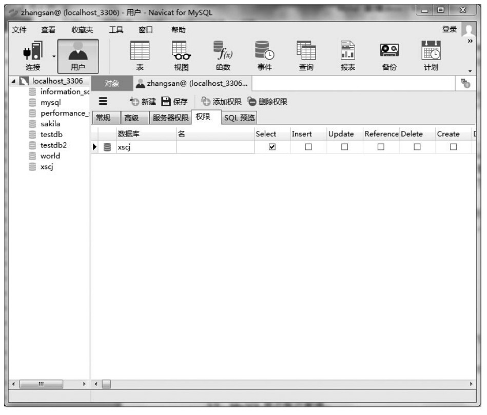
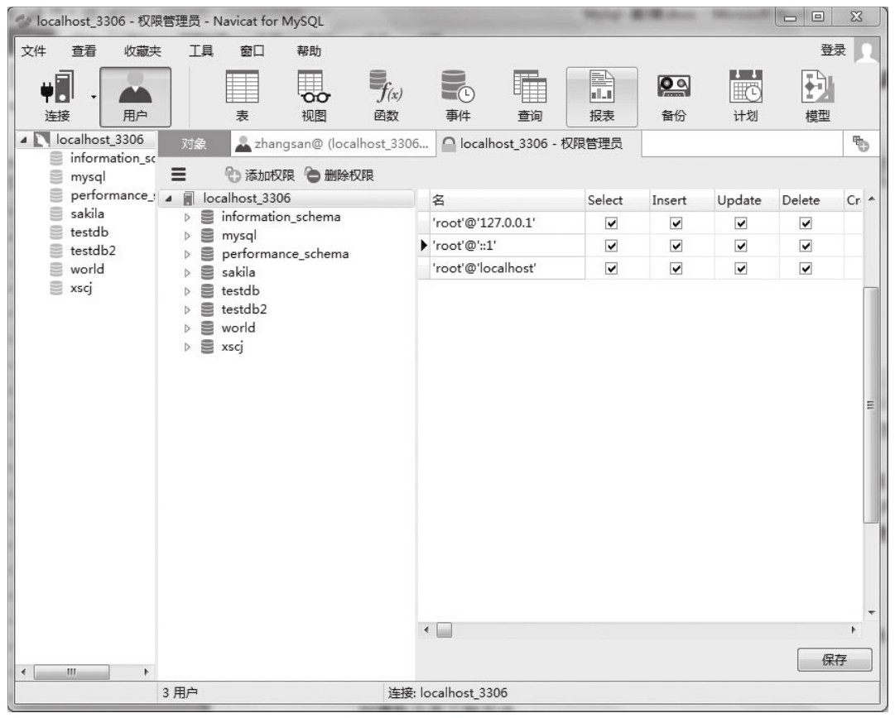

### 
  3.4 MySQL访问权限系统

 本节视频教学录像：7分钟

1.MySQL权限系统的作用

MySQL权限系统用于对用户执行的操作进行限制。用户的身份由用户用于连接的主机名和使用的用户名来决定。连接后，对于用户每一个操作，系统都会根据用户的身份判断该用户是否有执行该操作的权限，如SELECT、INSERT、UPDATE和DELETE权限。附加的功能包括匿名的用户对于MySQL特定的功能（例如LOAD DATA INFILE）进行授权及管理操作的能力。

2.MySQL权限系统工作原理

MySQL存取控制包含2个阶段。

阶段1：服务器检查是否允许连接。

阶段2：假定允许连接，服务器需要检查用户发出的每个请求，判断是否有足够的权限。例如，如果用户从数据库表中选择行或从数据库删除表，服务器需确定用户对表有SELECT权限或对数据库有DROP权限。

服务器在存取控制的两个阶段使用MySQL数据库中的user、db和host表。user表中范围列决定是否允许或拒绝到来的连接。对于允许的连接，user表授予的权限指出用户的全局(超级用户)权限。这些权限适用于服务器上的all数据库。db表中范围列决定用户能从哪个主机存取哪个数据库。权限列决定允许哪个操作。授予的数据库级别的权限适用于数据库和它的表。

除了user、db和host授权表，如果请求涉及表，服务器还可以参考tables_priv和columns_priv表。tables_priv和columns_priv表类似于db表，但是更精致。它们是在表和列级应用而非在数据库级，授予表级别的权限适用于表和它的所有列，授予列级别的权限只适用于专用列。另外，为了对涉及保存程序的请求进行验证，服务器将查阅procs_priv表。procs_priv表适用于保存的程序，授予程序级别的权限只适用于单个程序。

3.MySQL权限系统提供的权限

GRANT和REVOKE语句所用的涉及权限的名称、在授权表中每个权限的表列名称以及每个权限有关的对象如下表。

不同的MySQL图形化管理工具中都有权限管理模块，下面以Navicat for MySQL为例简单介绍如何给用户账号授权。打开“用户”界面，如下图所示。

选择某用户，如“zhangsan”，假定后面的代码需要对数据库“xscj”插入数据，故需要授予用户"insert"权限，然后单击“编辑用户”按钮，打开“权限”页面，如下图所示。

直接勾选“insert”列，或者可以单击“添加权限”按钮打开添加权限窗口进行设置，完成后单击“保存”按钮，保存权限设置。

也许应用程序需要更多的权限，如“UPDATE”和“DELETE”等，可以用同样的方法授予权限，但要注意的是，权限越多，安全性越低，必须对每个用户都实行控制。

如果需要批量对多个用户的权限进行管理，可以单击“权限管理员”打开“权限管理员”窗口进行管理，如下图所示。

