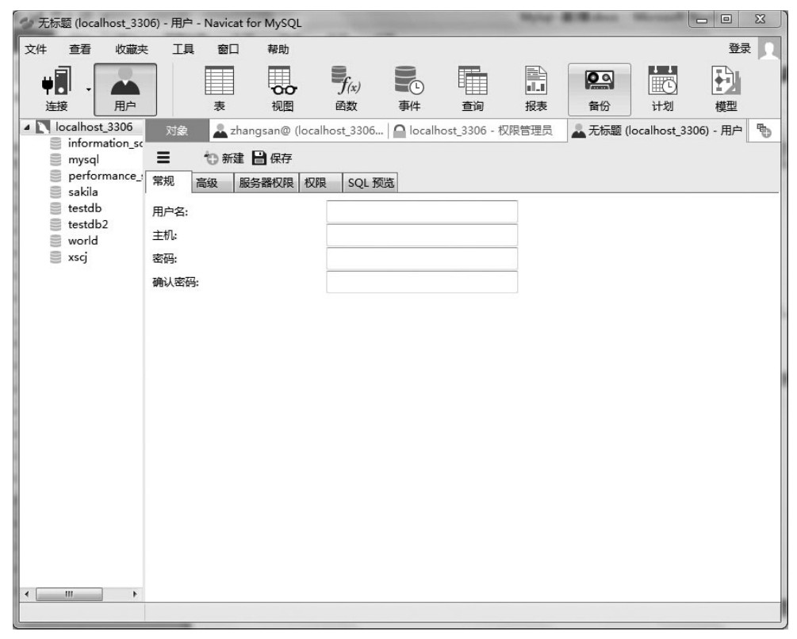
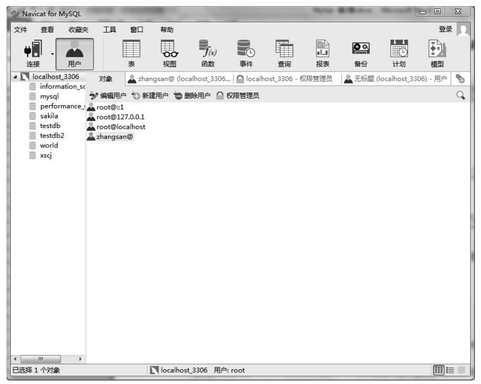

### 
  3.5 MySQL用户账户管理

 本节视频教学录像：5分钟

MySQL用户账户管理通常包括用户账户的创建和删除。下面来介绍这两个操作。

1.创建账户

创建账户有以下3种方法。

⑴使用GRANT创建新用户。

使用GRANT创建新用户，语法如下。

&#13;
    GRANT priv_type[(column_list)] ON[object_type]{tbl_name|*|*.*|db_name.*}&#13;
    TO user [IDENTIFIED BY [PASSWORD] ‘password’]&#13;
    [WITH with_option [with_option] ...]&#13;
    with_option =&#13;
    GRANT OPTION&#13;
    | MAX_QUERIES_PER_HOUR count&#13;
    | MAX_UPDATES_PER_HOUR count&#13;
    | MAX_CONNECTIONS_PER_HOUR count&#13;
    | MAX_USER_CONNECTIONS count&#13;

此方法必须以root登录，并且须有mysqlDB的insert权限与reload权限。

⑵直接操作授权表。

直接操作mysql.user表，向里面插入数据。

⑶使用图形化管理工具，以Navicat for MySQL为例介绍，连接到MySQL之后，单击“用户”，然后选择“新建用户”，如下图所示。

设置好相关属性，单击“保存”即可。

2.删除用户

删除用户可以使用SQL语句“drop user user_name;”，其中，user_name是账户名称，为两项，包括user与host列。如：'admin2'@'localhost'，如果使用“drop user admin2”，就会出现删除不掉的情况。

同样可以在Navicat for MySQL中执行删除用户的操作，仍然是单击“用户”，打开用户管理界面，然后选择某用户，单击“删除用户”，如下图所示。

