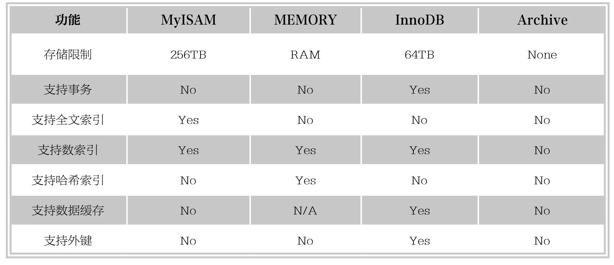

#### 
  4.3.5 选择存储引擎

每个存储引擎都有各自的特点，以适应不同的需求，如下表所示。为了方便选择，首先考虑每一个存储引擎提供了哪些不同的功能。

如果要求提供提交、回滚和崩溃恢复的事务安全（ACID兼容）能力，并要求实现并发控制，InnoDB是一个很好的选择。如果数据表主要用来插入和查询记录，则MyISAM引擎能提供较高的处理效率；如果只是临时存放数据，数据量不大，并且不需要较高的数据安全性，可以选择将数据保存在内存中的Memory引擎，MySQL中使用该引擎作为临时表，存放查询的中间结果。如果只有INSERT和SELECT操作，可以选择Archive引擎，Archive存储引擎支持高并发的插入操作，但是本身并不是事务安全的。Archive存储引擎非常适合存储归档数据，如记录日志信息可以使用Archive引擎。

使用哪一种引擎要根据需要灵活选择，一个数据库中多个表可以使用不同引擎以满足各种性能和实际需求。使用合适的存储引擎，将会提高整个数据库的性能。

