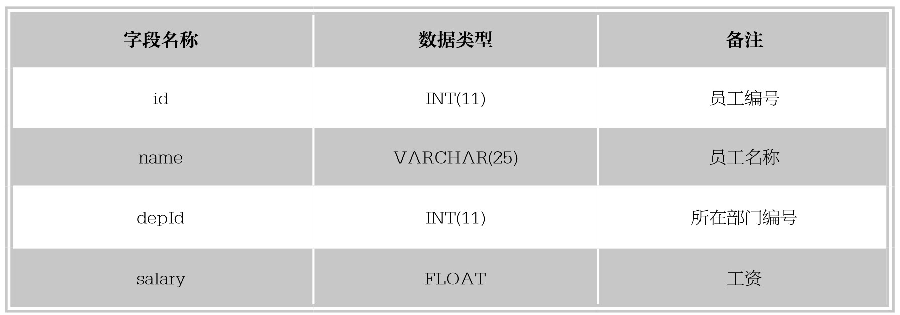

#### 
  5.1.1 创建表的语法形式

数据表属于数据库，在创建数据表之前，应该使用语句“USE <数据库名>”指定操作是在哪个数据库中进行，如果没有选择数据库，直接创建数据表，系统会显示“No database selected”的错误。

创建数据表的语句为CREATE TABLE，语法规则如下。

&#13;
    CREATE TABLE <表名>&#13;
    (&#13;
    字段名1，数据类型[列级别约束条件][默认值],&#13;
    字段名2，数据类型[列级别约束条件][默认值],&#13;
    ……&#13;
    [表级别约束条件]&#13;
    );&#13;

使用CREATE TABLE创建表时，必须指定以下信息。

(1)要创建的表的名称，不区分大小写，不能使用SQL语言中的关键字，如DROP、ALTER、INSERT等。

(2)数据表中每一个列（字段）的名称和数据类型，如果创建多个列，要用逗号隔离开。

【范例5-1】

创建员工表tb_employee1，结构如下表所示。

首先创建数据库，SQL语句如下。

&#13;
    CREATE DATABASE aa;&#13;

技巧 
 如果在第 4.1节，已经使用上述命令创建过数据库 aa，再次使用该命令行创建数据库，系统会提示：“无法创建数据库‘aa’,数据库已经存在”。

然后选择该数据库，SQL语句如下。

&#13;
    USE aa;&#13;

开始创建tb_employee1表，SQL语句如下。

&#13;
    CREATE TABLE tb_employee1&#13;
  (&#13;
    id   INT(11),&#13;
    name  VARCHAR(25),&#13;
    deptId INT(11),&#13;
    salary FLOAT&#13;
    );&#13;

语句执行后，便创建了一个名称为tb_employee1的数据表，使用“SHOW TABLES;”语句查看数据表是否创建成功，SQL语句如下。

&#13;
    mysql> SHOW TABLES;&#13;
    +--------------+&#13;
    | Tables_in_aa |&#13;
    +--------------+&#13;
    | tb_employee1 |&#13;
    +--------------+&#13;
    1 rows in set (0.00 sec)&#13;

可以看到，aa数据库中已经有了数据表tb_employee1，数据表创建成功。

