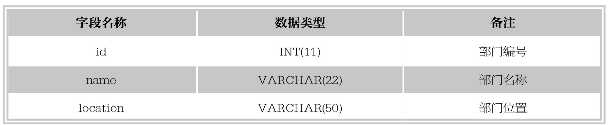

#### 
  5.1.3 外键约束

外键用来在两个表的数据之间建立连接，它可以是一列或者多列。一个表可以有一个或者多个外键。外键对应的是参照完整性，一个表的外键可以为空值，若不为空值，则每一个外键值必须等于另一个表中主键的某个值。

外键：下面介绍几个概念。是表中的一个字段，它可以不是本表的主键，但对应另外一个表的主键。外键的主要作用是保证数据引用的完整性，定义外键后，不允许删除在另一个表中具有关联关系的行。例如：部分表tb_dept的主键id，在员工表tb_employee5中有一个键deptId与这个id关联。

主表（父表）：对于两个具有关联关系的表而言，相关联字段中主键所在的那个表即是主表。

从表（自表）：对于两个具有关联关系的表而言，相关联字段中外键所在的那个表即是从表。

创建外键的语法规则如下。

&#13;
    [CONSTRAINT<外键名>]FOREIGN KEY 字段名1[,字段名2,…]&#13;
    REFERENCES<主表名> 主键列1[,主键列2,…]&#13;

其中，“外键名”为定义的外键约束的名称，一个表中不能有相同名称的外键；“字段名”表示子表需要添加外键约束的字段列。

【范例5-5】

定义数据表tb_employee5，并且在该表中创建外键约束。

创建一个部门表tb_dept1，表结构如下表所示，SQL语句如下。

&#13;
    CREATE TABLE tb_dept1&#13;
    (&#13;
      id INT(11)PRIMARY KEY,&#13;
      name VARCHAR(22)NOT NULL,&#13;
      location VARCHAR(50)&#13;
    );&#13;

定义数据表tb_employee5，让它的deptId字段作为外键关联到tb_dept1的主键id，SQL语句如下。

&#13;
    CREATE TABLE tb_employee5&#13;
    (&#13;
      id NT(11)PRIMARY KEY,&#13;
      name VARCHAR(25),&#13;
      deptId INT(11),&#13;
      salary FLOAT,&#13;
      CONSTRAINT fk_emp_dept1 FOREIGN KEY(deptId)REFERENCES tb_dept1(id)&#13;
    );&#13;

以上语句执行成功后，在表tb_employee5上添加了名称为fk_emp_dept1的外键约束，外键名称为deptId，其依赖于表tb_dept1的主键id。

提示 
 关联值是在关系型数据库中，相关表之间的联系。它是通过相容或相同的属性或属性组来表示的。子表的外键必须关联父表的主键，且关联字段的数据类型必须匹配，如果类型不一样，则创建子表时，就会出现错误提示。

