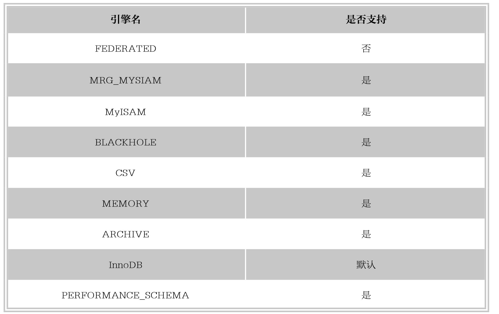

#### 
  5.3.7 更改表的存储引擎

通过前面章节的学习，知道存储引擎是MySQL中的数据存储在文件或内存中时采用的不同技术实现。可以根据自己的需要，选择不同的引擎，甚至可以为每一张表选择不同的存储引擎。MySQL中主要存储引擎有：MyISAM、InnoDB、MEMORY（HEAP）、BDB、FEDERATED等。可以使用SHOW ENGINES；语句查看系统支持的存储引擎。下表列出了MySQL 5.6.21版本中所支持的存储引擎。

更改表的存储引擎的语法格式如下。

&#13;
    ALTER TABLE <表名> ENGINE=<更改后的存储引擎名>;&#13;

【范例5-24】

将数据表tb_deptment3的存储引擎修改为MyISAM。

在修改存储引擎之前，首先使用SHOW CREATE TABLES查看表tb_deptment3当前的存储引擎，结果如下。

&#13;
    mysql> SHOW CREATE TABLE tb_deptment3\G&#13;
    *************************** 1.row ***************************&#13;
      Table: tb_deptment3&#13;
    Create Table: CREATE TABLE `tb_deptment3` (&#13;
   `id` int(11) NOT NULL,&#13;
   `name` varchar(22) DEFAULT NULL,&#13;
   `location` varchar(50) DEFAULT NULL,&#13;
   PRIMARY KEY (`id`),&#13;
    UNIQUE KEY `STH` (`name`)&#13;
     ) ENGINE=InnoDB DEFAULT CHARSET=utf8&#13;
     1 row in set (0.00 sec)&#13;

可以看到，表tb_deptment3当前的存储引擎为ENGINE=InnoDB，接下来修改存储引擎类型，SQL语句如下。

&#13;
    mysql> ALTER TABLE tb_deptment3 ENGINE=MyISAM;&#13;

使用SHOW CREATE TABLES再次查看表tb_deptment3的存储引擎，发现表tb_deptment3的存储引擎已变为“MyISAM”,结果如下。

&#13;
    mysql> SHOW CREATE TABLE tb_deptment3\G&#13;
    *************************** 1.row ***************************&#13;
      Table: tb_deptment3&#13;
    Create Table: CREATE TABLE `tb_deptment3` (&#13;
    `id` int(11) NOT NULL,&#13;
    `name` varchar(22) DEFAULT NULL,&#13;
    `location` varchar(50) DEFAULT NULL,&#13;
    PRIMARY KEY (`id`),&#13;
    UNIQUE KEY `STH` (`name`)&#13;
    ) ENGINE=MyISAM DEFAULT CHARSET=utf8&#13;
    1 row in set (0.01 sec)&#13;

