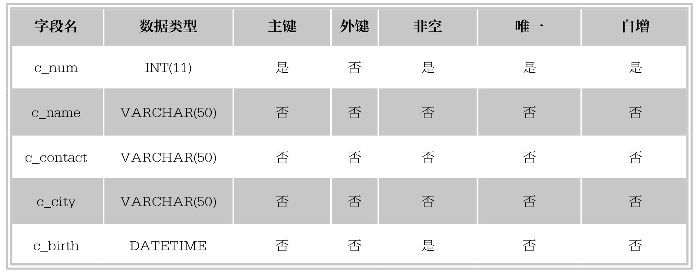
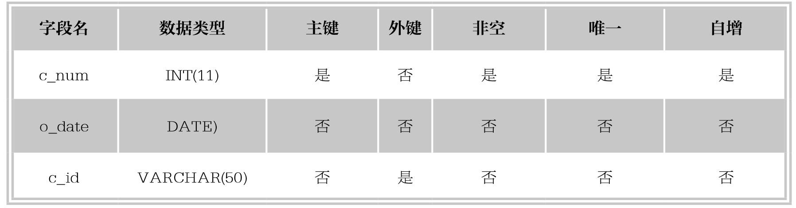

### 
  5.6 实战练习

1.创建数据库Market，在Market中创建数据表customers，customers表结构如下表所示，按要求进行操作。

⑴创建数据库Market。

⑵创建数据表customers，在c_num字段上添加主键约束和自增约束，在c_birth字段上添加非空约束。

⑶将c_contact字段插入到c_birth字段后面。

⑷将c_name字段数据类型改为VARCHAR(70)。

⑸将c_contact字段名改为c_phone。

⑹增加c_gender字段，数据类型为CHAR(1)。

⑺将表名修改为costomers_info。

⑻删除字段c_city。

⑼修改数据表的存储引擎为MyISAM。

2.在Market中创建数据表orders，orders表结构如下表所示，按要求进行操作。

⑴创建数据表orders，在c_num字段上添加主键约束和自增约束，在c_id字段上添加外键约束，关联customers表中的主键c_num。

⑵删除orders表的外键约束，然后删除表customers。

