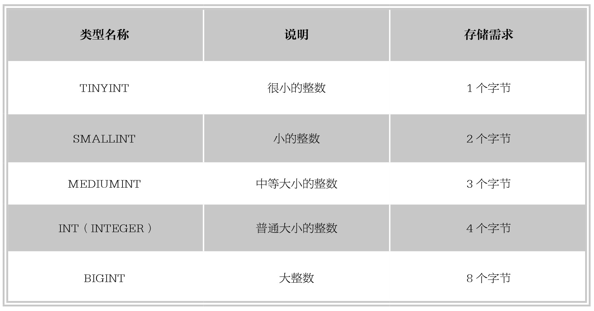
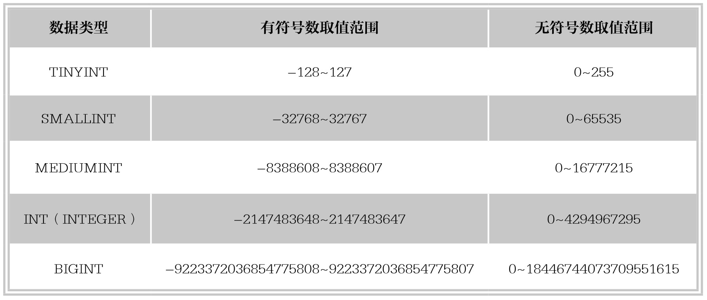

#### 
  6.1.1 整数类型

MySQL提供多种数值数据类型，不同的数据类型提供的取值范围不同，可以存储的值的范围越大，其所需要的存储空间也就越大，因此要根据实际需求选择适合的数据类型。MySQL主要提供的整数类型有：TINYINT、SMALLINT、MEDIUMINT、INT（INTEGER）、BIGINT。整数类型的字段属性可以添加AUTO_INCREMENT自增约束条件。下表列出了MySQL中整数型数据类型的说明。

表中显示，不同类型的整数存储时占用的字节不同，占用字节最少的是TINYINT类型，占用字节最大的是BIGINT，而占用字节多的类型所能存储的数字范围也大。可以根据占用的字节数计算出每一种整数类型的取值范围，例如TINYINT存储需求是一个字节（8 bits），那么TINYINT无符号数的最大值为28-1,即255；TINYINT有符号数的最大值为27-1,即127。用这种计算方式可以计算出其他整数类型的取值范围，如下表所示。

MySQL支持选择在该类型关键字后面的括号内指定整数值的显示宽度，可使用INT(M)进行设置。其中，M指示最大显示宽度，例如，INT(4)表示最大有效显示宽度为4。需要注意的是：显示宽度与存储大小或类型包含的值的范围无关。该可选显示宽度规定用于显示宽度小于指定的字段宽度的值时从左侧填满宽度。显示宽度只是指明MySQL最大可能显示的数值个数，数值的个数如果小于指定的宽度时，显示会由空格填充；如果插入了大于显示宽度的值，只要该值不超过该类型整数的取值范围，数据依然可以插入，而且显示无误。

例如，假设声明一个INT类型的字段如下。

&#13;
    year INT⑷&#13;

该声明指出，在year字段中的数据一般只显示4位数字的宽度。假如向year字段中插入数值12345，当使用select语句查询该列值的时候，MySQL显示的是完整的带有5位数字的12345，而不是4位数字。

其他整型数据类型也可以在定义表结构时指定所需要的显示宽度，如果不指定，则系统为每一种类型指定默认的宽度值，如范例6-1所示。

【范例6-1】

创建一个example数据库，并创建表ex1，其中字段a、b、c、d、e数据类型分别为TINYTEXT、SMALLTEXT、MEDIUMTEXT、INT、BIGINT，SQL语句如下。

&#13;
    create database example;&#13;
    use example;&#13;
    create table ex1(a TINYINT, b SMALLINT, c MEDIUMINT, d INT, e BIGINT);&#13;

执行成功后，使用DESC查看表结构，结果显示如下。

&#13;
    mysql> DESC ex1;&#13;
    +-------+--------------+------+-----+---------+-------+&#13;
    |Field|Type    |Null|Key|Default|Extra|&#13;
    +-------+--------------+------+-----+---------+-------+&#13;
    |a  |tinyint(4) |YES |  |NULL  |   |&#13;
    |b  |smallint(6) |YES |  |NULL  |   |&#13;
    |c  |mediumint(9)|YES |  |NULL  |   |&#13;
    |d  |int(11)   |YES |   |NULL  |   |&#13;
    |e  |bigint(20) |YES |   |NULL  |   |&#13;
    +-------+--------------+------+-----+---------+-------+&#13;

由MySQL执行结果可以看出，虽然定义数据表的时候未指明各数据类型的显示宽度，但是系统给每种数据类型添加了不同的默认显示宽度。这些显示宽度能够保证显示每一种数据类型的取值范围内所有的值。例如TINYINT有符号数和无符号数的取值范围分别是-128～127和0～255，由于符号占用一个数字位，所以TINYINT默认的显示宽度是4。同理，其他整数类型的默认显示宽度与其有符号数的最小值的宽度相同。

不同的整数类型的取值范围不同，所需的存储空间也不同，因此，在定义数据表的时候，要根据实际需求选择最合适的类型，这样做有利于节约存储空间，还有利于提高查询效率。

提示 
 整数类型的显示宽度只用于显示，不能限制取值范围和存储空间，如INT(4)会占用4个字节的存储空间，其允许的最大值是231-1或232-1，而不是9999。

现实生活中很多情况需要存储带有小数部分的数值，下面将介绍MySQL支持的能保存小数的数据类型。

