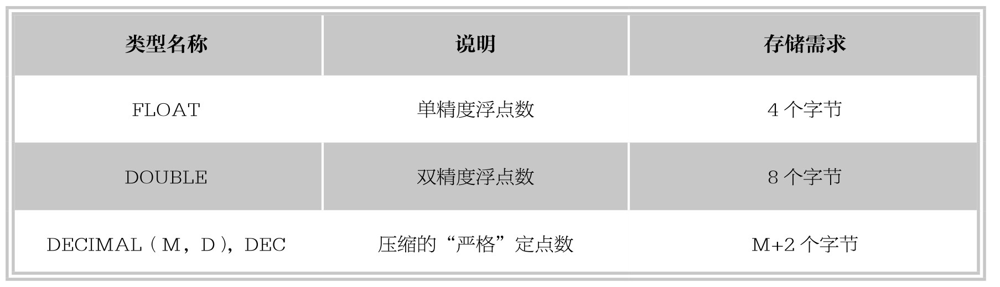

#### 
  6.1.2 浮点数类型和定点数类型

MySQL中使用浮点数和定点数表示小数。浮点类型有两种：单精度浮点类型（FLOAT）和双精度浮点类型（DOUBLE）。定点类型只有一种：DECIMAL。浮点类型和定点类型都可以用（M，D）来表示，其中M称为精度，表示总共的位数；D称为标度，表示小数的位数。浮点类型取值范围为：M(1～255)和D(1～30，且不能大于M-2)。分别表示显示宽度和小数位数。M和D在FLOAT和DOUBLE中是可选的，MySQL 3.23.6以上版本中，FLOAT和DOUBLE类型将被保存为硬件所支持的最大精度。DECIMAL的M和D值在MySQL 3.23.6后可选，默认D值为0，M值为10。下表列出了MySQL中的小数类型和存储需求。

DECIMAL 类型不同于FLOAT和DECIMAL，其中DECIMAL 实际是以字符串存储的。DECIMAL可能的最大取值范围与DOUBLE 一样，但是其有效的取值范围由M 和D 的值决定。如果改变M 而固定D，则其取值范围将随M 的变大而变大。如果固定M 而改变D，则其取值范围将随D 的变大而变小（但精度增加）。由MySQL中的小数类型表可以看出，DECIMAL的存储空间并不是固定的，而是由其精度值M决定，占用M+2个字节。

⑴FLOAT类型的取值范围如下。

①有符号的取值范围：-3.402823466E+38～-1.175494351E-38。

②无符号的取值范围：0和1.175494351E-38～3.402823466E+38。

⑵DOUBLE类型的取值范围如下。

①有符号的取值范围：-1.7976931348623157E+308～-2.2250738585072014E-308。

②无符号的取值范围：0和2.2250738585072014E-308～1.7976931348623157E+308。

技巧 
 不论是定点类型还是浮点类型，如果用户指定的精度值超过精度范围，则会进行四舍五入的处理。

【范例6-2】

创建表ex2，其中字段a、b、c的数据类型分别为FLOAT(4,1)、DOUBLE(4,1)和DECIMAL(4,1)，向表中插入数据4.23、4.26和4.234，SQL语句如下。

&#13;
    create table ex2(a FLOAT(4,1), b DOUBLE(4,1), c DECIMAL(4,1));&#13;

向表中插入数据的语句如下。

&#13;
    insert into ex2 values(4.23,4.26,4.234);&#13;

结果显示如下。

&#13;
    mysql> insert into ex2 values(4.23,4.26,4.234);&#13;
    Query OK, 1 row affected, 1 warning (0.05 sec)&#13;

MySQL执行结果可以看到，在插入数据时出现了一个警告信息，使用“show warnings；”语句查看警告信息，结果如下。

&#13;
    mysql> show warnings;&#13;
    +-------+------+----------------------------------------+&#13;
    |Level|Code|Message                |&#13;
    +-------+------+----------------------------------------+&#13;
    |Note |1265|Data truncated for column'c'at row 1|&#13;
    +-------+------+----------------------------------------+&#13;

警告信息中显示字段c，也就是定义的DECIMAL(4,1)定点数据类型在插入4.234的时候被警告字段被截断，而字段a和字段b在插入4.23和4.26时未给出警告。

执行select语句查看数据表ex2中内容，结果如下。

&#13;
    select * from ex2;&#13;
    mysql> select * from ex2;&#13;
    +------+------+------+&#13;
    |a  |b  |c  |&#13;
    +------+------+------+&#13;
    | 4.2| 4.3| 4.2|&#13;
    +------+------+------+&#13;

由执行结果看出，虽然字段a和字段b的FLOAT和DOUBLE数据类型在插入超过其精度范围的小数时，MySQL系统未给出警告，但是对插入的数据做了四舍五入的处理。同样，DECIMAL类型在对超出其精度范围的插入值做出四舍五入的处理的同时，系统还会给出截断插入值的警告。

提示 
 在MySQL中，在对精度要求比较高的时候（如货币、科学数据等），尽量选择使用DECIMAL类型。另外，两个浮点数在进行减法和比较运算的时候容易出问题，因此在使用浮点数类型时需要注意，并尽量避免做浮点数比较。

