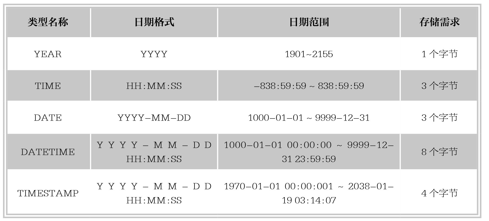

#### 
  6.1.3 日期与时间类型

MySQL中有多种表示日期的数据类型，主要有：YEAR、TIME、DATE、DATETIME、TIMESTAMP。例如：只需记录年份信息时，可以只用YEAR类型，而没有必要使用DATE。每一个类型都有合法的取值范围，当插入不合法的值时，系统会将“0”值插入到字段中。下表列出了MySQL中的日期与时间类型。

1.YEAR

YEAR类型使用单字节表示年份，在存储时只需要一个字节。可以使用不同格式指定YEAR的值。

⑴以4位字符串或者4位数字格式表示YEAR，其范围为‘1901’～‘2155’，输入格式为‘YYYY’或YYYY。例如，输入‘2015’或2015，插入到数据库的值都是2015。

⑵以2位字符串格式表示YEAR，范围为‘00’到‘99’。‘00’～‘69’和‘70’～‘99’范围的值分别被转换为2000～2069和1970～1999范围的YEAR值。输入‘0’与‘00’取值相同，皆为2000。插入超过取值范围的值将被转换为2000。

⑶以2位数字表示的YEAR，范围为1～99。1～69和70～99范围的值分别被转换为2001～2069和1970～1999范围的YEAR值。注意：0值被转换为0000，而不是2000。

提示 
 两位整数与两位字符串的取值范围稍有不同。例如：插入2000年，读者可能会使用数字格式的0表示YEAR，实际上，插入数据库的值为0000，而不是期望的20000。只有使用字符串格式的‘0’和‘00’，才可以得到2000。非法YEAR值被转换为0000。

【范例6-3】

创建数据表ex3，定义数据类型为YEAR的字段a，向表中插入值2015，‘2015’，‘2288’。

首先创建表ex3，SQL语句如下。

&#13;
    create table ex3(a YEAR);&#13;

向表中插入数据，SQL语句如下。

&#13;
    insert into ex3 values(2015),('2015');&#13;

执行结果，SQL语句如下。

&#13;
    mysql> insert into ex3 values(2015),('2015');&#13;
    Query OK, 2 rows affected (0.07 sec)&#13;
    Records:2 Duplicates:0 Warnings:0&#13;

再次向表中插入数据，SQL语句如下。

&#13;
    insert into ex3 values('2288');&#13;

执行结果如下所示。

&#13;
    mysql> insert into ex3 values('2288');&#13;
    ERROR 1264 (22003): Out of range value for column 'a' at row 1&#13;

MySQL给出一条错误提示，字段a中插入的第三个值‘2288’超出了YEAR类型的取值范围，此时不能正确地执行插入操作，使用select语句查看结果。

&#13;
    mysql> select * from ex3;&#13;
    +------+&#13;
    |a  |&#13;
    +------+&#13;
    | 2015 |&#13;
    | 2015 |&#13;
    +------+&#13;

由上述结果看出，插入值无论是数值型还是字符串型，都可以被正确地存储到数据库中；但是假如插入值超过了YEAR类型的取值范围，则插入失败。

【范例6-4】

向ex3表中字段a中插入1位和2位字符串表示的YEAR值，分别为‘0’，‘00’，‘89’和‘15’。

为了方便观察结果，可先清空表ex3中原有的数据，SQL语句如下。

&#13;
    delete from ex3;&#13;

然后再插入测试数据并查看数据，SQL语句如下。

&#13;
    insert into ex3 values('0'),('00'),('89'),('15');&#13;

结果如下。

&#13;
    mysql> insert into ex3 values('0'),('00'),('89'),('15');&#13;
    Query OK, 4 rows affected (0.04 sec)&#13;
    Records:4 Duplicates:0 Warnings:0&#13;

使用select语句查询表ex3，结果如下。

&#13;
    mysql> select * from ex3;&#13;
    +------+&#13;
    |a  |&#13;
    +------+&#13;
    | 2000 |&#13;
    | 2000 |&#13;
    | 1989 |&#13;
    | 2015 |&#13;
    +------+&#13;

执行结果可以看出，字符串‘0’和‘00’的作用相同，都被转换成了2000年，字符串‘89’被转换成了1989年，字符串‘15’被转换为2015年。

【范例6-5】

向ex3表中字段a中插入1位和2位数字表示的YEAR值，分别为0，00，89和15。

为了方便观察结果，可先清空表ex3中原有的数据，SQL语句如下。

&#13;
    delete from ex3;&#13;

然后再插入测试数据并查看数据，SQL语句如下。

&#13;
    insert into ex3 values(0),(00),(89),(15);&#13;

执行结果如下。

&#13;
    mysql> insert into ex3 values(0),(00),(89),(15);&#13;
    Query OK, 4 rows affected (0.07 sec)&#13;
    Records:4 Duplicates:0 Warnings:0&#13;

使用select语句查询表ex3内容，结果如下。

&#13;
    mysql> select * from ex3;&#13;
    +------+&#13;
    |a  |&#13;
    +------+&#13;
    | 0000 |&#13;
    | 0000 |&#13;
    | 1989 |&#13;
    | 2015 |&#13;
    +------+&#13;

从执行结果可以看出，数字0和00的作用相同，都被转换成了0000年，数字89被转换成了1989年，数字15被转换为2015年。

2.TIME

TIME类型用在只需记录时间信息的值，需要3个字节存储。格式为‘HH:MM:SS’。HH表示小时，MM表示分钟，SS表示秒。TIME类型的取值范围为-838:59:59～838:59:59，小时部分会这么大的取值是因为TIME类型不仅可以用来表示一天的时间（必须小于24小时），还可能是某个事件过去发生的时间或者两个事件之间的时间间隔（可以大于24小时，甚至可以为负值）。可以使用多种格式指定TIME的值。

⑴‘D HH:MM:SS’格式的字符串。‘也可以使用以下任何一种“非严格”的语法：‘HH:MM:SS’‘HH:MM’‘D HH:MM’‘D HH’或‘SS’。其中D表示日，取值范围是0～34。再插入数据库时，D被转换为小时保存，格式为‘D*24+HH’。

⑵‘HHMMSS’格式的、没有分隔符的字符串或HHMMSS格式的数值，假定是有意义的时间。例如，‘105508’被理解为‘10:55:08’,但‘106508’是不合法的，因为其分钟部分超出合理范围，存储时将变为00:00:00。

提示 
 为TIME类型输入简写值时应注意：如果没有冒号隔开，MySQL解释值的时候，假定最右边的两位表示秒。MySQL解释TIME值为过去的时间不是当天的时间。例如，读者可能认为’1011’和1011表示的是10:11:00，即10点11分，但是MySQL解释为00:10:11，即10分11秒。同样’20’和20被解释为00:00:20。

但是，如果TIME值中使用冒号时则一定被当作当天的时间，‘10:11’表示10:11:00。

【范例6-6】

创建表ex4，定义字段a的数据类型为TIME，向表中插入字符串值‘10:55:08’，‘22:59’，‘3 10:55’，‘4 08’，‘20’。

首先创建表ex4，SQL语句如下。

&#13;
    create table ex4(a TIME);&#13;

向表中插入数据并查询显示表ex4内容，SQL语句如下。

&#13;
    insert into ex4 values('10:55:08'),('22:59'),('3 10:55'),('4 08'),('20');&#13;
    select * from ex4;&#13;

执行结果如下。

&#13;
    mysql> create table ex4(a TIME);&#13;
    Query OK, 0 rows affected (0.29 sec)&#13;
    mysql> insert into ex4 values('10:55:08'),('22:59'),('3 10:55'),('4 08'),('20');&#13;
    Query OK, 5 rows affected (0.10 sec)&#13;
    Records:5 Duplicates:0 Warnings:0&#13;
    mysql> select * from ex4;&#13;
    +-----------+&#13;
    |a    |&#13;
    +-----------+&#13;
    |10:55:08 |&#13;
    |22:59:00 |&#13;
    |82:55:00 |&#13;
    | 104:00:00 |&#13;
    |00:00:20 |&#13;
    +-----------+&#13;

上述结果可以看出，字符串值‘10:55:08’被转换为10:55:08;字符串‘22:59’后面补秒数00被转换为22:59:00;字符串‘3 10:55’，经过计算3*24+10=82HH，最终被转换为82:55:00;字符串‘4 08’，经过计算4*24+08=104HH，最终被转换为104:00:00;字符串‘20’被转换为00:00:20。

提示 
 在使用‘D HH’格式时，小时一定要使用双位数值，如果是小于10的小时数，应在前面补0。

【范例6-7】

向表ex4中插入值‘105508’，123456，‘0’，106508。

为了方便观察结果，可先清空表ex4中原有的数据，SQL语句如下。

&#13;
    delete from ex4;&#13;
    insert into ex4 values ('105508'),(123456),('0');&#13;

然后再插入前3项测试数据，SQL语句如下。

&#13;
    mysql> insert into ex4 values ('105508'),(123456),('0');&#13;
    Query OK, 3 rows affected (0.06 sec)&#13;
    Records:3 Duplicates:0 Warnings:0&#13;

接着插入第4项测试数据，SQL语句如下。

&#13;
    insert into ex4 values (106508);&#13;

执行结果如下。

&#13;
    mysql> insert into ex4 values (106508);&#13;
    ERROR 1292 (22007): Incorrect time value: '106508' for column 'a' at row 1&#13;

执行结果显示，当插入TIME类型数据超过规定范围时，系统报错，因为数值106508中的分钟超过了59，数据不能插入。

查看表ex4中的结果如下。

&#13;
    mysql> select * from ex4;&#13;
    +----------+&#13;
    |a    |&#13;
    +----------+&#13;
    | 10:55:08 |&#13;
    | 12:34:56 |&#13;
    | 00:00:00 |&#13;
    +----------+&#13;

执行结果可以看出，字符串‘105508’被转换为10:55:08；数值123456被转换为12:34:56；字符串‘0’被转换为00:00:00；数值106508因为分钟超过取值范围，没有被插入到表中。

【范例6-8】

向表ex4中插入系统当前时间。

为了方便观察结果，可先清空表ex4中原有的数据，SQL语句如下。

&#13;
    delete from ex4;&#13;

然后再插入测试数据，SQL语句如下。

&#13;
    insert into ex4 values (CURRENT_TIME),(NOW());&#13;

查看结果如下。

&#13;
    mysql> insert into ex4 values (CURRENT_TIME),(NOW());&#13;
    Query OK, 2 rows affected (0.11 sec)&#13;
    Records:2 Duplicates:0 Warnings:0&#13;
    mysql> select * from ex4;&#13;
    +----------+&#13;
    |a    |&#13;
    +----------+&#13;
    | 15:20:46 |&#13;
    | 15:20:46 |&#13;
    +----------+&#13;

执行结果可以看出，获取当前系统时间函数（第7章有详解）CURRENT_TIME和NOW()将当前系统时间插入到字段a中。读者因为输入insert语句的时间不同，获取到的结果可能不同。

3.DATE类型

DATE类型用在仅需要存储日期值的时候，不存储时间，存储需要3个字节。日期格式为‘YYYY-MM-DD’其中YYYY表示年，MM表示月，DD表示日。给DATE类型的字段赋值时，可以使用字符串类型或者数值类型的数据，只要符合DATE的日期格式即可。常用的DATE格式如下。

⑴以‘YYYY-MM-DD’或者‘YYYYMMDD’字符串格式表示日期，取值范围为‘1000-01-01’～‘9999-12-31’。例如，输入‘2014-12-31’或者‘20141231’，插入数据库中的日期都是2014-12-31。

⑵以‘YY-MM-DD’或者‘YYMMDD’字符串格式表示日期，YY表示两位的年份值。两位的年份值不能清楚地表示具体的年份，因为不知道在哪个世纪。MySQL使用以下规则解释两位的年份值：‘00～69’范围的年份值转换为‘2000～2069’，‘70～99’范围的年份值转换为‘1970～1999’。例如，输入‘14-12-31’，插入数据库的日期是2014-12-31；输入‘95-12-31’，插入数据库的日期是1995-12-31。

⑶以YYMMDD数值格式表示日期，00～69范围的年份值转换为2000～2069；70～99范围的年份值转换为1970～1999。例如，输入141231插入数据库的日期为2014-12-31；输入951231，插入数据库的日期是1995-12-31。

使用CURRENT_DATE或者NOW()，插入当年计算机系统的日期。

【范例6-9】

创建数据库ex5，定义字段a为DATE数据类型，向表中插入4位字符表示年份格式的数据，如字符串格式的数据‘1998-10-30’，‘19981030’和‘20150316’。

首先创建表ex5，SQL语句如下。

&#13;
    create table ex5(a DATE);&#13;

向表中插入数据并查看插入结果，SQL语句如下。

&#13;
    insert into ex5 values('1998-10-30'),('19981030'),('20150316');&#13;

查看执行结果如下。

&#13;
    mysql> create table ex5(a DATE);&#13;
    Query OK, 0 rows affected (0.21 sec)&#13;
    mysql> insert into ex5 values('1998-10-30'),('19981030'),('20150316');&#13;
    Query OK, 3 rows affected (0.04 sec)&#13;
    Records:3 Duplicates:0 Warnings:0&#13;
    mysql> select * from ex5;&#13;
    +------------+&#13;
    |a     |&#13;
    +------------+&#13;
    | 1998-10-30 |&#13;
    | 1998-10-30 |&#13;
    | 2015-03-16 |&#13;
    +------------+&#13;

由执行结果可以看出，不同格式的字符串型的日期数据被正确插入数据表中。

【范例6-10】

向ex5表中插入两位字符表示年份的字符串数据，如‘98-12-31’，‘981231’，‘001231’，‘151213’。

为了方便观察结果，可先清空表ex5中原有的数据，SQL语句如下。

&#13;
    delete from ex5;&#13;

然后再插入测试数据，SQL语句如下。

&#13;
    insert into ex5 values('98-12-31'),('981231'),('001231'),('151213');&#13;

查看结果如下。

&#13;
    mysql> delete from ex5;&#13;
    Query OK, 3 rows affected (0.05 sec)&#13;
    mysql> insert into ex5 values('98-12-31'),('981231'),('001231'),('151213');&#13;
    Query OK, 4 rows affected (0.03 sec)&#13;
    Records:4 Duplicates:0 Warnings:0&#13;
    mysql> select * from ex5;&#13;
    +------------+&#13;
    |a     |&#13;
    +------------+&#13;
    | 1998-12-31 |&#13;
    | 1998-12-31 |&#13;
    | 2000-12-31 |&#13;
    | 2015-12-13 |&#13;
    +------------+&#13;

【范例6-11】

向ex5表中插入两位数字表示年份的日期值，如981231，001231，151213。

为了方便观察结果，可先清空表ex5中原有的数据，SQL语句如下。

&#13;
    delete from ex5;&#13;

然后再插入测试数据，SQL语句如下。

&#13;
    insert into ex5 values (981231),(001231),(151213);&#13;
    mysql> insert into ex5 values (981231),(001231),(151213);&#13;
    Query OK, 3 rows affected (0.04 sec)&#13;
    Records:3 Duplicates:0 Warnings:0&#13;
    mysql> select * from ex5;&#13;
    +------------+&#13;
    |a     |&#13;
    +------------+&#13;
    | 1998-12-31 |&#13;
    | 2000-12-31 |&#13;
    | 2015-12-13 |&#13;
    +------------+&#13;

注意 
 假如尝试把98-12-31作为数值类型插入到字段a，系统会提示错误。

&#13;
    mysql> insert into ex5 values (98-12-31);&#13;
    ERROR 1292 (22007): Incorrect date value: '55' for column 'a' at row 1&#13;

【范例6-12】

向表ex5中插入系统当前时间。

为了方便观察结果，可先清空表ex5中原有的数据，SQL语句如下。

&#13;
    delete from ex5;&#13;

然后插入测试数据，SQL语句如下。

&#13;
    insert into ex5 values (CURRENT_DATE);&#13;

查看结果如下。

&#13;
    mysql> insert into ex5 values (CURRENT_DATE);&#13;
    Query OK, 1 row affected (0.08 sec)&#13;

接着再插入测试数据，SQL语句如下。

&#13;
    insert into ex5 values (NOW());&#13;

执行insert语句，系统提出警告，使用show查看语句内容，SQL语句如下。

&#13;
    mysql> insert into ex5 values (NOW());&#13;
    Query OK, 1 row affected, 1 warning (0.07 sec)&#13;
    mysql> show warnings;&#13;
    +-------+------+---------------------------------------------------------------------+&#13;
    |Level|Code|Message                              |&#13;
    +-------+------+---------------------------------------------------------------------+&#13;
    |Note |1292|Incorrect date value:‘2015-03-22 17:06:14’for column‘a’at row 1|&#13;
    +-------+------+---------------------------------------------------------------------+&#13;

查看ex5表内容如下。

&#13;
    mysql> select * from ex5;&#13;
    +------------+&#13;
    |a     |&#13;
    +------------+&#13;
    | 2015-03-22 |&#13;
    | 2015-03-22 |&#13;
    +------------+&#13;
    2 rows in set (0.00 sec)&#13;

执行结果可以看出，获取当前系统日期函数（第7章有详解）CURRENT_DATE和NOW()将当前系统日期插入到字段a中。由于NOW()函数得到的是系统的日期和时间值，但是字段a定义是DATE类型，所以数据类型不一致，系统提出警告。从表内容可以看出，虽然被警告，系统还是将NOW()函数得到的值截取日期部分插入字段a。读者因为输入insert语句的日期不同，获取到的结果可能不同。

提示 
 MySQL允许“不严格”的语法插入日期，任何标点符号都可以用作日期部分的间隔符。例如，‘95-12-13’，‘95.12.31’，‘95/12/31’和‘95@12@31’等字符串的表示方法都是等价的，这些值都可以正确地插入到数据库。

4.DATETIME

DATETIME类型同时包含日期和时间信息，存储需要8个字节。日期格式为‘YYYY-MM-DD HH:MM:SS’，其中YYYY表示年，MM表示月，DD表示日；HH表示小时，MM表示分钟，SS表示秒。在给DATETIME类型的字段赋值时，可以使用字符串类型或者数值类型的数据，只需符合DATETIME的日期格式即可。常用的DATETIME的格式如下。

⑴以‘YYYY-MM-DD HH:MM:SS’或者‘YYYYMMDDHHMMSS’字符串格式表示日期时间，取值范围为‘1000-01-01 00:00:00’～‘9999-12-31 23:59:59’。例如输入‘2014-12-31 11:28:30’或者‘20141231112830’，插入数据库的DATETIME值都是2014-12-31 11:28:30。

⑵以‘YY-MM-DD HH:MM:SS’或者’YYMMDDHHMMSS’字符串格式表示日期时间，在这里YY表示年份值。和DATE类型一样，‘00～69’范围的年份值转换为‘2000～2069’，‘70～99’范围的年份值转换为‘1970～1999’。例如输入‘14-12-31 11:28:30’，插入数据库的DATETIME类型值为2014-12-31 11:28:30；输入‘951231112830’，插入数据库的DATETIME类型值为1995-12-31 11:28:30。

⑶以YYYYMMDDHHMMSS或者YYMMDDHHMMSS数值格式表示日期时间，例如输入20141231112830，插入数据库的DATETIME为2014-12-31 11:28:30；输入951231112830，插入数据库的DATETIME类型值为1995-12-31 11:28:30。

【范例6-13】

创建表ex6，定义字段a的数据类型为DATETIME，向表中插入四位字符表示年份的字符串数据，如‘1999-09-09 09:09:09‘，‘19990909090909‘和‘20150303030303’。

首先创建表ex6，SQL语句如下。

&#13;
    create table ex6(a DATETIME);&#13;

向表中插入数据并查看插入结果，SQL语句如下。

&#13;
    insert into ex6 values ('1999-09-09 09:09:09'),('19990909090909'),('20150303030303');&#13;

查看执行结果如下。

&#13;
    mysql> create table ex6(a DATETIME);&#13;
    Query OK, 0 rows affected (0.24 sec)&#13;
    mysql> insert into ex6 values ('1999-09-09 09:09:09'),('19990909090909'),('20150303030303');&#13;
    Query OK, 3 rows affected (0.06 sec)&#13;
    Records:3 Duplicates:0 Warnings:0&#13;
    mysql> select * from ex6;&#13;
    +---------------------+&#13;
    |a         |&#13;
    +---------------------+&#13;
    | 1999-09-09 09:09:09 |&#13;
    | 1999-09-09 09:09:09 |&#13;
    | 2015-03-03 03:03:03 |&#13;
    +---------------------+&#13;

由执行结果可以看出，不同格式的字符串型的日期时间数据被正确插入数据表中。

【范例6-14】

向ex6表中插入两位字符表示年份的字符串数据，如‘99-09-09 09:09:09’，‘9909090909090’，‘150303030303’。

为了方便观察结果，可先清空表ex6中原有的数据，SQL语句如下。

&#13;
    delete from ex6;&#13;

然后再插入测试数据，SQL语句如下。

&#13;
    insert into ex6 values ('99-09-09 09:09:09'),('990909090909'),('150303030303');&#13;

查看结果如下。

&#13;
    mysql> delete from ex6;&#13;
    Query OK, 3 rows affected (0.04 sec)&#13;
    mysql> insert into ex6 values ('99-09-09 09:09:09'),('990909090909'),('150303030303');&#13;
    Query OK, 3 rows affected (0.08 sec)&#13;
    Records:3 Duplicates:0 Warnings:0&#13;
    mysql> select * from ex6;&#13;
    +---------------------+&#13;
    |a         |&#13;
    +---------------------+&#13;
    | 1999-09-09 09:09:09 |&#13;
    | 1999-09-09 09:09:09 |&#13;
    | 2015-03-03 03:03:03 |&#13;
    +---------------------+&#13;

【范例6-15】

向ex6表中插入数值类型的日期时间值，如19981231121212，150303030303。

为了方便观察结果，可先清空表ex6中原有的数据，SQL语句如下。

&#13;
    delete from ex6;&#13;

然后再插入测试数据，SQL语句如下。

&#13;
    insert into ex6 values (19981231121212),(150303030303);&#13;

查看结果如下。

&#13;
    mysql> insert into ex6 values (19981231121212),(150303030303);&#13;
    Query OK, 2 rows affected (0.04 sec)&#13;
    Records:2 Duplicates:0 Warnings:0&#13;
    mysql> select * from ex6;&#13;
    +---------------------+&#13;
    |a         |&#13;
    +---------------------+&#13;
    | 1998-12-31 12:12:12 |&#13;
    | 2015-03-03 03:03:03 |&#13;
    +---------------------+&#13;

【范例6-16】

向表ex6中插入系统当前日期和时间。

为了方便观察结果，可先清空表ex6中原有的数据，SQL语句如下。

&#13;
    delete from ex6;&#13;

然后插入测试数据，SQL语句如下。查看结果如下。

&#13;
    insert into ex6 values (CURRENT_TIMESTAMP,NOW());&#13;

&#13;
    mysql> insert into ex6 values (CURRENT_TIMESTAMP),(NOW());&#13;
    Query OK, 2 rows affected (0.05 sec)&#13;
    Records:2 Duplicates:0 Warnings:0&#13;
    mysql> select * from ex6;&#13;
    +---------------------+&#13;
    |a         |&#13;
    +---------------------+&#13;
    | 2015-03-22 17:17:07 |&#13;
    | 2015-03-22 17:17:07 |&#13;
    +---------------------+&#13;

执行结果可以看出，获取当前系统日期时间函数（第7章有详解）CURRENT_TIMESTAMP和NOW(),然后将当前系统日期时间插入到字段a中。

技巧 
 MySQL允许“不严格”的语法插入日期，任何标点符号都可以用作日期部分或时间部分的间隔符。例如，‘95-12-13 11:28:30’，‘95.12.31 11+28+30’，‘95/12/31 11*28*30’和‘95@12@31 11^28^30’等表示方法都是等价的，这些值都可以正确地插入到数据库。

5.TIMESTAMP

TIMESTAMP的显示格式与DATETIME相同，显示宽度固定在19个字符，格式为YYYY-MM-DD HH:MM:SS，存储需要4个字节。但是TIMESTAMP列的取值范围小于DATETIME的取值范围，为‘1970-01-01 00:00:01’ UTC～‘2038-01-19 03:14:07’ UTC（Coordinated Universal Time，世界标准时间），因此在插入数据时，要保证在合法的取值范围内。

【范例6-17】

创建表ex7，定义字段a的数据类型为TIMESTAMP，向表中插入各种形式的日期时间数据，如‘1999-09-09 09:09:09’，‘19990909090909’ 和‘150303030303’，‘99@12@31 10*10*10’，150316121212, NOW()。

首先创建表ex7，SQL语句如下。

&#13;
    create table ex7(a TIMESTAMP);&#13;

向表中插入测试数据并查看插入结果，SQL语句如下。

&#13;
    insert into ex7 values('1999-09-09 09:09:09'),('19990909090909'),('150303030303');&#13;
    insert into ex7 values('99@12@31 10*10*10'),(150316121212),(NOW());&#13;

查看执行结果如下。

&#13;
    mysql> create table ex7(a TIMESTAMP);&#13;
    Query OK, 0 rows affected (0.33 sec)&#13;
    mysql> insert into ex7 values('1999-09-09 09:09:09'),('19990909090909'),('150303030303');&#13;
    Query OK, 3 rows affected (0.05 sec)&#13;
    Records:3 Duplicates:0 Warnings:0&#13;
    mysql> insert into ex7 values('99@12@31 10*10*10'),(150316121212),(NOW());&#13;
    Query OK, 3 rows affected (0.10 sec)&#13;
    Records:3 Duplicates:0 Warnings:0&#13;
    mysql> select * from ex7;&#13;
    +---------------------+&#13;
    |a         |&#13;
    +---------------------+&#13;
    | 1999-09-09 09:09:09 |&#13;
    | 1999-09-09 09:09:09 |&#13;
    | 2015-03-03 03:03:03 |&#13;
    | 1999-12-31 10:10:10 |&#13;
    | 2015-03-16 12:12:12 |&#13;
    | 2015-03-22 17:19:11 |&#13;
    +---------------------+&#13;

由执行结果可以看出，不同格式的日期时间数据都被正确插入数据表中。

【范例6-18】

向ex7表中插入当年日期时间，查看插入值，并更改时区为东7区，再次查看插入值。

为了方便观察结果，可先清空表ex7中原有的数据，SQL语句如下。

&#13;
    delete from ex7;&#13;

然后再插入测试数据，为当前时区的系统时间（作者在中国，时区是东8区），SQL语句如下。

&#13;
    insert into ex7 values (NOW());&#13;

查看结果如下。

&#13;
    mysql> delete from ex7;&#13;
    Query OK, 6 rows affected (0.04 sec)&#13;
    mysql> insert into ex7 values (NOW());&#13;
    Query OK, 1 row affected (0.05 sec)&#13;
    mysql> select * from ex7;&#13;
    +---------------------+&#13;
    |a         |&#13;
    +---------------------+&#13;
    | 2015-03-22 17:21:44 |&#13;
    +---------------------+&#13;

接着，修改当前时区为东7区，SQL语句如下。

&#13;
    set time_zone='+7:00';&#13;

然后再次查看插入时的日期时间值，SQL语句如下。

&#13;
    mysql> set time_zone='+7:00';&#13;
    Query OK, 0 rows affected (0.03 sec)&#13;
    mysql> select * from ex7;&#13;
    +---------------------+&#13;
    |a         |&#13;
    +---------------------+&#13;
    | 2015-03-22 16:21:44 |&#13;
    +---------------------+&#13;

由上述结果可以看出，因为东7区比东8区慢一个小时，因此查询结果在经过时区转换之后，值减少了一个小时。

提示 
 TIMESTAMP和DATETIME除了存储字节和支持的范围不同之外，还有一个最大的区别：DATETIME在存储日期数据时，按实际输入的格式存储，即输入什么就存储什么，和读者所在的时区无关；而TIMESTAMP值的存储是以UTC（世界标准时间）格式保存，存储时对当前时区进行转换，检索时再转换回当前时区。在进行查询时，根据读者所在时区不同，显示的日期时间值是不同的。

