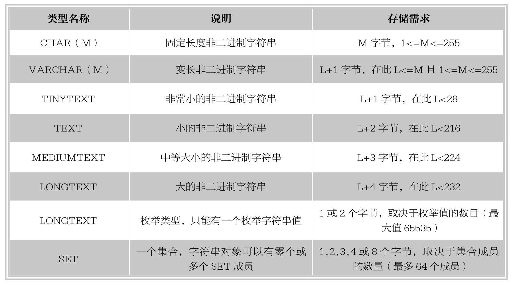
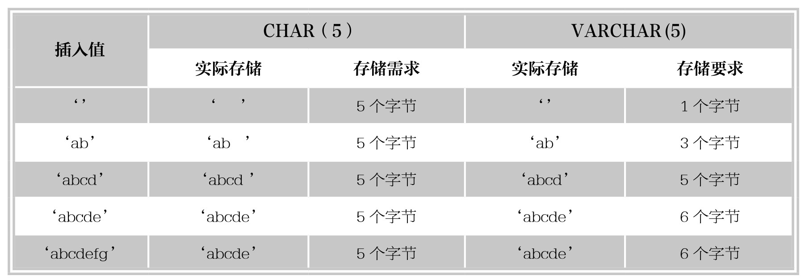
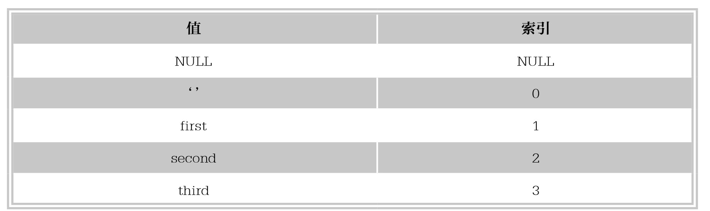

#### 
  6.1.4 字符串类型

字符串类型用于存储字符串数据，MySQL支持两类字符串数据：文本字符串和二进制字符串。本小节所讲的是文本字符串类型。文本字符串可以进行区分或不区分大小写的串比较，也可以进行模式匹配查找。MySQL中字符串类型指的是CHAR、VARCHAR、TINYTEXT、TEXT、MEDIUMTEXT、LONGTEXT、ENUM和SET。下表列出了MySQL中的字符串数据类型。

VARCHAR和TEXT类型是变长类型，它们的存储需求取决于值得实际长度（上表中用L表示），而不是取决于类型的最大可能长度。例如，一个VARCHAR(10)字段能保存最大长度为10个字符的一个字符串，实际的存储需求是字符串的长度L，加上1个字节以记录字符串的长度。例如，字符串‘teacher’，L是7，而存储需求是8个字节。

1.CHAR和VARCHAR类型

CHAR(M)为固定长度字符串，在定义时指定字符串长度，当保存时在右侧填充空格以达到指定的长度。M表示字符串长度，M的取值范围是0～255。例如，CHAR(4)定义了一个固定长度的字符串字段，其包含的字符个数最大为4。当检索到CHAR的值时，尾部的空格将被删除掉。

VARCHAR(M)是长度可变的字符串，M表示最大的字段长度。M的取值范围是0～65535。VARCHAR的最大实际长度由最长字段的大小和使用的字符集确定，而其实际占用的空间为字符串的实际长度加1。例如，VARCHAR(40)定义了一个最大长度为40的字符串，如果插入的字符串只有20个字符，则实际存储的字符串为20个字符和一个字符串结束字符。VARCHAR在值保存和检索时尾部的空格仍保留。

【范例6-19】

将不同字符串存储到CHAR(5)和VARCHAR(5)数据类型的字段中，差别通过下表说明。

从上表可以看出，CHAR(5)定义了固定长度为5的字段，不管存入的字符串长度为多少，所占用的空间都是5个字节；VARCHAR(5)定义的字段所占的字节数为实际字符串长度加1。

【范例6-20】

创建表ex8，定义字段a为CHAR(5)和字段b为VARCHAR()，向表中插入字符串数据‘abc ’。

首先创建表ex8，SQL语句如下。

&#13;
    create table ex8(a CHAR(5), b VARCHAR(5));&#13;

向表中插入数据并查看插入结果，SQL语句如下。

&#13;
    insert into ex8 values('ab ','ab ');&#13;

查看执行结果如下。

&#13;
    mysql> create table ex8(a CHAR(5), b VARCHAR(5));&#13;
    Query OK, 0 rows affected (0.31 sec)&#13;
    mysql>insert into ex8 values('ab ','ab ');&#13;
    Query OK, 1 row affected (0.06 sec)&#13;
    mysql> select * from ex8;&#13;
    +------+-------+&#13;
    |a  |b  |&#13;
    +------+-------+&#13;
    |ab |ab  |&#13;
    +------+-------+&#13;

为了更明显地显示出字段a和b存储的字符串不同，使用MySQL的concat函数返回带有连接参数‘(‘和’)’的结果，SQL语句如下。

&#13;
    select concat('(',a,')'),concat('(',b,')') from ex8;&#13;

显示结果如下。

&#13;
    mysql> select concat('(',a,')'),concat('(',b,')') from ex8;&#13;
    +-------------------+-------------------+&#13;
    | concat('(',a,')') | concat('(',b,')') |&#13;
    +-------------------+-------------------+&#13;
    |(ab)       |(ab )     |&#13;
    +-------------------+-------------------+&#13;

由结果可以看出，字段a的CHAR(5)在存储字符串‘ab ’的时候将末尾的3个空格自动删除了，而字段b的VARCHAR(5)保留了空格。

提示 
 CHAR(5)与VARCHAR(5)储存区别表中，最后一行要插入的字符串值大于字段定义的类型长度，只有在使用“不严格”模式时，字符串才会被截断插入；如果MySQL运行在“严格”模式，超过字段长度的值不会被保存，而是会出现错误信息：“ERROR 1406(22001):Data too long for column”，即字符串长度超过指定长度，无法插入。

2.TEXT类型

TEXT字段保存非二进制字符串，如文章内容、评论和留言等。当保存或查询TEXT字段的值时，不删除尾部空格。TEXT类型分为4种：TINYTEXT、TEXT、MEDIUMTEXT和LONGTEXT。不同的TEXT类型所需存储空间和数据长度不同。

⑴TINYTEXT最大长度为255（28-1）字符。

⑵TEXT最大长度为65535（216-1）字符。

⑶MEDIUMTEXT最大长度为16777215（224-1）字符。

⑷LONGTEXT最大长度为4294967295或4GB（232-1）字符。

3.ENUM类型

ENUM是一个字符串对象，其值为表创建时在字段规定中枚举的一列值，语法格式如下。

&#13;
    字段名 ENUM(‘值1’,‘值2’,…，‘值n’)&#13;

其中，“字段”名指的是将要定义的字段名称；“值n”指的是枚举列表中的第n个值。ENUM类型的字段在取值时，只能在指定的枚举列表中取，而且一次只能取一个值。如果创建的成员中有空格，其尾部的空格将自动被删除。ENUM值在内部用整数表示，每个枚举值均有一个索引值，列表值所允许的成员值从1开始编号，MySQL存储的就是这个索引编号。枚举最多可以有65535个元素。

例如定义ENUM类型的字段(‘first’,’second’,’third’)，该字段可以取的值和每个值的索引以下表说明。

ENUM值依照索引顺序排列，并且空字符串排在非空字符串之前，NULL值排在其他所有枚举值之前。

【范例6-21】

创建表ex9，定义字段a为ENUM的数据类型，字段a的枚举列表为(‘x’,’y’,’z’)，查看字段a的成员并显示其索引值。

首先创建表ex9，SQL语句如下。

&#13;
    create table ex9 (a ENUM('x','y','z'));&#13;

向表中插入数据并查看插入结果，SQL语句如下。

&#13;
    insert into ex9 values('y'),('x'),('z'),(NULL);&#13;

使用a+0查看表中字段a的值的索引值，查看执行结果如下。

&#13;
        mysql>create table ex9(a ENUM(‘x’,’y’,’z’));&#13;
        Query OK,0 rows affected(0.31 sec)&#13;
        mysql>insert into ex9 values(‘y’),(‘x’),(‘z’),(NULL);&#13;
        Query OK,4 rows affected(0.05 sec)&#13;
        Records:4 Duplicates:0 Warnings:0&#13;
        mysql>select a,a+0 from ex9;&#13;
        +------+------+&#13;
        |a  |a+0 |&#13;
    +------+------+&#13;
    |y  |   2|&#13;
    |x  |   1|&#13;
    |z  |   3|&#13;
    | NULL | NULL |&#13;
    +------+------+&#13;

由执行结果可以看出，字段a枚举列表中的索引值跟定义的时候一致。

技巧 
 ENUM类型的字段有一个默认值NULL。如果将ENUM列声明为允许NULL，NULL值则为该字段的一个有效值，并且默认值为NULL。如果ENUM列被声明为NOT NULL，其默认值为允许的值列的第1个元素。

【范例6-22】

创建表ex10，定义字段score为TINYINT类型，字段grade为ENUM类型，枚举列表值为(‘disti nct’,‘good’,‘pass’,‘fail’)，向表ex10中插入测试数据。

首先创建表ex10，SQL语句如下。

&#13;
    create table ex10 (score TINYINT, grade ENUM('distinct','good','pass','fail'));&#13;

向表中插入数据并查看插入结果，SQL语句如下。

&#13;
    insert into ex10 values (80,'good'),(98,1),(65,3),(46,'fail');&#13;

查看执行结果如下。

&#13;
    mysql> create table ex10 (score TINYINT, grade ENUM(‘distinct’,‘good’,‘pass’,‘fail’));&#13;
    Query OK, 0 rows affected (0.36 sec)&#13;
    mysql> insert into ex10 values (80,‘good’),(98,1),(65,3),(46,‘fail’);&#13;
    Query OK, 4 rows affected (0.05 sec)&#13;
    Records:4 Duplicates:0 Warnings:0&#13;
    mysql> select * from ex10;&#13;
    +-------+----------+&#13;
    |score|grade  |&#13;
    +-------+----------+&#13;
    |  80|good  |&#13;
    |  98|distinct|&#13;
    |  65|pass  |&#13;
    |  46|fail  |&#13;
    +-------+----------+&#13;

假如再插入测试数据，SQL语句如下。

&#13;
    insert into ex10 values (100,'best');&#13;

显示结果如下。

&#13;
    mysql> insert into ex10 values (100,'best');&#13;
    ERROR 1265 (01000): Data truncated for column 'grade' at row 1&#13;

由执行结果可以看出，无论插入ENUM类型枚举列表中的字符串值还是其对应索引的编号，都可以正确存储数据。但是假如插入的值不是枚举列表中的内容，比如上例中的‘best’，系统就会报错。

4.SET类型

SET类型是一个字符串对象，可以有零或多个值，SET字段最大可以有64个成员，其值为表创建时规定的一列值。指定包括多个SET成员的SET字段值时，各成员之间用逗号隔开，语法格式如下。

&#13;
    SET(‘值1’,‘值2’,…，‘值n’)&#13;

与ENUM类型相同，SET值在内部用整数表示，列表中每一个值都有一个索引编号。当创建表时，SET成员值的尾部空格将自动被删除。但与ENUM类型不同的是，ENUM类型的字段只能从定义的字段值中选择一个值插入，而SET类型的字段可从定义的列值中选择多个字符的联合。

如果插入SET字段中的值有重复，则MySQL自动删除重复的值；插入SET字段的值的顺序不重要，MySQL会在存入数据库的时候，按照定义的顺序显示；如果插入了不正确的值，默认情况下，MySQL将忽视这些值，并给出相应警告。

【范例6-23】

创建表ex11，定义字段a为SET类型，取值列表为(‘x’,’y’,’z’)，插入测试数据（‘x’）,(‘x, z,x’),(‘z,x,y’),(‘z,y’)，(‘m,y’)。

首先创建表ex11，SQL语句如下。

&#13;
    create table ex11 (a SET('x','y','z'));&#13;

向表中插入数据并查看插入结果，SQL语句如下。

&#13;
    insert into ex11 values ('x'),('x,z,x'),('z,x,y'),('z,y');&#13;

查看执行结果如下。

&#13;
    mysql> create table ex11 (a SET('x','y','z'));&#13;
    Query OK, 0 rows affected (0.31 sec)&#13;
    mysql> insert into ex11 values ('x'),('x,z,x'),('z,x,y'),('z,y');&#13;
    Query OK, 4 rows affected (0.04 sec)&#13;
    Records:4 Duplicates:0 Warnings:0&#13;

继续向表中插入数据，SQL语句如下。

&#13;
    insert into ex11 values ('m,y');&#13;

执行结果如下。

&#13;
    mysql> insert into ex11 values ('m,y');&#13;
    ERROR 1265 (01000): Data truncated for column 'a' at row 1&#13;

由于插入的数据m不是SET集合中的值，系统提示错误。

最后查看表ex11内容，结果如下。

&#13;
    mysql> select * from ex11;&#13;
    +-------+&#13;
    |a  |&#13;
    +-------+&#13;
    |x  |&#13;
    |x,z |&#13;
    | x,y,z |&#13;
    |y,z |&#13;
    +-------+&#13;

由结果可以看出，如果插入的值被包含在SET集合中，但是有重复的值，结果只取一个，例如‘x,z,x’，最终结果为’x,z’；如果插入的值不按SET定义时的顺序排列，则会自动排序插入，如‘z,x,y’，最终结果为‘x,y,z’；如果试图插入非SET集合中的值，系统提示错误，禁止插入。

