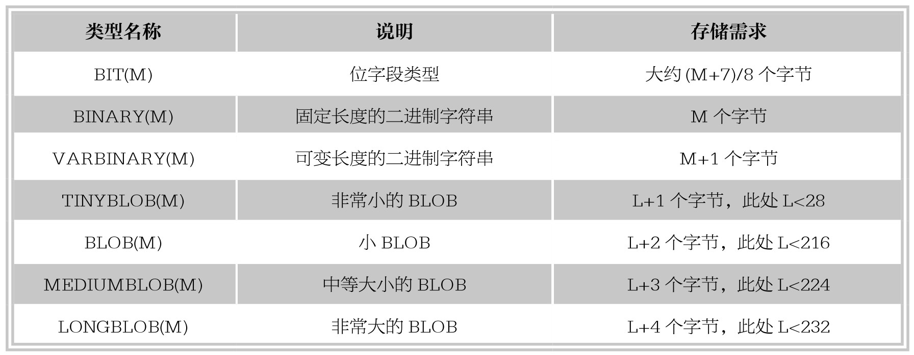
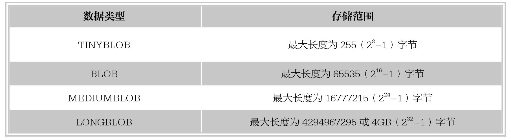

#### 
  6.1.5 二进制类型

MySQL支持两种字符型数据：文本字符串和二进制字符串。前面讲了文本字符串类型，本小节讲解MySQL中用来存储二进制数据的数据类型。MySQL中的二进制数据类型有：BIT、BINARY、VARBINARY，TINYBLOB、BLOB、MEDIUMBLOB和LONGBLOB。下表列出了MySQL中的二进制数据类型。

1.BIT类型

上表中，BIT(M)为位字段类型，M表示每个值的位数，取值范围为1～64。如果M被省略，默认为1。如果为BIT(M)字段分配的值的长度小于M位，在值的左边用0填充。例如，为BIT(6)字段分配一个值b‘101’，其效果与分配b‘000101’相同。BIT数据类型用来保存位字段值，例如，以二进制的形式保存十进制数据12，12的二进制形式为1100，在这里需要位数至少为4位的BIT类型，即可以定义字段类型BIT(4)。大于二进制1111的数据不能插入BIT(4)类型的字段中。

【范例6-24】

创建表ex12，定义字段a为BIT(4)类型，向表中插入数值3,7,15,16。

首先创建表ex12，SQL语句如下。

&#13;
    create table ex12 (a BIT(4));&#13;

向表中插入数据并查看插入结果，SQL语句如下。

&#13;
    insert into ex12 values (3),(7),(15);&#13;

查看执行结果如下。

&#13;
    mysql> create table ex12 (a BIT(4));&#13;
    Query OK, 0 rows affected (0.28 sec)&#13;
    mysql> insert into ex12 values (3),(7),(15);&#13;
    Query OK, 3 rows affected (0.05 sec)&#13;
    Records:3 Duplicates:0 Warnings:0&#13;

继续向表中插入测试数据，SQL语句如下。

&#13;
    insert into ex12 values (16);&#13;

执行结果如下。

&#13;
    mysql> insert into ex12 values (16);&#13;
    ERROR 1406 (22001): Data too long for column 'a' at row 1&#13;

结果显示，十进制数16已超出了BIT(4)的取值范围。

最后，要使用BIN()函数将数值转换为二进制，a+0表示将二进制的结果转换为对应的数值，并select查询结果，SQL语句如下。

&#13;
    select BIN(a+0) from ex12;&#13;

执行结果如下。

&#13;
    mysql> select BIN(a+0) from ex12;&#13;
    +----------+&#13;
    | BIN(a+0) |&#13;
    +----------+&#13;
    |11   |&#13;
    |111   |&#13;
    |1111  |&#13;
    +----------+&#13;

提示 
 默认情况下，MySQL不可以插入超出该字段类型允许范围的值，如十进制数16，超出了BIT(4)的取值范围，系统报错。

2.BINARY和VARBINARY类型

BINARY和VARBINARY类型类似于CHAR和VARCHAR，不同的是它们包含二进制字符串。其语法格式如下。

字段名称 BINARY(M)或VARBINARY(M)

其中，BINARY类型的长度是固定的，指定长度后，不足最大长度的，将在右边填充‘\0’补齐以达到指定长度。例如：指定字段数据类型为BINARY(4)，当插入‘a’时，存储的内容实际为‘a\0\0\0’,当插入‘ab’时，实际存储的内容为‘ab\0\0’，不管存储的内容是否达到指定的长度，其存储空间均为指定的值M。

VARBINARY类型的长度是可变的，指定好长度后，其长度可以在0到最大值之间。例如，指定字段数据类型为VARBINARY(30)，如果插入的值的长度只有20，则实际存储空间为20+1，即其实际占用的空间为字符串的实际长度加1。

【范例6-25】

创建表ex13，定义字段a为BINARY(3)类型，字段b为VARBINARY(3)，向表中插入测试数值5，比较字段a和b的存储空间。

首先创建表ex13，SQL语句如下。

&#13;
    create table ex13 (a BINA&#13;
    RY(3), b VARBINARY(3));&#13;

向表中插入数据并查看插入结果，SQL语句如下。

&#13;
    insert into ex13 values (5,5);&#13;

查看执行结果如下。

&#13;
    mysql> create table ex13 (a BINARY(3), b VARBINARY(3));&#13;
    Query OK, 0 rows affected (0.56 sec)&#13;
    mysql> insert into ex13 values (5,5);&#13;
    Query OK, 1 row affected (0.04 sec)&#13;

使用length()函数查看字段a和字段b中存储数据的长度，SQL语句如下。

&#13;
    select length(a),length(b) from ex13;&#13;

执行结果如下。

&#13;
    mysql> select length(a),length(b) from ex13;&#13;
    +-----------+-----------+&#13;
    | length(a) | length(b) |&#13;
    +-----------+-----------+&#13;
    |    3|    1|&#13;
    +-----------+-----------+&#13;

结果显示，字段a的值的存储长度是3，而字段b的数据长度是1。

为了进一步确认数值5在字段a和b中不同的存储方式，使用以下SQL查询。

&#13;
    select a,b,a='5',a='5\0\0',b='5',b='5\0\0' from ex13;&#13;

执行结果如下。

&#13;
    mysql> select a,b,a='5',a='5\0\0',b='5',b='5\0\0' from ex13;&#13;
    +------+------+-------+-----------+-------+-----------+&#13;
    |a  |b  |a='5'|a='5\0\0'|b='5'|b='5\0\0'|&#13;
    +------+------+-------+-----------+-------+-----------+&#13;
    |5  |5  |  0|    1|  1|    0|&#13;
    +------+------+-------+-----------+-------+-----------+&#13;

由执行结果可以看出，字段a和b长度不同，因为字段a是BINARY类型，不足的空间用‘\0’补满，而字段b是VARBINARY类型，是可变的长度，不需要填充。

3.BLOB类型

BLOB类型是一个二进制大对象，用来存储可变数量的数据。BLOB类型分为4种：TINYBLOB、BLOB、MEDIUMBLOB和LONGBLOB，它们的存储范围见下表。

BLOB字段存储的是二进制字符串（字节字符串），TEXT存储的是非二进制字符串（字符字符串）。BLOB字段没有字符集，且排列和比较基于字段值字节的数值，TEXT字段有一个字符集，并根据字符集对值进行排序和比较。

