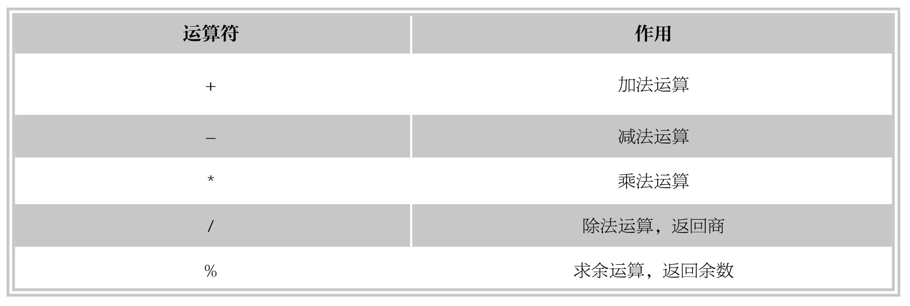

#### 
  6.3.2 算术运算符

算术运算符是SQL中最基本的运算符，MySQL中的算术运算符如下表所示。

下面分别介绍不同算术运算符的使用方法。

【范例6-26】

创建表tmp14，定义数据类型为INT的字段num，插入值64，对num值进行算术 运算。

首先，创建表tmp14，输入语句如下。

&#13;
    CREATE TABLE tmp14(num INT);&#13;

向字段num插入数据99，语句如下。

&#13;
    INSERT INTO tmp14 value(99);&#13;

接下来，对num值进行加法和减法运算，语句如下。

&#13;
    mysql> SELECT num,num+1,num-5+1,num+1-5,num+1.5 FROM tmp14;&#13;
    +------+-------+---------+---------+---------+&#13;
    |num |num+1|num-5+1|num+1-5|num+1.5|&#13;
    +------+-------+---------+---------+---------+&#13;
    | 99| 100|   95|   95| 100.5|&#13;
    +------+-------+---------+---------+---------+&#13;
    1 row in set (0.05 sec)&#13;

由计算结果可以看到，可以对num字段的值进行加法和减法的运算，而且由于“+”和“-”的优先级相同，因此先加后减，或先减后加之后的结果是相同的。

【范例6-27】

对tmp14表中的num进行乘法、除法运算。

&#13;
    mysql> SELECT num,num*2,num/3,num/7,num%4 FROM tmp14;&#13;
    +------+-------+---------+---------+-------+&#13;
    |num |num*2|num/3 |num/7 |num%4|&#13;
    +------+-------+---------+---------+-------+&#13;
    | 99| 198|33.0000|14.1429|  3|&#13;
    +------+-------+---------+---------+-------+&#13;
    1 row in set (0.00 sec)&#13;

由计算结果可以看到，对num进行除法运算的时候，由于99无法被7整除，因此MySQL对num/7求商的结果保存到小数点后面四位，结果为14.1429；99除以4的余数为3，因此取余运算num%4结果为3。

在数学运算时，除数为0的时候无意义，因此除法运算中除数不能为0，如果被0除，则返回结果NULL。

【范例6-28】

除数为0时运算的结果：用0除num。

&#13;
    mysql> SELECT num,num/0,num%0 FROM tmp14;&#13;
    +------+-------+-------+&#13;
    |num |num/0|num%0|&#13;
    +------+-------+-------+&#13;
    | 99| NULL| NULL|&#13;
    +------+-------+-------+&#13;
    1 row in set (0.00 sec)&#13;

由计算结果可以看出，用0对num进行除法运算和取余运算结果均为NULL。

