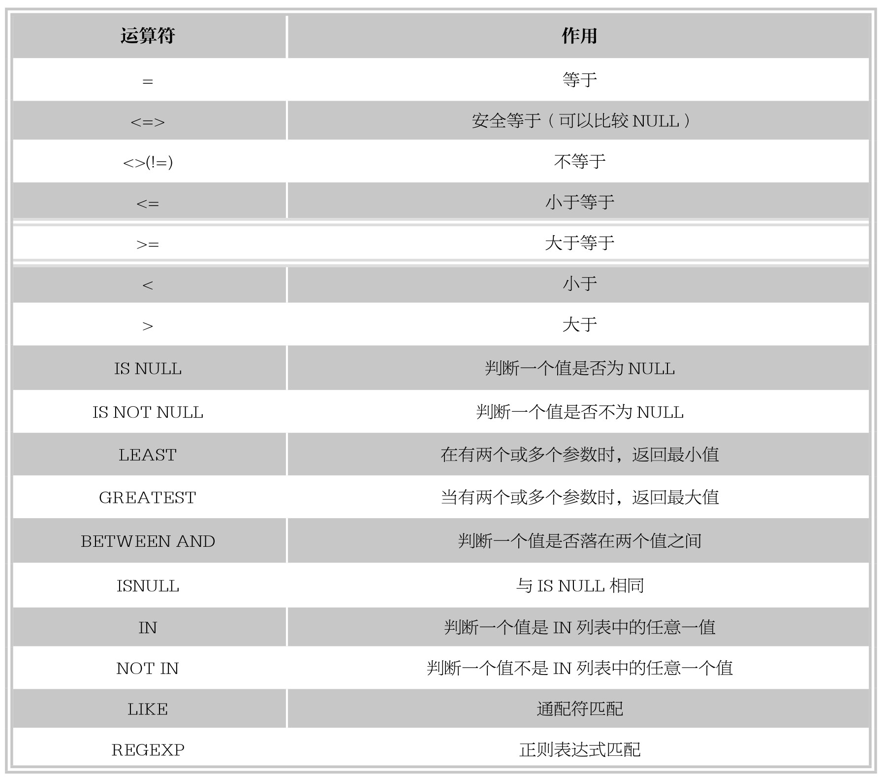

#### 
  6.3.3 比较运算符

一个比较运算符的结果总是1、0或者NULL，比较运算符经常在SELECT查询条件子句中使用，用来查询满足指定条件的记录。MySQL中比较运算符如下表所示。

下面依次讨论各个比较运算符的使用方法。

1.等于运算符“=”

等号“=”用来判断数字、字符串和表达式是否相等。如果相等，返回值为1，否则返回值为0。

【范例6-29】

使用“=”进行相等判断，语句如下。

&#13;
    mysql> SELECT 1=2,'3'=3,3=3,'0.01'=0,'a'='a',(2+4)=(3+3),NULL=NULL;&#13;
    +-----+-------+-----+----------+---------+-------------+-----------+&#13;
    | 1=2 | '3'=3 | 3=3 | '0.01'=0 | 'a'='a' | (2+4)=(3+3) | NULL=NULL |&#13;
    +-----+-------+-----+----------+---------+-------------+-----------+&#13;
    | 0|  1| 1|    0|   1|     1|   NULL|&#13;
    +-----+-------+-----+----------+---------+-------------+-----------+&#13;
    1 row in set (0.00 sec)&#13;

由结果可以看到，在进行判断时，‘3’=3 和3=3的返回值相同，都是1。因为在进行比较判断时，MySQL自动进行了转换，把字符‘3’转换成数字3；‘a’=‘a’为相同的字符比较，因此返回值为1；表达式2+4和3+3的结果都为6，结果相等，因此返回值为1；由于“=”不能用于空值NULL的判断，因此返回值为NULL。

数值比较时有如下规则。

⑴若有一个或两个参数为NULL，则比较运算的结果为NULL。

⑵若同一个比较运算中的两个参数都是字符串，则按照字符串进行比较。

⑶若两个参数均为正数，则按照整数进行比较。

⑷若一个字符串和一个数字进行相等判断，则MySQL可以自动将字符串转换为数字。

2.安全等于运算符“<=>”

这个操作符具备“=”操作符的所有功能，唯一不同的是“<=>”可以用来判断NULL值。在两个操作数均为NULL时，其返回值为1而不为NULL；当其中一个操作数为NULL时，其返回值为0而不为NULL。

【范例6-30】

使用“<=>”进行相等的判断，语句如下。

&#13;
    mysql> SELECT 1<=>2,'3'<=>3,3<=>3,'0.01'<=>0,'a'<=>'a',(2+4)<=>(3+3),NULL<=>NULL;&#13;
    +-------+---------+-------+------------+-----------+---------------+-------------+&#13;
    | 1<=>2 | '3'<=>3 | 3<=>3 | '0.01'<=>0 | 'a'<=>'a' | (2+4)<=>(3+3) | NULL<=>NULL |&#13;
    +-------+---------+-------+------------+-----------+---------------+-------------+&#13;
    |  0|   1|  1|     0|    1|      1|     1|&#13;
    +-------+---------+-------+------------+-----------+---------------+-------------+&#13;
    1 row in set (0.02 sec)&#13;

由结果可以看到，“<=>”在执行比较操作时和“=”的作用是相似的，唯一的区别是“<=>”可以用来对NULL进行判断，两者都为NULL时返回值为1。

3.不等于运算符“<>”或者“!=”

“<>”或者“!=”用于判断数字、字符串、表达式不相等的判断。如果不相等，返回值为1；否则返回值为0。这两个运算符不能用于判断空值NULL。

【范例6-31】

使用“<>”和“!=”进行不相等的判断，语句如下。

&#13;
    mysql> SELECT 'bad'<>'bed',1<>2,3!=3,4.4!=4,(1+1)!=(2+2),NULL<>NULL;&#13;
    +--------------+------+------+--------+--------------+------------+&#13;
    | 'bad'<>'bed' | 1<>2 | 3!=3 | 4.4!=4 | (1+1)!=(2+2) | NULL<>NULL |&#13;
    +--------------+------+------+--------+--------------+------------+&#13;
    |      1|  1|  0|   1|      1|   NULL|&#13;
    +--------------+------+------+--------+--------------+------------+&#13;
    1 row in set (0.01 sec)&#13;

由结果可以看到，两个不等于运算符作用相同，都可以进行数字、字符串、表达式的比较。

4.小于或等于运算符“<=”

“<=”用来判断左边的操作数是否小于等于右边的操作数。如果小于或等于，返回值为1，否则返回值为0。“<=”不能用于判断空值NULL。

【范例6-32】

使用“<=”进行比较判断，SQL语句如下。

&#13;
    mysql> SELECT 'bad'<='bed',1<=2,3<=3,4.4<=4,(1+1)<=(2+2),NULL<=NULL;&#13;
    +--------------+------+------+--------+--------------+------------+&#13;
    | 'bad'<='bed' | 1<=2 | 3<=3 | 4.4<=4 | (1+1)<=(2+2) | NULL<=NULL |&#13;
    +--------------+------+------+--------+--------------+------------+&#13;
    |      1|  1|  1|   0|      1|   NULL|&#13;
    +--------------+------+------+--------+--------------+------------+&#13;
    1 row in set (0.03 sec)&#13;

由结果可以看出，左边操作数小于或等于右边时，返回值为1，例如‘bad’<=‘bed’，‘bad’第二位字符‘a’在字母表中的顺序小于bed第二位字符e，因此返回值为1；左边操作数大于右边操作数时，返回值为0，例如4.4<=4，返回值为0；同样比较NULL值时，返回NULL。

5.小于运算符“<”

“<”运算符用来判断左边的操作数是否小于右边的操作数，如果小于，返回值为1；否则返回值为0。“<”不能用于判断空值NULL。

【范例6-33】

使用“<”进行比较判断，SQL语句如下。

&#13;
    mysql> SELECT 'bad'<'bed',1<2,3<3,4.4<4,(1+1)<(2+2),NULL<NULL;&#13;
    +-------------+-----+-----+-------+-------------+-----------+&#13;
    | 'bad'<'bed' | 1<2 | 3<3 | 4.4<4 | (1+1)<(2+2) | NULL<NULL |&#13;
    +-------------+-----+-----+-------+-------------+-----------+&#13;
    |     1| 1| 0|  0|     1|   NULL|&#13;
    +-------------+-----+-----+-------+-------------+-----------+&#13;
    1 row in set (0.00 sec)&#13;

由结果可以看出，当左边操作数小于右边时，返回值为1，例如‘bad’<=‘bed’，‘bad’第二位字符a在字母表中的顺序小于bed第二位字符e，因此返回值为1；当左边操作数大于或等于右边时，返回值为0，例如1<2和3<3；同样比较NULL值时，返回NULL。

6.大于或等于运算符“>=”

“>=”运算符用来判断左边的操作数是否大于或者等于右边的操作数，如果大于或者等于，返回值为1；否则返回值为0。“>=”不能用于判断空值NULL。

【范例6-34】

使用“>=”进行判断比较，语句如下。

&#13;
    mysql> SELECT 'bad'>='bed',1>=2,3>=3,4.4>=4,(1+1)>=(2+2),NULL>=NULL;&#13;
    +--------------+------+------+--------+--------------+------------+&#13;
    | 'bad'>='bed' | 1>=2 | 3>=3 | 4.4>=4 | (1+1)>=(2+2) | NULL>=NULL |&#13;
    +--------------+------+------+--------+--------------+------------+&#13;
    |      0|  0|  1|   1|      0|   NULL|&#13;
    +--------------+------+------+--------+--------------+------------+&#13;
    1 row in set (0.00 sec)&#13;

由结果可以看到，左边操作数大于或者等于右边操作数时，返回值为1，例如：3>=3；当左边操作数小于右边时，返回值为0，例如：1>=2；同样比较NULL值时，返回NULL。

7.大于运算符“>”

“>”运算符用来判断左边的操作数是否大于右边的操作数，如果大于，返回值1；否则返回值0。“>”不能用于判断空值NULL。

【范例6-35】

使用“>”进行比较，语句如下。

&#13;
    mysql> SELECT 'bad'>'bed',1>2,3>3,4.4>4,(1+1)>(2+2),NULL>NULL;&#13;
    +-------------+-----+-----+-------+-------------+-----------+&#13;
    | 'bad'>'bed' | 1>2 | 3>3 | 4.4>4 | (1+1)>(2+2) | NULL>NULL |&#13;
    +-------------+-----+-----+-------+-------------+-----------+&#13;
    |     0| 0| 0|  1|     0|   NULL|&#13;
    +-------------+-----+-----+-------+-------------+-----------+&#13;
    1 row in set (0.00 sec)&#13;

由结果可以看到，左边操作数大于右边时，返回值为1，例如：4.4>4；当左边操作数小于或等于右边时，返回0，例如：1>2和3>3；同样比较NULL值时，返回NULL。

8.IS NULL(ISNULL)、IS NOT NULL运算符

IS NULL和ISNULL是检验一个值是否为NULL，如果为NULL，返回值为1，否则返回值为0；IS NOT NULL检验一个值是否非NULL，如果非NULL，返回值1，否则返回值为0。

【范例6-36】

使用IS NULL、ISNULL和IS NOT NULL判断NULL值和非NULL值，语句如下。

&#13;
    mysql> SELECT NULL IS NULL,ISNULL(NULL),ISNULL(99),99 IS NOT NULL;&#13;
    +--------------+--------------+------------+----------------+&#13;
    | NULL IS NULL | ISNULL(NULL) | ISNULL(99) | 99 IS NOT NULL |&#13;
    +--------------+--------------+------------+----------------+&#13;
    |      1|      1|     0|       1|&#13;
    +--------------+--------------+------------+----------------+&#13;
    1 row in set (0.11 sec)&#13;

由结果可以看出，IS NULL和ISNULL的作用相同，使用格式不同。ISNULL和IS NOT NULL的返回值正好相反。

9.BETWEEN AND运算符

该运算符语法格式为如下。

&#13;
    expr BETWEEN min AND max&#13;

假如expr大于或等于min且小于或等于max，则BETWEEN的返回值为1，否则返回值为0。

【范例6-37】

使用BETWEEN AND进行值区间判断，输入SQL语句如下。

&#13;
    mysql> SELECT 3 BETWEEN 2 AND 4,3 BETWEEN 3 AND 4,3 BETWEEN 9 AND 10;&#13;
    +-------------------+-------------------+--------------------+&#13;
    | 3 BETWEEN 2 AND 4 | 3 BETWEEN 3 AND 4 | 7 BETWEEN 9 AND 10 |&#13;
    +-------------------+-------------------+--------------------+&#13;
    |        1|        1|         0|&#13;
    +-------------------+-------------------+--------------------+&#13;
    1 row in set (0.00 sec)&#13;
    mysql> SELECT 'b' BETWEEN 'a' AND 'c','z'BETWEEN 'a' AND 'b';&#13;
    +-------------------------+-------------------------+&#13;
    | 'b' BETWEEN 'a' AND 'c' | 'z' BETWEEN 'a' AND 'b' |&#13;
    +-------------------------+-------------------------+&#13;
    |           1|           0|&#13;
    +-------------------------+-------------------------+&#13;
    1 row in set (0.00 sec)&#13;

由结果可以看到，3在端点区间或者等于其中一个端点值时，BETWEEN AND表达式返回值为1；7不在指定区间内，因此返回值为0；对于字符串类型的比较，按字母表中字母顺序进行比较，‘b’位于指定字母区间内，因此返回值为1，‘z’不在指定的字母区间内，因此返回值为0。

10.LEAST(value1,value2,...)

该运算符语法格式如下。

&#13;
    LEAST(值1，值2，…值n)&#13;

其中，“值n”表示参数列表中有n个值。在有两个或多个参数的情况下，返回最小值。假如任意一个自变量为NULL，则LEAST()的返回值为NULL。

【范例6-38】

使用LEAST运算符进行大小判断，SQL语句如下。

&#13;
    mysql> SELECT least(3,1),least(10.0,1.0,10.5),least('a','c','b'),least(100,NULL);&#13;
    +------------+----------------------+--------------------+-----------------+&#13;
    | least(3,1) | least(10.0,1.0,10.5) | least('a','c','b') | least(100,NULL) |&#13;
    +------------+----------------------+--------------------+-----------------+&#13;
    |     1|         1.0|a         |      NULL|&#13;
    +------------+----------------------+--------------------+-----------------+&#13;
    1 row in set (0.00 sec)&#13;

由结果可以看到，当参数中是整数或者浮点数时，LEAST将返回其中最小的值；当参数为字符串时，返回字母表顺序最靠前的字符；当比较值列表中有NULL时，不能判断大小，返回值为NULL。

11.GREATEST(value1,value2,...)

该运算符语法格式如下。

&#13;
    GREATEST(值1，值2，…值n)&#13;

其中，“值n”表示参数列表中有n个值。当有两个或多个参数时，返回值为最大值，假如任意一个自变量为NULL，则GREATEST()的返回值为NULL。

【范例6-39】

使用GREATEST运算符进行大小判断，SQL语句如下。

&#13;
    mysql> SELECT greatest(3,1),greatest(10.0,1.0,10.5),greatest('a','c','b'),greatest(100,NULL);&#13;
    +---------------+-------------------------+-----------------------+--------------------+&#13;
    | greatest(3,1) | greatest(10.0,1.0,10.5) | greatest('a','c','b') | greatest(100,NULL) |&#13;
    +---------------+-------------------------+-----------------------+--------------------+&#13;
    |      3|          10.5|c          | NULL       |&#13;
    +---------------+-------------------------+-----------------------+--------------------+&#13;
    1 row in set (0.00 sec)&#13;

由结果可以看到，当参数中是整数或者浮点数时，GREATEST将返回其中最大值；当参数为字符串时，返回字母表顺序中最靠后的字符；当比较值列表中有NULL时，不能判断大小，返回值为NULL。

12.IN、NOT IN运算符

IN运算符用来判断操作数是否为IN列表中的其中一个值，如果是，返回值为1；否则返回值为0。

NOT IN运算符用来判断操作数是否为IN列表中的其中一个值，如果不是，返回值为1；否则返回值为0。

【范例6-40】

使用IN、NOT IN运算符进行判断，SQL语句如下。

&#13;
    mysql> SELECT 3 IN (2,4,6,'aa'), 'aa' IN (2,4,6,'aa');&#13;
    +-------------------+----------------------+&#13;
    | 3 IN (2,4,6,'aa') | 'aa' IN (2,4,6,'aa') |&#13;
    +-------------------+----------------------+&#13;
    |        0|          1|&#13;
    +-------------------+----------------------+&#13;
    1 row in set, 2 warnings (0.00 sec)&#13;
    mysql> SELECT 3 NOT IN (2,4,6,'aa'), 'aa' NOT IN (2,4,6,'aa');&#13;
    +-----------------------+--------------------------+&#13;
    | 3 NOT IN (2,4,6,'aa') | 'aa' NOT IN (2,4,6,'aa') |&#13;
    +-----------------------+--------------------------+&#13;
    |          1|            0|&#13;
    +-----------------------+--------------------------+&#13;
    1 row in set, 2 warnings (0.02 sec)&#13;

由结果可以看到，IN和NOT IN的返回值正好相反。

在左侧表达式为NULL的情况下，或是表中找不到匹配项并且表中一个表达式为NULL的情况下，IN的返回值均为NULL。

【范例6-41】

存在NULL值时的IN查询，SQL语句如下。

&#13;
    mysql> SELECT NULL IN (2,4,6,'aa'), 9 IN (2,3,NULL,'aa');&#13;
    +----------------------+----------------------+&#13;
    | NULL IN (2,4,6,'aa') | 9 IN (2,3,NULL,'aa') |&#13;
    +----------------------+----------------------+&#13;
    |        NULL|        NULL|&#13;
    +----------------------+----------------------+&#13;
    1 row in set, 1 warning (0.00 sec)&#13;

IN语法也可用于在SELECT语句中进行嵌套子查询，在后面章节会具体讲解。

13.LIKE

LIKE运算符用来匹配字符串，其语法格式如下。

&#13;
    expr LIKE匹配条件&#13;

如果expr满足匹配条件，则返回值为1(TRUE)；如果不匹配，则返回值为0（FALSE）。若expr或匹配条件中任何一个为NULL，则结果为NULL。

LIKE运算符在进行匹配时，可以使用下面两种通配符。

⑴“%”匹配任何数目字符，甚至包括零字符。

⑵“_”只能匹配一个字符。

【范例6-42】

使用运算符LIKE进行字符串匹配运算，SQL语句如下。

&#13;
    mysql> SELECT 'cake' LIKE 'cake','cake' LIKE 'cak_','cake' LIKE '%e','cake' LIKE 'k___','k' LIKE NULL;&#13;
    +--------------------+--------------------+------------------+--------------------+---------------+&#13;
    | 'cake' LIKE 'cake' | 'cake' LIKE 'cak_' | 'cake' LIKE '%e' | 'cake' LIKE 'k_ _ _' | 'k' LIKE NULL |&#13;
    +--------------------+--------------------+------------------+--------------------+---------------+&#13;
    |         1|         1|        1|         0|     NULL|&#13;
    +--------------------+--------------------+------------------+--------------------+---------------+&#13;
    1 row in set (0.00 sec)&#13;

由结果可以看出，指定匹配字符串为cake。第一组比较“cake”直接匹配cake字符串，满足匹配条件，返回值为1；第二组比较“cak_”表示匹配以cak开头的长度为4位的字符串，cake正好4个字符，满足匹配条件，因此匹配成功，返回值为1；“%e”表示匹配以字母结尾的字符串，cake满足匹配条件，匹配成功，返回值为1；“k_ _ _”表示匹配开头以k开头长度为4的字符串，cake不满足匹配条件，返回值为0；当字符“k”与NULL匹配时，结果为NULL。

14.REGEXP

REGEXP运算符用来匹配字符串，语法格式如下。

&#13;
    expr REGEXP匹配条件&#13;

如果expr满足匹配条件，返回1；如果不满足，则返回0；若expr或匹配条件任意一个为NULL，则结果为NULL。

REGEXP运算符在进行匹配时，常用的有下面几种通配符。

⑴‘^’匹配以该字符后面的字符开头的字符串。

⑵‘$’匹配以该字符前面的字符结尾的字符串。

⑶‘.’匹配任何一个单字符。

⑷“[…]”匹配在方括号内的任何字符。例如，“[abc]”匹配a、b或c。为了命名字符的范围，使用一个‘-’。“[a-z]”匹配任意字母，而“[0-9]”匹配任意数字。

⑸‘*’匹配零个或多个在它前面的字符。例如，“x*”匹配任意数量的‘x’字符，“[0-9]*”匹配任意数量的数字，而“.*”则匹配任意数量的任意字符。

【范例6-43】

使用运算符REGEXP进行字符串匹配运算，SQL语句如下。

&#13;
    mysql> SELECT 'car'REGEXP'^c','car'REGEXP'r$','car'REGEXP'.ar','car'REGEXP'[xy]';&#13;
    +-----------------+-----------------+------------------+-------------------+&#13;
    | 'car'REGEXP'^c' | 'car'REGEXP'r$' | 'car'REGEXP'.ar' | 'car'REGEXP'[xy]' |&#13;
    +-----------------+-----------------+------------------+-------------------+&#13;
    |       1|       1|        1|        0|&#13;
    +-----------------+-----------------+------------------+-------------------+&#13;
    1 row in set (0.00 sec)&#13;

由结果可以看到，指定匹配字符串为car。“^c”表示匹配任何以字母c开头的字符串，满足匹配条件，因此返回值为1；“r$”表示任何以字母r结尾的字符串，满足匹配条件，因此返回值为1；“.ar”匹配任何以ar结尾，字符总长度为3的字符串，满足匹配条件，因此返回值为1；“[xy]”匹配任何包含字母x或者y的字符串，指定字符串中没有字母x或y，不满足匹配条件，因此返回值为0。

提示 
 正则表达式是一个可以进行复杂查询的强大工具，相对于LIKE字符串匹配，它可以使用更多的通配符类型，查询结果更加灵活。用户可以参考相关资料，详细学习正则表达式的写法，在此不详细介绍。

