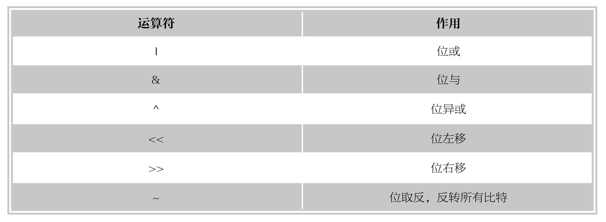
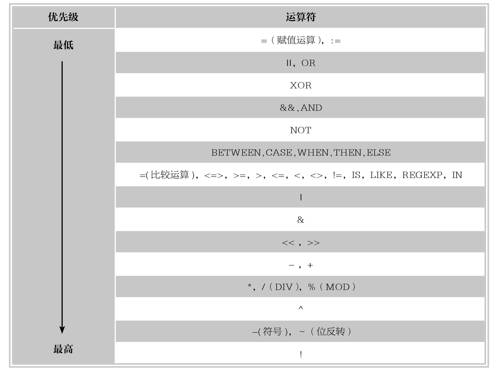

#### 
  6.3.5 位运算符

位运算符是用来对二进制字节中的位进行测试、位移或者测试处理，MySQL中提供的位运算符有：按位或（|），按位与（&），按位异或（^），按位左移（<<），按位右移（>>），按位取反（～），如下表所示。

接下来，分别讨论不同的位运算符的使用方法。

1.位或运算符“|”

位或运算符的实质是将参与运算的两个数据，按对应的二进制数进行逻辑或运算。对应的二进制位有一个或两个为1则该位的运算结果为1，否则为0。

【范例6-48】

使用位或运算符进行运算，SQL语句如下。

&#13;
    mysql> SELECT 10|15,9|4|2;&#13;
    +-------+-------+&#13;
    | 10|15 | 9|4|2 |&#13;
    +-------+-------+&#13;
    |  15|  15|&#13;
    +-------+-------+&#13;
    1 row in set (0.04 sec)&#13;

10的二进制数值为1010，15的二进制数值为1111，按位或运算之后，结果为1111，即整数15；9的二进制数值为1001，4的二进制数值为0100，2的二进制数为0010，按位或运算之后，结果为1111，也是整数15。其结果为一个64位无符号整数。

2.位与运算符“&”

位与运算的实质是将参与运算的两个操作数，按对应的二进制数逐位进行逻辑与运算。对应的二进制位都为1，则该位的运算结果为1，否则为0。

【范例6-49】

使用位与运算符进行运算，SQL语句如下。

&#13;
    mysql> SELECT 10 & 15, 9 & 4 & 2;&#13;
    +---------+-----------+&#13;
    | 10 & 15 | 9 & 4 & 2 |&#13;
    +---------+-----------+&#13;
    |   10|    0|&#13;
    +---------+-----------+&#13;
    1 row in set (0.00 sec)&#13;

10的二进制数值为1010，15的二进制数值为1111，按位与运算之后，结果为1010，即整数10；9的二进制数值为1001，4的二进制数值为0100，2的二进制数值为0010，按位与运算之后，结果为0000，即整数0。其结果为一个64位无符号整数。

3.位异或运算符“^”

位异或运算的实质是将参与运算的两个数据，按对应的二进制数逐位进行逻辑异或运算。对应的二进制数不同时，对应位的结果才为1；如果两个对应位数都为0或都为1，则对应位的运算结果为0。

【范例6-50】

使用位异或运算符进行运算，SQL语句如下。

&#13;
    mysql> SELECT 10^15,1^0,1^1;&#13;
    +-------+-----+-----+&#13;
    | 10^15 | 1^0 | 1^1 |&#13;
    +-------+-----+-----+&#13;
    |  5| 1| 0|&#13;
    +-------+-----+-----+&#13;
    1 row in set (0.01 sec)&#13;

10的二进制数为1010，15的二进制数为1111，按位异或运算之后，结果为0101，即整数5；1的二进制数为0001，0的二进制数为0000，按位异或运算之后，结果为0001，即整数1；1和1本身二进制完全相同，因此运算结果为0。

4.位左移运算符“<<”

位左移运算符“<<”的功能是让指定二进制值的所有位都左移指定的位数。左移指定位数之后，左边高位的数值将被移出并丢弃，右边低位空出的位置用0补齐。语法格式为：a<<n。这里的n指定值a要移动的位置。

【范例6-51】

使用位左移运算符进行运算，SQL语句如下。

&#13;
    mysql> SELECT 1<<2,4<<2;&#13;
    +------+------+&#13;
    | 1<<2 | 4<<2 |&#13;
    +------+------+&#13;
    |  4| 16|&#13;
    +------+------+&#13;
    1 row in set (0.01 sec)&#13;

1的二进制值为0000 0001，左移两位之后变成0000 0100，即十进制整数4；十进制4左移两位之后变成0001 0000，即十进制数16。

5.位右移运算符“>>”

位右移运算符“>>”的功能是让指定的二进制值的所有位都右移指定的位数。右移指定位数之后，右边低位的数值将被移出并丢弃，左边高位空出的位置用0补齐。语法格式为：语法格式为：a>>n。这里的n指定值a要移动的位置。

【范例6-52】

使用位右移运算符进行运算，SQL语句如下。

&#13;
    mysql> SELECT 1>>1,16>>2;&#13;
    +------+-------+&#13;
    | 1>>1 | 16>>2 |&#13;
    +------+-------+&#13;
    |  0|  4|&#13;
    +------+-------+&#13;
    1 row in set (0.00 sec)&#13;

1的二进制值为0000 0001，右移1位之后变成0000 0000，即十进制整数0；16的二进制值为0001 0000，右移两位之后变成0000 0100，即十进制数4。

6.位取反运算符“～”

位取反运算符的实质是将参与运算的数据，按对应的二进制数逐位反转，即1取反后变为0，0取反后变为1。

【范例6-53】

使用位取反运算符进行运算，SQL语句如下。

&#13;
    mysql> SELECT 5&～1;&#13;
    +-------+&#13;
    | 5 &～1 |&#13;
    +-------+&#13;
    |  4|&#13;
    +-------+&#13;
    1 row in set (0.02 sec)&#13;

逻辑运算5&～1，由于位取反运算符“～”的级别高于位与运算符“&”，因此先对1取反操作，取反之后，除了最低位为0其他都为1，然后再与十进制数值5进行运算，结果为0100，即整数4。

提示 
 MySQL经过位运算之后的数值是一个64位的无符号整数，1的二进制数值表示为最右边为1，其他位均为0，取反操作之后，除了最低位，其他位均变为1。

&#13;
    mysql> SELECT BIN(～1);&#13;
    +------------------------------------------------------------------+&#13;
    |BIN(～1)                             |&#13;
    +------------------------------------------------------------------+&#13;
    | 1111111111111111111111111111111111111111111111111111111111111110 |&#13;
    +------------------------------------------------------------------+&#13;
    1 row in set (0.00 sec)&#13;

7.运算符的优先级

运算符的优先级决定了不同的运算符在表达式中计算的先后顺序，下表列出了MySQL中的各类运算符及其优先级。

可以看到，不同运算符的优先级是不同的。一般情况下，级别高的运算符先进行计算，如果级别相同，MySQL按表达式的顺序从左到右依次计算。当然，在无法确定优先级的情况下，可以使用圆括号（）来改变优先级，并且这样会使计算过程更加清晰。

