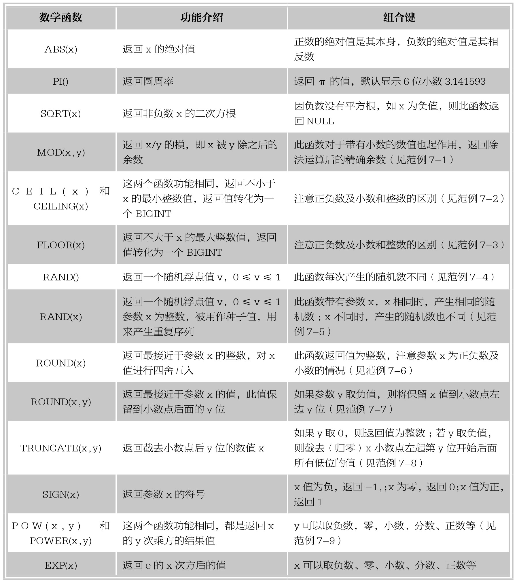
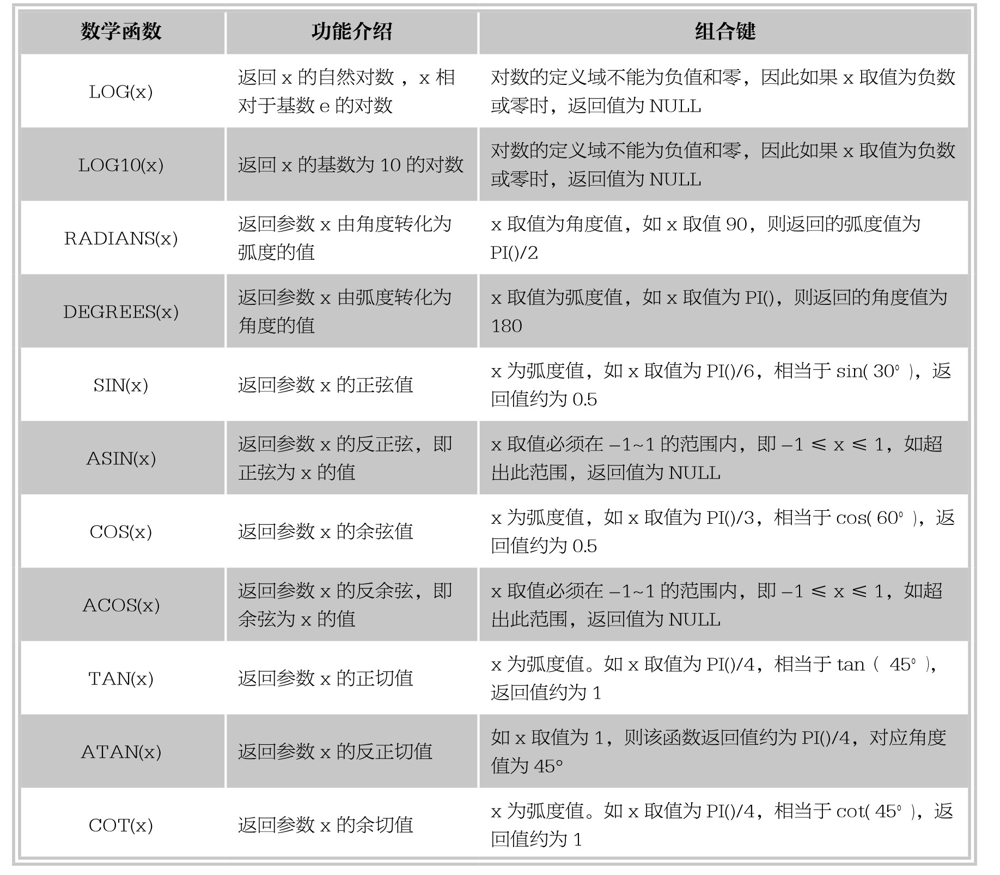

### 
  7.1 数学函数

 本节视频教学录像：6分钟

数学函数是用来处理数值数据方面的运算，主要的数学函数有：绝对值函数、三角函数（包含正弦函数、余弦函数、正切函数、余切函数等）、对数函数、随机函数等。使用数学函数过程中，如果有错误产生，该函数将会返回空值NULL。本节将结合实例介绍常用的数学函数的功能及用法。

【范例7-1】

对MOD(25,6)，MOD(365,9)，MOD(35.4,8.3)进行求余运算，输入语句如下。

&#13;
    mySQL> select MOD(25,6),MOD(365,9),MOD(35.4,8.3);&#13;
    +-----------+------------+-------------+&#13;
    | MOD(25,6) | MOD(365,9) | MOD(35.4,8.3) |&#13;
    +-----------+------------+-------------+&#13;
    |    1|     5|    2.2|&#13;
    +-----------+------------+-------------+&#13;

【范例7-2】

使用CEIL(x)和CEILING(x)函数返回不小于x的最小整数，输入语句如下。

&#13;
    mySQL> select CEIL(2),CEIL(2.75),CEILING(-2),CEILING(-2.75);&#13;
    +---------+------------+-------------+----------------+&#13;
    | CEIL(2) | CEIL(2.75) | CEILING(-2) | CEILING(-2.75) |&#13;
    +---------+------------+-------------+----------------+&#13;
    |   2|     3|     -2|      -2|&#13;
    +---------+------------+-------------+----------------+&#13;

请注意此例中输入正负数及小数和整数的不同：输入整数2和-2时，CEIL函数返回值是其自身；输入小数且为正数2.75时，返回值是3；输入小数且为负数-2.75时，返回值是-2。

【范例7-3】

使用FLOOR(x)函数返回不大于x的最大整数，输入语句如下。

&#13;
    mySQL> select FLOOR(2),FLOOR(2.75),FLOOR(-2),FLOOR(-2.75);&#13;
    +----------+-------------+-----------+--------------+&#13;
    | FLOOR(2) | FLOOR(2.75) | FLOOR(-2) | FLOOR(-2.75) |&#13;
    +----------+-------------+-----------+--------------+&#13;
    |    2|     2|    -2|     -3|&#13;
    +----------+-------------+-----------+--------------+&#13;

请注意此例中输入正负数及小数和整数的不同：输入整数2和-2时，FLOOR函数返回值是其自身；输入小数且为正数2.75时，返回值是2；输入小数且为负数-2.75时，返回值是-3。

【范例7-4】

使用RAND()函数产生随机数，输入语句如下。

&#13;
    mySQL> select RAND(),RAND(),RAND();&#13;
    +--------------------+--------------------+-------------------+&#13;
    |RAND()      |RAND()      |RAND()      |&#13;
    +--------------------+--------------------+-------------------+&#13;
    | 0.9313106620044547 | 0.2982633852383712 | 0.697384970912137 |&#13;
    +--------------------+--------------------+-------------------+&#13;

从执行结果看出，不带参数的RAND()函数，每次产生的随机数是不同。

【范例7-5】

使用RAND(x)函数产生随机数，输入语句如下。

&#13;
    mySQL> select RAND(5),RAND(5),RAND(11);&#13;
    +---------------------+---------------------+-------------------+&#13;
    |RAND(5)      |RAND(5)      |RAND(11)     |&#13;
    +---------------------+---------------------+-------------------+&#13;
    | 0.40613597483014313 | 0.40613597483014313 | 0.907234631392392 |&#13;
    +---------------------+---------------------+-------------------+&#13;

从执行结果看出，带有参数的RAND(x)函数，当参数x取值相同时，产生的随机数相同；当参数x取值不同时，产生的随机数不同。

【范例7-6】

使用ROUND(x)函数返回最接近于参数x的整数，输入语句如下。

&#13;
    mySQL> select ROUND(-2.5),ROUND(-2.25),ROUND(-2.75),ROUND(2.25),ROUND(-2.75);&#13;
    +-------------+--------------+--------------+-------------+--------------+&#13;
    | ROUND(-2.5) | ROUND(-2.25) | ROUND(-2.75) | ROUND(2.25) | ROUND(-2.75) |&#13;
    +-------------+--------------+--------------+-------------+--------------+&#13;
    |     -3|     -2|     -3|     2|     -3|&#13;
    +-------------+--------------+--------------+-------------+--------------+&#13;

从执行结果可以看出，ROUND(x)将值x四舍五入之后保留了整数部分。

【范例7-7】

使用ROUND(x,y)函数对参数x进行四舍五入的操作，返回值保留小数点后面指定的y位，输入语句如下。

&#13;
    mySQL> select ROUND(-2.55,1),ROUND(-2.25,3),ROUND(375.49,-1),ROUND(375.49,-2);&#13;
    +----------------+----------------+------------------+------------------+&#13;
    | ROUND(-2.55,1) | ROUND(-2.25,3) | ROUND(375.49,-1) | ROUND(375.49,-2) |&#13;
    +----------------+----------------+------------------+------------------+&#13;
    |     -2.6|    -2.250|       380|       400|&#13;
    +----------------+----------------+------------------+------------------+&#13;

从执行结果可以看出，根据参数y值，将参数x四舍五入后得到保留小数点后y位的值，x值小数位不够y位的补零；如y为负值，则保留小数点左边y位，先进行四舍五入操作，再将相应的位数值取零。

提示 
 ROUND(x,y)函数中y为负值时，先进行四舍五入操作，再将保留的小数点左边相应的位数直接保存为0。

【范例7-8】

使用TRUNCATE(x,y)函数对参数x进行截取操作，返回值保留小数点后面指定的y位，输入语句如下。

&#13;
    mySQL> select TRUNCATE(2.25,1),TRUNCATE(2.99,1),TRUNCATE(2.99,0),TRUNCATE(99.99,-1);&#13;
    +------------------+------------------+------------------+--------------------+&#13;
    | TRUNCATE(2.25,1) | TRUNCATE(2.99,1) | TRUNCATE(2.99,0) | TRUNCATE(99.99,-1) |&#13;
    +------------------+------------------+------------------+--------------------+&#13;
    |       2.2|       2.9|        2|        90|&#13;
    +------------------+------------------+------------------+--------------------+&#13;

从执行结果可以看出，TRUNCATE(x,y)函数并不是四舍五入的函数，而是直接截去指定保留y位之外的值。y取负值时，先将小数点左边第y位的值归零，右边其余低位全部截去。

技巧 
 ROUND(x,y)函数是进行四舍五入的取值，而TRUNCATE(x,y)函数则是直接截取指定位，并不进行四舍五入。

【范例7-9】

使用POW(x,y)和POWER(x,y)函数对参数x进行y次乘方的求值，输入语句如下。

&#13;
    mySQL> select POW(3,-1),POW(3,0),POW(3,2),POWER(3,2),POWER(3,-1/3);&#13;
    +--------------------+----------+----------+------------+--------------------+&#13;
    |POW(3,-1)     |POW(3,0)|POW(3,2)|POWER(3,2)|POWER(3,-1/3)   |&#13;
    +--------------------+----------+----------+------------+--------------------+&#13;
    |0.3333333333333333|    1|    9|     9|0.6933612746045464|&#13;
    +--------------------+----------+----------+------------+--------------------+&#13;

从执行结果可以看出，POW和POWER函数功能相同，y的取值可以为负数、零、正数、小数或分数等。

