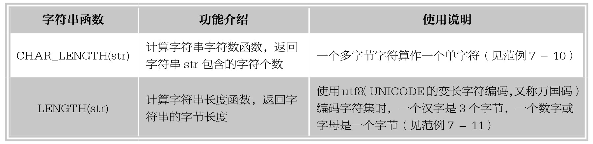
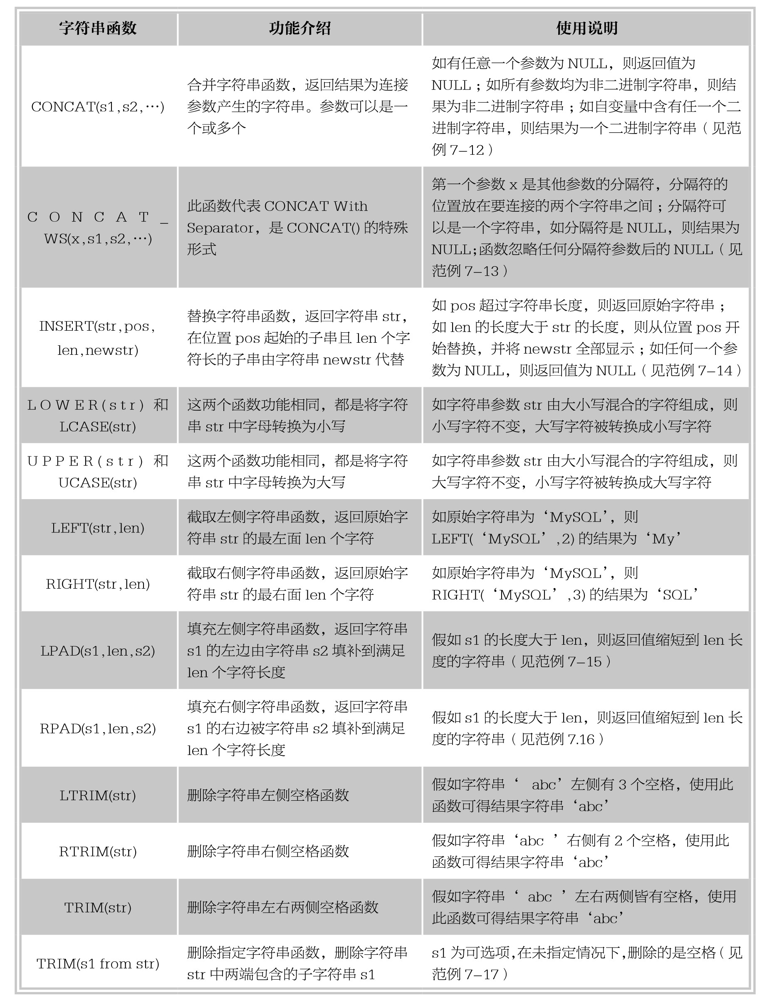
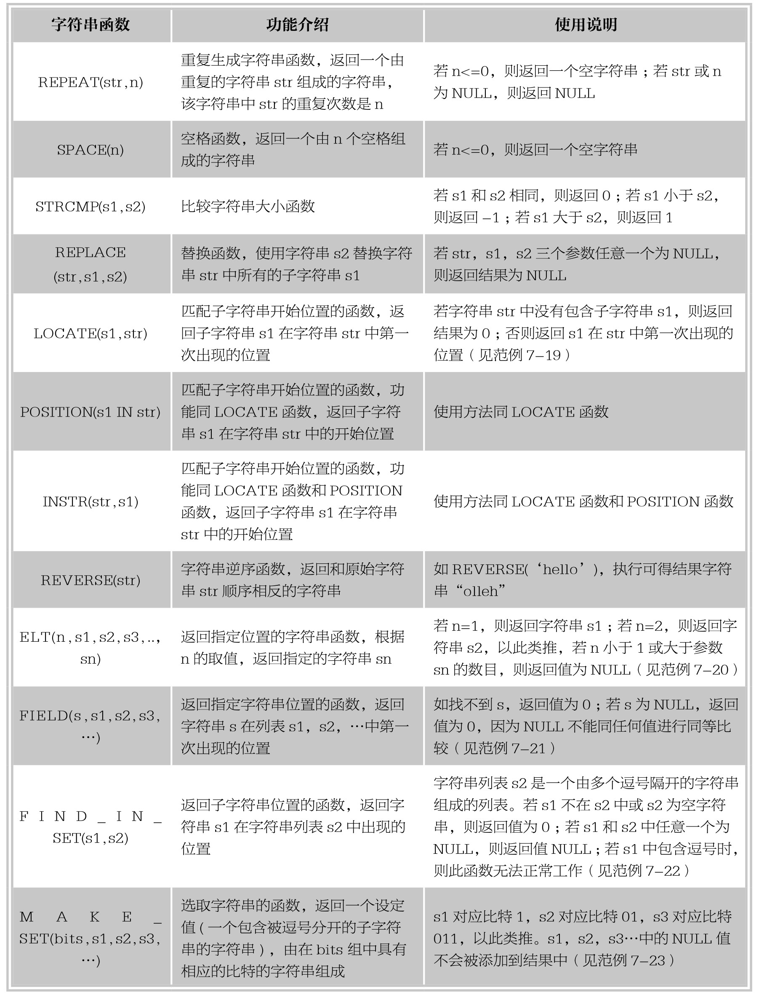

### 
  7.2 字符串函数

节视频教学录像：1分钟

字符串函数主要用来处理字符串数据，MySQL中字符串函数主要有：计算字符长度函数、字符串合并函数、字符串转换函数、字符串比较函数、查找指定字符串位置函数等。本节将结合实例介绍常用字符串函数的功能和用法。

【范例7-10】

使用CHAR_LENGTH(str)函数计算字符串的字符个数，输入语句如下。

&#13;
    mySQL> select CHAR_LENGTH('test'),CHAR_LENGTH('测试');&#13;
    +---------------------+-----------------------+&#13;
    |CHAR_LENGTH('test')|CHAR_LENGTH('测试') |&#13;
    +---------------------+-----------------------+&#13;
    |         4|          2|&#13;
    +---------------------+-----------------------+&#13;

由执行结果可以看出，汉字是多字节字符，一个汉字是3个字节，但在此函数应用中，一个汉字算作是一个单字符。

【范例7-11】

使用LENGTH(str)函数计算字符串的字节长度，输入语句如下。

&#13;
    mySQL> select LENGTH('test'),LENGTH('测试');&#13;
    +----------------+------------------+&#13;
    |LENGTH('test')|LENGTH('测试') |&#13;
    +----------------+------------------+&#13;
    |       4|        6|&#13;
    +----------------+------------------+&#13;

由执行结果看出，一个汉字是3个字节，一个数字和英文字符都是一个字节，此函数返回的值是字符串的字节长度。

【范例7-12】

使用CONCAT(s1,s2,…)函数连接多个字符串，输入语句如下。

&#13;
    mySQL> select CONCAT('My','SQL'),CONCAT('My',NULL,'SQL'),CONCAT('我','爱','MySQL');&#13;
    +--------------------+-------------------------+-----------------------------+&#13;
    |CONCAT('My','SQL')|CONCAT('My',NULL,'SQL')|CONCAT('我','爱','MySQL') |&#13;
    +--------------------+-------------------------+-----------------------------+&#13;
    |MySQL       |NULL          |我爱MySQL         |&#13;
    +--------------------+-------------------------+-----------------------------+&#13;

由执行结果可以看出，CONCAT函数将多个字符串连接起来，如被连接的参数有一个是NULL，则返回结果为NULL。

【范例7-13】

使用CONCAT_WS(x,s1,s2,…)函数连接带有分隔符的多个字符串，输入语句如下。

&#13;
    mySQL> select CONCAT_WS('*','first','second','third'),CONCAT_WS('&','你','我');&#13;
    +-----------------------------------------+----------------------------+&#13;
    |CONCAT_WS('*','first','second','third')|CONCAT_WS('&','你','我') |&#13;
    +-----------------------------------------+----------------------------+&#13;
    |first*second*third           |你&我           |&#13;
    +-----------------------------------------+----------------------------+&#13;
    mySQL> select CONCAT_WS(NULL,'first','second','third'),CONCAT_WS('&','你',NULL,'我');&#13;
    +------------------------------------------+---------------------------------+&#13;
    |CONCAT_WS(NULL,'first','second','third')|CONCAT_WS('&','你',NULL,'我') |&#13;
    +------------------------------------------+---------------------------------+&#13;
    |NULL                  |你&我             |&#13;
    +------------------------------------------+---------------------------------+&#13;

由执行结果可以看出，该函数将参数字符串用指定的分隔符连接成一个字符串，如分隔符为NULL，则结果为NULL；如分隔符后的参数为NULL，则忽略之。

【范例7-14】

使用函数INSERT(str,pos,len,newstr)进行字符串替换操作，输入语句如下。

&#13;
    mySQL> select INSERT('first',2,3,'SECOND') AS column1,&#13;
    >INSERT('first',-1,2,'SECOND') AS column2,&#13;
    >INSERT('first',6,3,'SECOND') AS column3,&#13;
    >INSERT('first',3,20,'SECOND') AS column4,&#13;
    >INSERT('first',3,NULL,'SECOND') AS column5;&#13;
    +----------+---------+-------------+----------+---------+&#13;
    |column1 |column2|column3  |column4 |column5|&#13;
    +----------+---------+-------------+----------+---------+&#13;
    |fSECONDt|first |firstSECOND|fiSECOND|NULL  |&#13;
    +----------+---------+-------------+----------+---------+&#13;

由执行结果可以看出，column1中，原始字符串‘first’，从第2位字符‘i’开始，使用替换字符串‘SECOND’替换‘first’中的‘irs’3个字符；column2中，参数pos值等于-1，在取值范围之外，则结果显示为原始字符串；column3中，pos取值为6，显示结果为原始字符串从第6位开始后面显示替换字符串；column4中，len取值大于原始字符串长度时，将替换字符串从原始字符串‘first’的第3位开始全部替换；column5中，此函数中任何一个参数为NULL时，结果都为NULL。

【范例7-15】

使用函数LPAD(s1,len,s2)对字符串进行填充的操作，输入语句如下。

&#13;
    mySQL> select LPAD('abcd',3,'**'),LPAD('abcd',7,'**');&#13;
    +---------------------+---------------------+&#13;
    | LPAD('abcd',3,'**') | LPAD('abcd',7,'**') |&#13;
    +---------------------+---------------------+&#13;
    |abc        |***abcd      |&#13;
    +---------------------+---------------------+&#13;

由执行结果可以看出，len取值为3时，小于字符串‘abcd’的4位长度，此时将s1缩短为从左到右数的3位长度的字符串‘abc’；当len取值为7时，大于‘abcd’的4位长度，则在其左侧填补字符串‘**’，直至满足7位长度。

【范例7-16】

使用函数RPAD(s1,len,s2) 对字符串进行填充的操作，输入语句如下。

&#13;
    mySQL> select RPAD('abcd',3,'**'),RPAD('abcd',7,'**');&#13;
    +---------------------+---------------------+&#13;
    | RPAD('abcd',3,'**') | RPAD('abcd',7,'**') |&#13;
    +---------------------+---------------------+&#13;
    |abc        |abcd***      |&#13;
    +---------------------+---------------------+&#13;

由执行结果可以看出，len取值为3时，小于字符串‘abcd’的4位长度，此时将s1缩短为从左到右数的3位长度的字符串‘abc’；当len取值为7时，大于‘abcd’的4位长度，则将其右侧填补字符串‘**’，直至满足7位长度。

【范例7-17】

使用函数TRIM(s1 FROM str) 对原始字符串str的左右两端进行匹配性删除的操作，输入语句如下：

&#13;
    mySQL>select TRIM('st'FROM'stabcstpqst'),CONCAT('(',TRIM(' df '),')');&#13;
    +-------------------------------+--------------------------------+&#13;
    | TRIM('st' FROM 'stabcstpqst') | CONCAT('(',TRIM(' df '),')') |&#13;
    +-------------------------------+--------------------------------+&#13;
    |abcstpq           |(df)             |&#13;
    +-------------------------------+--------------------------------+&#13;

由执行结果可以看出，原始字符串‘stabcstpqst’中只有左右两端的字符串‘st’被删除，中间的并没有被删除；缺省参数s1时，跟TRIM(str)函数的作用一样，即删除左右两端的空格。

【范例7-18】

使用函数SUBSTRING(str,pos,len)截取原始字符串str中从pos开始的len长度字符串的操作，输入语句如下。

&#13;
    mySQL> select SUBSTRING('MySQL',3,2) AS column1,&#13;
    >SUBSTRING('MySQL',3) AS column2,&#13;
    >SUBSTRING('MySQL',-4,3) AS column3,&#13;
    >SUBSTRING('MySQL',-5) AS column4;&#13;
    +---------+---------+---------+---------+&#13;
    | column1 | column2 | column3 | column4 |&#13;
    +---------+---------+---------+---------+&#13;
    |SQ   |SQL  |ySQ  |MySQL |&#13;
    +---------+---------+---------+---------+&#13;

由执行结果可以看出，当缺省一位参数时，缺省的是长度len参数，获取从pos开始的剩余字符串内容；若参数pos为负值时，比如column3中pos取-4，返回从str字符串‘MySQL’末尾开始第4位，也就是字符‘y’开始，取len位，即3位，最终获得字符串‘ySQ’。

【范例7-19】

使用函数LOCATE(s1,str)匹配子字符串s1在字符串str中第一次出现的位置，输入语句如下。

&#13;
    mySQL> select LOCATE('my','MySQL'),LOCATE('SQL','MySQLMySQL'),LOCATE('sy','MySQL');&#13;
    +----------------------+----------------------------+----------------------+&#13;
    | LOCATE('my','MySQL') | LOCATE('SQL','MySQLMySQL') | LOCATE('sy','MySQL') |&#13;
    +----------------------+----------------------------+----------------------+&#13;
    |          1|             3|          0|&#13;
    +----------------------+----------------------------+----------------------+&#13;

由执行结果可以看出，匹配字符串不区分大小写，‘my’和‘My’可以匹配；返回结果是s1‘SQL’在str‘MySQLMySQL’中第一次出现的位置3；若s1在str中找不到，返回结果0。

【范例7-20】

使用函数ELT(n,s1,s2,s3,…,sn)返回指定位置的字符串的操作，输入语句如下。

&#13;
    mySQL> select ELT(3,'ie','ff','chrome','360'),ELT(3,'ie','ff');&#13;
    +---------------------------------+------------------+&#13;
    | ELT(3,'ie','ff','chrome','360') | ELT(3,'ie','ff') |&#13;
    +---------------------------------+------------------+&#13;
    |chrome             |NULL      |&#13;
    +---------------------------------+------------------+&#13;

由执行结果可以看出，使用函数ELT返回第3个位置的字符串，当子字符串sn的个数大于n的取值时，取sn字符串内容；当n取值小于1或者大于sn的个数时，返回NULL。

【范例7-21】

使用函数FIELD(s,s1,s2,s3,…)返回指定字符串位置的操作，输入语句如下。

&#13;
    mySQL> select FIELD('My','my1','mY2','my','MySQL') AS column1,&#13;
    > FIELD('My','mySQL','php') AS column2,&#13;
    > FIELD(NULL,'s1','s2') AS column3;&#13;
    +---------+---------+---------+&#13;
    | column1 | column2 | column3 |&#13;
    +---------+---------+---------+&#13;
    |   3|   0|   0|&#13;
    +---------+---------+---------+&#13;

由执行结果可以看出，column1中，s字符串‘My’出现在列表中的第3个字符串位置，字符串比较的时候不区分大小写；column2中，s字符串‘My’没有出现在列表中，此时返回值为0；column3中，s字符串取值NULL，返回值为0。

【范例7-22】

使用函数FIND_IN_SET(s1,s2)返回指定字符串位置的操作，输入语句如下。

&#13;
    mySQL> select FIND_IN_SET('ie','ff,chrome,ie,safari') AS column1,&#13;
    > FIND_IN_SET(NULL,'a,b,c') AS column2,&#13;
    > FIND_IN_SET('ie,ff','ie,ff,chrome') AS column3;&#13;
    +---------+---------+---------+&#13;
    | column1 | column2 | column3 |&#13;
    +---------+---------+---------+&#13;
    |   3|  NULL|   0|&#13;
    +---------+---------+---------+&#13;

由执行结果可以看出，在column1中，字符串s1‘ie’在字符串列表s2中位于第3位，返回结果值为3；在column2中，s1为NULL，返回结果为NULL；在column3中，s1中包含逗号，虽然s2中有字符串和s1相同，但是返回值为0。

提示 
 虽然FIND_IN_SET函数和FIELD函数格式不同，但作用相似，都是可以返回指定字符串在字符串列表中的位置。

【范例7-23】

使用函数MAKE_SET(x,s1,s2,s3,…)根据二进制位选取指定相应位字符串的操作，输入语句如下。

&#13;
    mySQL> select MAKE_SET(3,'x','y','z') AS column1,&#13;
    > MAKE_SET(0,'x','y','z') AS column2,&#13;
    > MAKE_SET(1 | 4,'hello','nice','world') AS column3,&#13;
    > MAKE_SET(1 | 4,'hello','nice',NULL,'world') AS column4;&#13;
    +---------+---------+-------------+---------+&#13;
    |column1|column2|column3  |column4|&#13;
    +---------+---------+-------------+---------+&#13;
    | x,y  |    |hello,world|hello |&#13;
    +---------+---------+-------------+---------+&#13;

由执行结果可以看出，column1中，2的二进制值为011，将这个二进制数倒着写，从左到右，由低位到高位写，即110，取字符串列表‘x’‘，y’‘，z’中的第1和第2位，并以逗号隔开，结果为‘x，y’；column2中，0的二进制值还是000，返回结果为空字符串；column3中，1的二进制数是0001，4的二进制数是0100，那么1|4是 0001和0100的“或运算”，得0101，将这个二进数倒过来写，从左到右，由低位到高位写，为1010，然后取对应字符串排列为‘hello’,‘nice’,‘world’，对应着从低位到高位的1,2,3(只有3位)，取出1对应的字符串所以，1（hello）0(nice)1(world)0，对应返回值‘hello,word’；同理，在column4中，列表第3位是NULL，不显示在结果中，只能返回字符串‘hello’。

