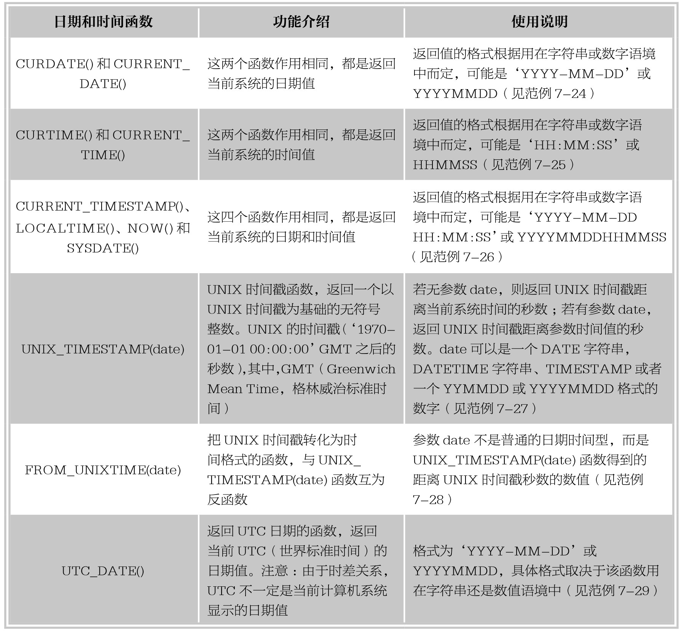
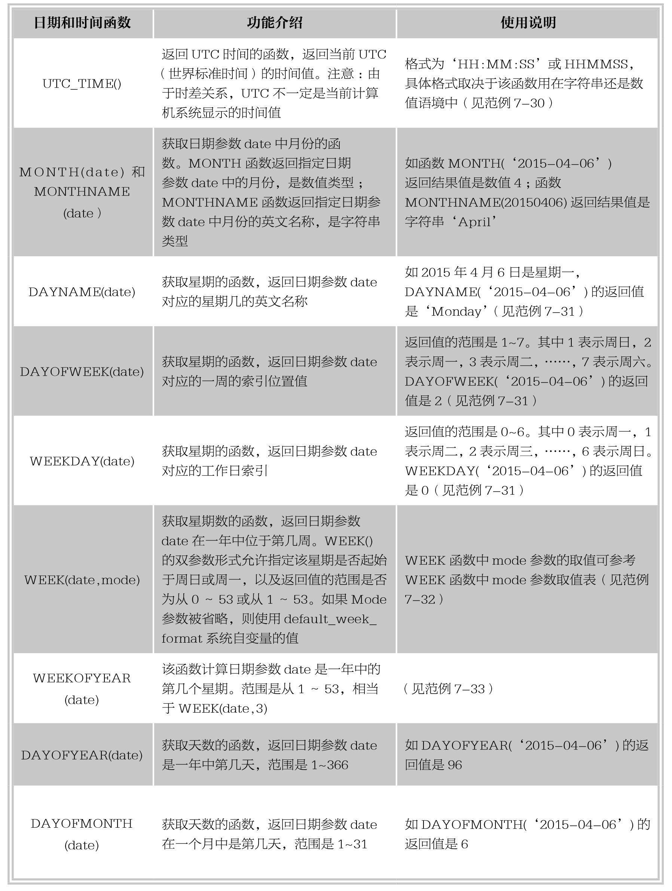
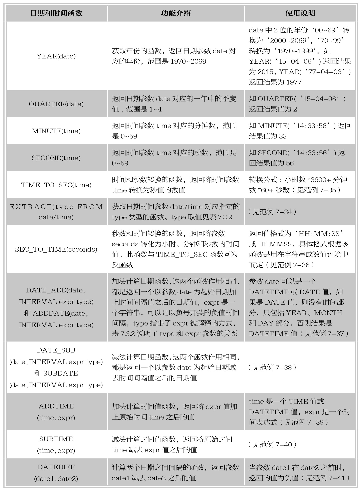
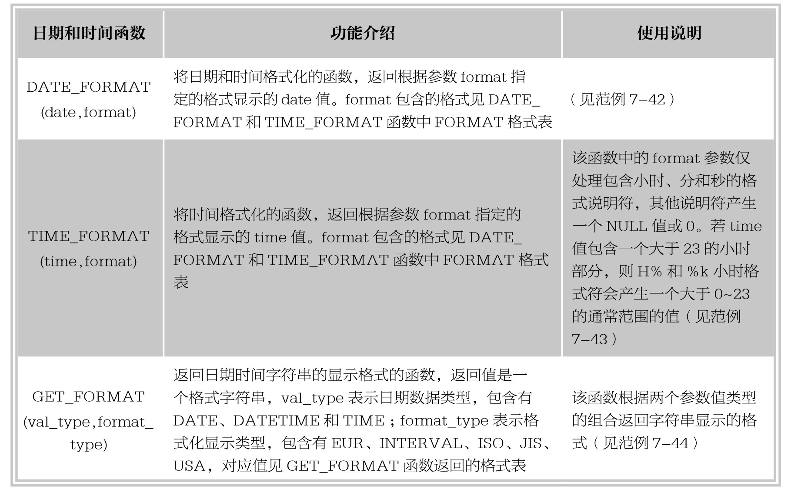
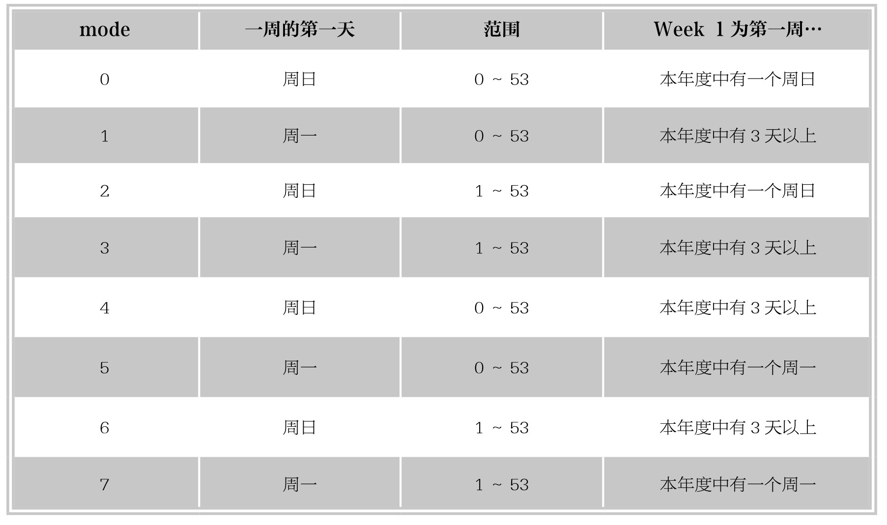
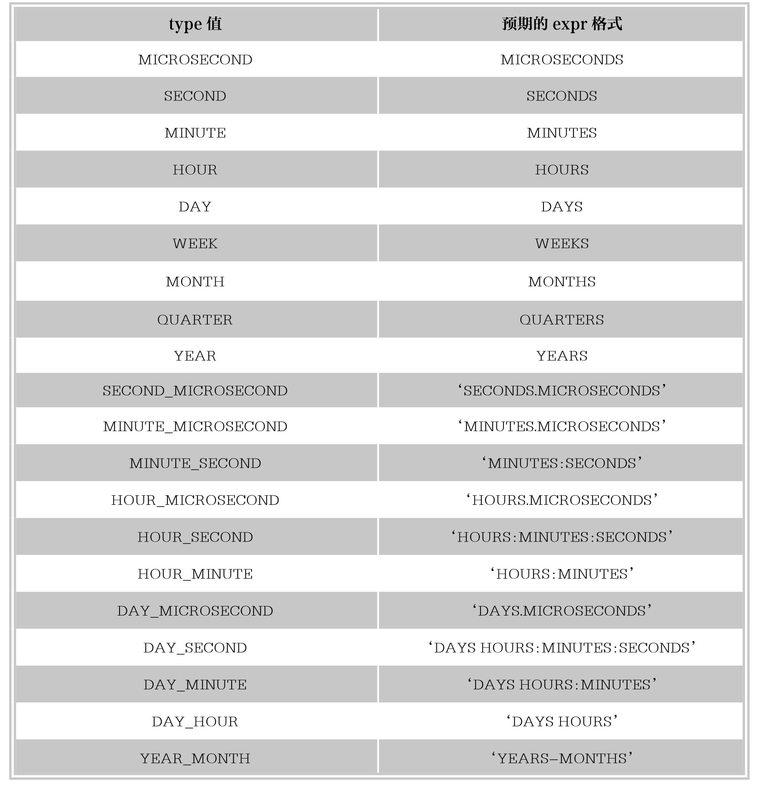
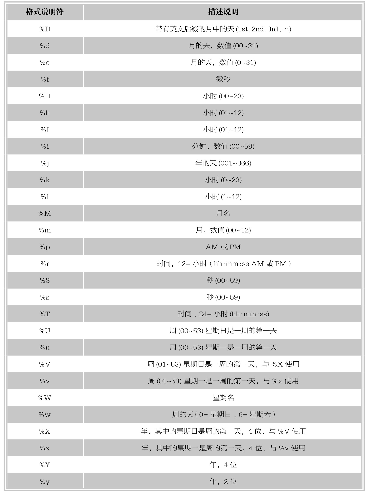
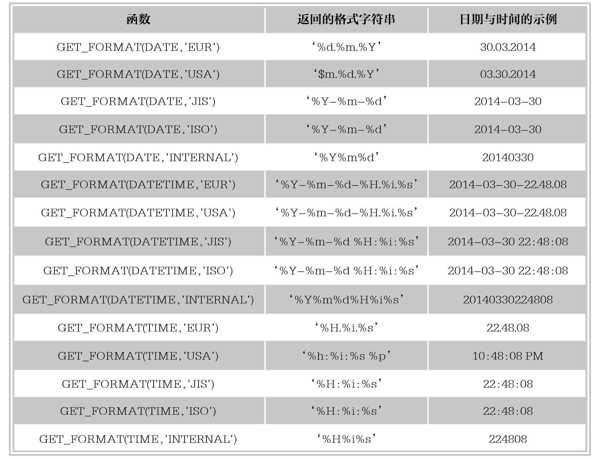

### 
  7.3 日期和时间函数

本节视频教学录像：1分钟

日期和时间函数主要用来处理日期和时间的值，一般的日期函数除了使用DATE类型的参数外，也可以使用DATETIME或TIMESTAMP类型的参数，只是忽略了这些类型值的时间部分。类似的情况还有，以TIME类型为参数的函数，可以接受TIMESTAMP类型的参数，只是忽略了日期部分，许多日期函数可以同时接受数值和字符串类型的参数，本节将介绍常用日期和时间函数的功能及用法。

【范例7-24】

使用函数CURDATE()和CURRENT_DATE()函数显示当前系统日期的操作，输入语句如下。

&#13;
    mySQL> select CURDATE(),CURRENT_DATE(),CURDATE()+0;&#13;
    +------------+----------------+-------------+&#13;
    |CURDATE() |CURRENT_DATE()|CURDATE()+0|&#13;
    +------------+----------------+-------------+&#13;
    |2015-04-05|2015-04-05  |  20150405|&#13;
    +------------+----------------+-------------+&#13;

由执行结果可以看出，这两个函数作用完全相同，都返回了当前系统的日期值，一般情况下，返回的是‘YYYY-MM-DD’格式的字符串；当将函数参与数值运算时，结果返回的是数值型。

【范例7-25】

使用函数CURTIME()和CURRENT_TIME()函数显示当前系统时间的操作，输入语句如下。

&#13;
    mySQL> select CURTIME(),CURRENT_TIME(),CURTIME()+0;&#13;
    +-----------+----------------+-------------+&#13;
    | CURTIME() | CURRENT_TIME() | CURTIME()+0 |&#13;
    +-----------+----------------+-------------+&#13;
    |20:35:52 |20:35:52   |   203552|&#13;
    +-----------+----------------+-------------+&#13;

由执行结果可以看出，这两个函数作用完全相同，都返回了当前系统的时间值，一般情况下，返回的是‘HH:MM:SS’格式的字符串；当将函数参与数值运算时，结果返回的是数值型。

【范例7-26】

使用函数CURRENT_TIMESTAMP()、LOCALTIME()、NOW()和SYSDATE()函数显示当前系统的日期和时间的操作，输入语句如下。

&#13;
    mySQL> select CURRENT_TIMESTAMP(),LOCALTIME(),NOW(),SYSDATE();&#13;
    +---------------------+---------------------+---------------------+---------------------+&#13;
    |CURRENT_TIMESTAMP()|LOCALTIME()    |NOW()       |SYSDATE()     |&#13;
    +---------------------+---------------------+---------------------+---------------------+&#13;
    | 2015-04-05 20:45:13 | 2015-04-05 20:45:13 | 2015-04-05 20:45:13 | 2015-04-05 20:45:13 |&#13;
    +---------------------+---------------------+---------------------+---------------------+&#13;
    mySQL> select NOW()+0;&#13;
    +----------------+&#13;
    |NOW()+0    |&#13;
    +----------------+&#13;
    | 20150405204730 |&#13;
    +----------------+&#13;

由执行结果可以看出，这四个函数作用相同，返回都是当前系统日期和时间值，一般情况都是字符串类型，当函数返回值参与数值运算时，返回的是数值型。

【范例7-27】

使用UNIX_TIMESTAMP(date)函数显示UNIX时间戳的操作，输入语句如下。

&#13;
    mySQL> select NOW(),UNIX_TIMESTAMP(),UNIX_TIMESTAMP(NOW()),UNIX_TIMESTAMP(20150406104700);&#13;
    +---------------------+------------------+-----------------------+--------------------------------+&#13;
    | NOW()                | UNIX_TIMESTAMP() | UNIX_TIMESTAMP(NOW()) | UNIX_TIMESTAMP(20150406104700)|&#13;
    +---------------------+------------------+-----------------------+--------------------------------+&#13;
    |2015-04-06 10:47:04|   1428288424|      1428288424|          1428288420|&#13;
    +---------------------+------------------+-----------------------+--------------------------------+&#13;

由执行结果可以看出，当前系统时间是NOW()函数返回的结果为2015-04-06 10:47:04，使用UNIX_TIMESTAMP(NOW())可以得到一个无符号整数1428288424，而缺省date参数的UNIX_TIMESTAMP()的返回结果同UNIX_TIMESTAMP(NOW())相同，都是1428288424；使用UNIX_TIMESTAMP(20150406104700)，参数比当前系统时间早4秒，那么得到的结果是1428288420，这个数值比1428288424小4，也就是距离UNIX时间戳少了4秒。

【范例7-28】

使用FROM_UNIXTIME(date)函数把UNIX时间戳转化为普通格式的时间的操作，输入语句如下：

&#13;
    mySQL> select UNIX_TIMESTAMP('2015-04-06 10:47:34'),FROM_UNIXTIME(1428288454);&#13;
    +---------------------------------------+---------------------------+&#13;
    | UNIX_TIMESTAMP('2015-04-06 10:47:34') | FROM_UNIXTIME(1428288454) |&#13;
    +---------------------------------------+---------------------------+&#13;
    |              1428288454|2015-04-06 10:47:34   |&#13;
    +---------------------------------------+---------------------------+&#13;

由执行结果可以看出，在范例7-27由UNIX_TIMESTAMP('2015-04-06 10:47:34')函数产生的UNIX时间戳数值1428288454，可以用FROM_UNIXTIME(1428288454)得到相对应的日期时间值2015-04-06 10:47:34，也就是说，这两个函数互为反函数。

【范例7-29】

使用UTC_DATE()函数返回当前UTC日期值的操作，输入语句如下。

&#13;
    mySQL> select UTC_DATE(),UTC_DATE()+0;&#13;
    +------------+--------------+&#13;
    | UTC_DATE() | UTC_DATE()+0 |&#13;
    +------------+--------------+&#13;
    |2015-04-06|  20150406|&#13;
    +------------+--------------+&#13;

由执行结果可以看出，一般情况下，该函数返回结果为字符串型‘2015-04-06’；当UTC_DATE()函数参与数值运算时，返回结果为数值型20150406。

【范例7-30】

使用UTC_TIME()函数返回当前UTC时间值的操作，输入语句如下。

&#13;
    mySQL> select UTC_TIME(),UTC_TIME()+0,NOW();&#13;
    +------------+--------------+---------------------+&#13;
    |UTC_TIME()|UTC_TIME()+0|NOW()       |&#13;
    +------------+--------------+---------------------+&#13;
    |04:04:25 |    40425|2015-04-06 12:04:25|&#13;
    +------------+--------------+---------------------+&#13;

由执行结果可以看出，使用NOW()函数获得当前计算机系统的时间是中午12点4分25秒，而UTC_TIME()函数返回值是凌晨4点4分25秒，因为中国地区位于东八区的时区，所以比UTC时间晚了8个小时；一般情况下，该函数返回结果为字符串型‘04:04:25’；当UTC_TIME()函数参与数值运算时，返回结果为数值型40425。

【范例7-31】

使用函数DAYNAME(date)、DAYOFWEEK(date)和WEEKDAY(date)返回日期参数date对应的星期几的操作，输入语句如下。

&#13;
    mySQL> select DAYNAME('2015-04-06'),DAYOFWEEK('2015-04-06'),WEEKDAY('2015-04-06');&#13;
    +-----------------------+-------------------------+-----------------------+&#13;
    | DAYNAME('2015-04-06') | DAYOFWEEK('2015-04-06') | WEEKDAY('2015-04-06') |&#13;
    +-----------------------+-------------------------+-----------------------+&#13;
    |Monday        |           2|          0|&#13;
    +-----------------------+-------------------------+-----------------------+&#13;

由执行结果可以看出，假如日期参数date取值为‘2015-04-06’，这一天是星期一，那么函数DAYNAME的输出结果就是‘Monday’；函数DAYOFWEEK的输出结果是2，是当天在一周中的索引位置，1表示周日，2就表示周一；函数WEEKDAY的输出结果是0，是当天对应的工作日索引，0表示周一。

【范例7-32】

使用WEEK(date,mode)函数返回日期参数date是一年中的第几周的操作，输入语句如下。

&#13;
    mySQL> select WEEK('2015-04-06'),WEEK('2015-04-06',0),WEEK('2015-04-06',1);&#13;
    +--------------------+----------------------+----------------------+&#13;
    | WEEK('2015-04-06') | WEEK('2015-04-06',0) | WEEK('2015-04-06',1) |&#13;
    +--------------------+----------------------+----------------------+&#13;
    |        14|         14|         15|&#13;
    +--------------------+----------------------+----------------------+&#13;

由执行结果可以看出，WEEK('2015-04-06')只使用一个参数date，它的第二个参数mode则为default_week_format默认值，MySQL中该值默认为0，指定一周的第一天为周日，因此和WEEK(‘2015-04-06',0)返回的结果相同，都是14，也就是说2015年4月6日是一年中的第14个星期；WEEK('2015-04-06',1)中第二个参数mode为1，指定一周的第一天为周一，返回值为15。可以看到，第二个参数mode的取值的不同，返回的结果也不同。使用不同的参数的原因是不同地区和国家的习惯不同，每周的第一天并不相同。

【范例7-33】

使用WEEKOFYEAR(date)函数计算日期参数date位于一年中的第几周的操作，输入语句如下。

&#13;
    mySQL> select WEEKOFYEAR('2015-04-06'),WEEK('2015-04-06'),WEEK('2015-04-06',3);&#13;
    +--------------------------+--------------------+----------------------+&#13;
    | WEEKOFYEAR('2015-04-06') | WEEK('2015-04-06') | WEEK('2015-04-06',3) |&#13;
    +--------------------------+--------------------+----------------------+&#13;
    |           15|        14|         15|&#13;
    +--------------------------+--------------------+----------------------+&#13;

由执行结果可以看出，2015年4月6日使用WEEKOFYEAR函数输出结果是15，使用WEEK函数mode取0输出值是14，而mode取3时输出值是15，和WEEKOFYEAR函数的结果相同，WEEKOFYEAR函数可以看作是WEEK函数的某一种情况，即mode取值为3的情况。

【范例7-34】

使用EXTRACT(type FROM date/time)函数提取日期时间参数中指定的type类型的操作，输入语句如下。

&#13;
    mySQL> select NOW(),EXTRACT(YEAR FROM NOW())AS column1,&#13;
    > EXTRACT(YEAR_MONTH FROM NOW())AS column2,&#13;
    > EXTRACT(DAY_MINUTE FROM'2015-04-06 15:22:49')AS column3;&#13;
    +---------------------+---------+---------+---------+&#13;
    |NOW()       |column1|column2|column3|&#13;
    +---------------------+---------+---------+---------+&#13;
    |2015-04-06 15:23:14|  2015| 201504| 61522|&#13;
    +---------------------+---------+---------+---------+&#13;

由执行结果可以看出，EXTRACT函数可以取出当前系统日期时间的年份、年份和月份，也可以取出指定日期时间的日和分钟数，结果由日、小时和分钟数组成。

【范例7-35】

使用TIME_TO_SEC(time)函数将时间值转换为秒值的操作，输入语句如下。

&#13;
    mySQL> select TIME_TO_SEC('16:18:20');&#13;
    +-------------------------+&#13;
    | TIME_TO_SEC('16:18:20') |&#13;
    +-------------------------+&#13;
    |         58700|&#13;
    +-------------------------+&#13;

由执行结果可以看出，根据计算公式：16*3600+18*60+20，得出结果秒数58700。

【范例7-36】

使用SEC_TO_TIME(seconds)函数将秒值转换为时间格式的操作，输入语句如下。

&#13;
    mySQL> select SEC_TO_TIME(58700),SEC_TO_TIME(58700)+0;&#13;
    +--------------------+----------------------+&#13;
    | SEC_TO_TIME(58700) | SEC_TO_TIME(58700)+0 |&#13;
    +--------------------+----------------------+&#13;
    |16:18:20     |       161820|&#13;
    +--------------------+----------------------+&#13;

由执行结果可以看出，将范例7-35中得到的秒数58700通过函数SEC_TO_TIME计算，返回结果是时间值16:18:20为字符串型；当把此函数作为数值类型参与计算时，得到的结果为数值型。SEC_TO_TIME(seconds)和TIME_TO_SEC(time)函数互为反函数。

【范例7-37】

使用DATE_ADD(date,INTERVAL expr type)和ADDDATE(date,INTERVAL expr type)函数执行日期的加运算操作，输入语句如下。

&#13;
    mySQL> select DATE_ADD(''2014-12-31 23:59:59',INTERVAL 1 SECOND)AS column1,&#13;
    > ADDDATE('2014-12-31 23:59:59',INTERVAL 1 SECOND)AS column2,&#13;
    > DATE_ADD('2014-12-31 23:59:59',INTERVAL'1 1:1:1'DAY_SECOND)AS column3;&#13;
    +---------------------+---------------------+---------------------+&#13;
    |column1      |column2      |column3      |&#13;
    +---------------------+---------------------+---------------------+&#13;
    | 2015-01-01 00:00:00 | 2015-01-01 00:00:00 | 2015-01-02 01:01:00 |&#13;
    +---------------------+---------------------+---------------------+&#13;

由执行结果可以看出，DATE_ADD和ADDDATE函数功能完全相同，在原始时间‘2014-12-31 23:59:59’上加一秒之后结果都是‘2015-01-01 00:00:00’；根据表7.3.2中显示的expr和type的关系，在原始时间加一天一小时一分钟一秒的写法是表达式‘1 1:1:1’ 及关键词DAY_SECOND，最终可得结果‘2015-01-02 01:01:00’。

【范例7-38】

使用DATE_SUB(date,INTERVAL expr type)和SUBDATE(date,INTERVAL expr type)函数执行日期的减法运算操作，输入语句如下。

&#13;
    mySQL> select DATE_SUB('2015-04-06',INTERVAL 31 DAY)AS column1,&#13;
    > SUBDATE('2015-04-06',INTERVAL 31 DAY)AS column2,&#13;
    > DATE_SUB('2015-01-02 01:01:00',INTERVAL '1 1:1:1' DAY_SECOND)AS column3;&#13;
    +------------+------------+---------------------+&#13;
    |column1  |column2  |column3      |&#13;
    +------------+------------+---------------------+&#13;
    | 2015-03-06 | 2015-03-06 | 2014-12-31 23:59:59 |&#13;
    +------------+------------+---------------------+&#13;

由执行结果可以看出，DATE_SUBD和SUBDATE函数功能完全相同，在原始时间‘2015-04-06’上减去31天之后结果都是‘2015-03-06’；根据表7.3.2中显示的expr和type的关系，在原始时间‘2015-01-02 01:01:00 ‘减去一天一小时一分钟一秒的写法是表达式‘1 1:1:1’及关键词DAY_SECOND，最终可得结果‘2014-12-31 23:59:59’。

提示 
 DATE_ADD和DATE_SUB函数在指定加减的时间段时，也可以指定负值，加法的负值即返回原始时间之前的日期和时间，减法的负值即返回原始时间之后的日期和时间。

【范例7-39】

使用ADDTIME(time,expr)函数进行时间的加法运算的操作，输入语句如下。

&#13;
    mySQL> select ADDTIME('2014-12-31 23:59:59','0:1:1'),&#13;
    > ADDTIME('19:32:59','10:12:37');&#13;
    +----------------------------------------+--------------------------------+&#13;
    | ADDTIME('2014-12-31 23:59:59','0:1:1') | ADDTIME('19:32:59','10:12:37') |&#13;
    +----------------------------------------+--------------------------------+&#13;
    |2015-01-01 00:01:00          |29:45:36           |&#13;
    +----------------------------------------+--------------------------------+&#13;

由执行结果可以看出，在原始日期时间‘2014-12-31 23:59:59’上加上0小时1分1秒之后，返回的日期时间是‘2015-01-01 00:01:00’；在原始时间‘19:32:59’上加上10小时12分37秒之后，返回的日期时间是‘29:45:36’。

【范例7-40】

使用SUBTIME(time,expr)函数进行时间的减法运算的操作，输入语句如下。

&#13;
    mySQL> select SUBTIME('2014-12-31 23:59:59','0:1:1'),&#13;
    > SUBTIME('19:32:59','10:12:37');&#13;
    +----------------------------------------+--------------------------------+&#13;
    | SUBTIME('2014-12-31 23:59:59','0:1:1') | SUBTIME('19:32:59','10:12:37') |&#13;
    +----------------------------------------+--------------------------------+&#13;
    |2014-12-31 23:58:58          |09:20:22           |&#13;
    +----------------------------------------+--------------------------------+&#13;

由执行结果可以看出，在原始日期时间‘2014-12-31 23:59:59’上减去0小时1分1秒之后，返回的日期时间是‘2014-12-31 23:58:58’；在原始时间‘19:32:59’上减去10小时12分37秒之后，返回的日期时间是‘09:20:22’。

【范例7-41】

使用DATEDIFF(date1,date2)函数计算两个日期之间的间隔天数的操作，输入语句如下。

&#13;
    mySQL> select DATEDIFF('2014-12-31','2015-04-06')AS column1,&#13;
    > DATEDIFF('2015-04-06 20:15:43','2014-12-31 23:59:59')AS column2;&#13;
    +---------+---------+&#13;
    | column1 | column2 |&#13;
    +---------+---------+&#13;
    |  -96|   96|&#13;
    +---------+---------+&#13;

由执行结果可以看出，DATEDIFF函数返回date1减去date2之后的值，参数忽略时间值，只是将日期值相减。

【范例7-42】

使用DATE_FORMAT(date,format)函数根据format指定的格式显示date值的操作，输入语句如下。

&#13;
    mySQL> select DATE_FORMAT('2015-04-06 20:43:57','%W %M %Y %l %p')AS column1,&#13;
    > DATE_FORMAT('2015-01-01','%D %b %y %T')AS column2;&#13;
    +------------------------+---------------------+&#13;
    |column1        |column2      |&#13;
    +------------------------+---------------------+&#13;
    | Monday April 2015 8 PM | 1st Jan 15 00:00:00 |&#13;
    +------------------------+---------------------+&#13;

由执行结果可以看出，column1中将日期时间值‘2015-04-06 20:43:57’格式化为指定格式‘%W %M %Y %l %p’，根据DATE-FORMAT和TIME-FORMAT函数中FORMAT格式表，可得结果‘Monday April 2015 8 PM’；column2中，将日期值‘2015-01-01’按照指定格式‘%D %b %y %T’进行格式化之后返回结果‘1st Jan 15 00:00:00’。

【范例7-43】

使用TIME_FORMAT(time,format)函数根据format指定的格式显示time值的操作，输入语句如下。

&#13;
    mySQL> select TIME_FORMAT('2015-04-06 20:43:57','%W %M %Y %l %p %r')AS column1,&#13;
  > TIME_FORMAT('20:43:57','%l %p %r')AS column2,&#13;
    > TIME_FORMAT('34:06:57','%H %k %h %r')AS column3;&#13;
    +---------+------------------+----------------------+&#13;
    |column1|column2     |column3       |&#13;
    +---------+------------------+----------------------+&#13;
    |NULL  |8 PM 08:43:57 PM|34 34 10 10:06:57 AM|&#13;
    +---------+------------------+----------------------+&#13;

由执行结果可以看出，column1中，此函数的参数format中如果包含非时间格式说明符时，返回结果为NULL；column2中，按照DATE-FORMAT和TIME-FORMAT函数中FORMAT格式表格式化了时间值；column3中，当原始时间值的小时数超过0～23取值范围时，小时格式说明符‘%H %k’返回了一个大于其取值范围的值34，当使用‘%h %r’进行格式化的时候，返回小时的值为10。

【范例7-44】

使用GET_FORMAT(val_type,format_type)函数返回日期时间字符串的显示格式的操作，输入语句如下。

&#13;
    mySQL> select GET_FORMAT(DATE,'EUR'),GET_FORMAT(DATETIME,'USA');&#13;
    +------------------------+----------------------------+&#13;
    | GET_FORMAT(DATE,'EUR') | GET_FORMAT(DATETIME,'USA') |&#13;
    +------------------------+----------------------------+&#13;
    |%d.%m.%Y       |%Y-%m-%d %H.%i.%s     |&#13;
    +------------------------+----------------------------+&#13;

由执行结果可以看出，GET_FORMAT函数中，参数val_type和format_type取值不同，根据GET_FORMAT函数返回的格式表，可以得到不同的日期时间格式化字符串的结果。

在DATE_FORMAT函数中，使用GET_FORMAT函数返回的显示格式字符串来显示指定的日期值，输入语句如下。

&#13;
    mySQL> select NOW(),DATE_FORMAT(NOW(), GET_FORMAT(DATE,'EUR'));&#13;
    +---------------------+--------------------------------------------+&#13;
    |NOW()       |DATE_FORMAT(NOW(),GET_FORMAT(DATE,'EUR'))|&#13;
    +---------------------+--------------------------------------------+&#13;
    |2015-04-06 22:45:48|06.04.2015                |&#13;
    +---------------------+--------------------------------------------+&#13;

由执行结果可以看出，当前系统时间NOW()函数返回值是‘2015-04-06 22:45:48’，使用GET_FORMAT函数将此日期时间值格式化为欧洲习惯的日期，查询GET_FORMAT函数返回的格式表可得格式化字符串‘%d.%m.%Y’,即日月年的顺序显示日期，最终可得结果‘06.04.2015’。

