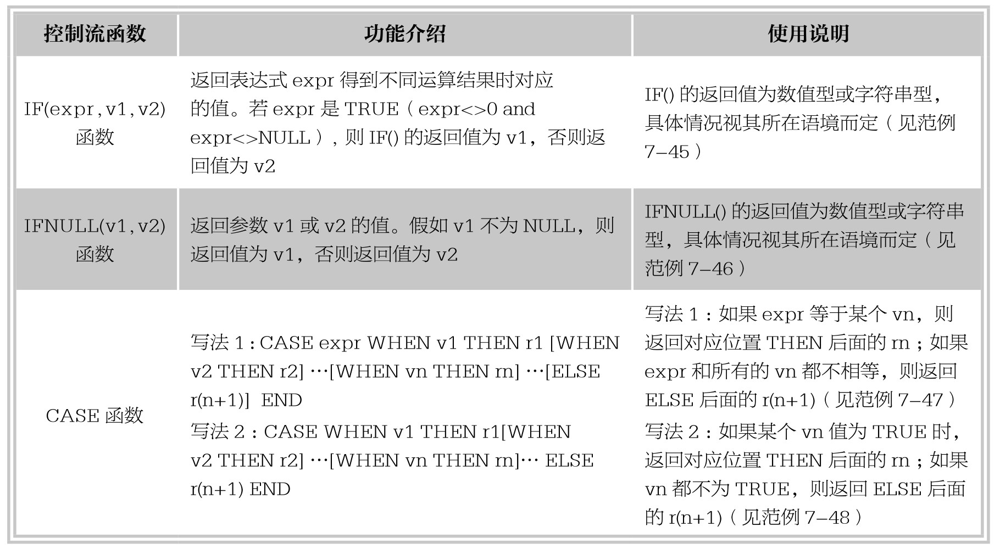

### 
  7.4 控制流函数

本节视频教学录像：1分钟

控制流函数也成为条件判断函数。函数根据满足的条件不同，执行相应的流程。MySQL中的控制流函数有IF、IFNULL和CASE。本节将结合实例介绍MySQL中控制流函数的功能和用法。

【范例7-45】

使用IF(expr,v1,v2)函数根据expr表达式结果返回相应值的操作，输入语句如下。

&#13;
    mySQL> select IF(3<2,1,0)AS column1,&#13;
    > IF(1>0,'√','×')AS column2,&#13;
    > IF(STRCMP('a','ab'),'yes','no')AS column3,&#13;
    > STRCMP('a','ab');&#13;
    +---------+---------+---------+------------------+&#13;
    | column1 | column2 | column3 | STRCMP('a','ab') |&#13;
    +---------+---------+---------+------------------+&#13;
    |   0|√   |yes  |       -1|&#13;
    +---------+---------+---------+------------------+&#13;

由执行结果可以看出，column1中，表达式3<2所得结果是false，则返回结果为v2，即数值0；column2中，表达式1>0结果是true，则返回结果为v1，即字符串‘√’；column3中，先用函数STRCMP比较两个字符串的大小，字符串‘a’和‘ab’比较结果返回值为-1，也就是表达式expr返回结果不等于0且不等于NULL，则返回值为v1，即字符串‘yes’。

【范例7-46】

使用IFNULL(v1,v2)函数根据v1取值返回相应值的操作，输入语句如下。

&#13;
    mySQL> select IFNULL(2,3),IFNULL(NULL,'OK'),IFNULL(SQRT(-2),'false'),SQRT(-2);&#13;
    +-------------+-------------------+--------------------------+----------+&#13;
    | IFNULL(2,3) | IFNULL(NULL,'OK') | IFNULL(SQRT(-2),'false') | SQRT(-2) |&#13;
    +-------------+-------------------+--------------------------+----------+&#13;
    |     2|OK        |false          |  NULL|&#13;
    +-------------+-------------------+--------------------------+----------+&#13;
    1 row in set (0.00 sec)&#13;

由执行结果可以看出，当IFNULL函数中参数v1=2和v2=3都不为空，即v1=2不为空，返回v1的值为2；当v1=NULL，则返回v2的值，即字符串‘OK’；当v1=SQRT(-2)时，函数SQRT(-2)返回值为NULL，即v1=NULL，所以返回v2为字符串‘false’。

【范例7-47】

使用CASE函数根据expr取值返回相应值的操作，输入语句如下。

&#13;
    mySQL>select CASE WEEKDAY(NOW())WHEN 0 THEN'星期一'WHEN 1 THEN'星期二'WHEN 2 THEN'星期三'WHEN 3 THEN'星期四'WHEN 4 THEN'星期五'WHEN 5 THEN'星期六'ELSE'星期天' END AS column1,NOW(),WEEKDAY(NOW()),DAYNAME(NOW());&#13;
    +-----------+---------------------+----------------+----------------+&#13;
    |column1 |NOW()       |WEEKDAY(NOW())|DAYNAME(NOW())|&#13;
    +-----------+---------------------+----------------+----------------+&#13;
    |星期天  |2015-04-12 15:09:26|       6|Sunday    |&#13;
    +-----------+---------------------+----------------+----------------+&#13;

由执行结果可以看出，NOW()函数得到当前系统时间是2015年4月12日，函数DAYNAME(NOW())得到当天是 ‘Sunday’，函数WEEKDAY(NOW())返回当前时间的工作日索引是6，即对应的是星期天；column1中，CASE后面表达式为日期时间函数WEEKDAY(NOW())，结果是6,，对照WHEN后面取值不是0～5，所以返回ELSE后面的值‘星期天’。

【范例7-48】

使用CASE函数根据vn取值返回相应值的操作，输入语句如下。

&#13;
    mySQL> select CASE WHEN WEEKDAY(NOW())=0 THEN ' 星 期 一 ' WHEN WEEKDAY(NOW())=1 THEN'星期二'WHEN WEEKDAY(NOW())=2 THEN'星期三'WHEN WEEKDAY(NOW())=3 THEN'星期四' WHEN WEEKDAY(NOW())=4 THEN'星期五'WHEN WEEKDAY(NOW())=5 THEN'星期六'ELSE'星期天' END AS column1,NOW(),WEEKDAY(NOW()),DAYNAME(NOW());&#13;
    +-----------+---------------------+----------------+----------------+&#13;
    |column1 |NOW()       |WEEKDAY(NOW())|DAYNAME(NOW())|&#13;
    +-----------+---------------------+----------------+----------------+&#13;
    |星期天  |2015-04-12 15:19:32|       6|Sunday    |&#13;
    +-----------+---------------------+----------------+----------------+&#13;

此范例跟范例7-47返回结果一样，只是使用了CASE函数的不同写法，WHEN后面为表达式，当表达式返回结果为TRUE时，取THEN后面的值，如果都不是，则返回ELSE后面的值。

