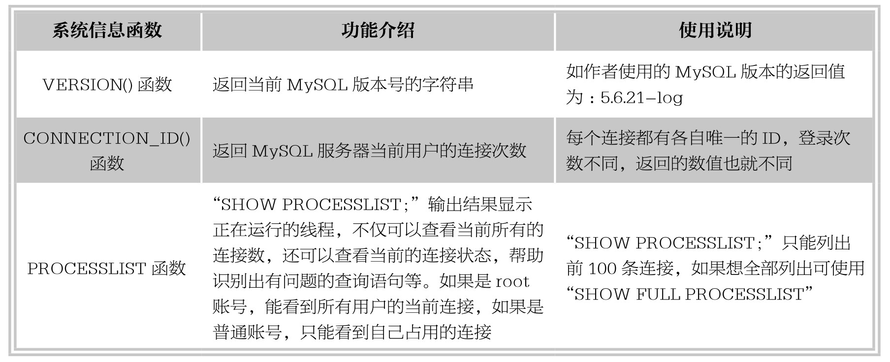
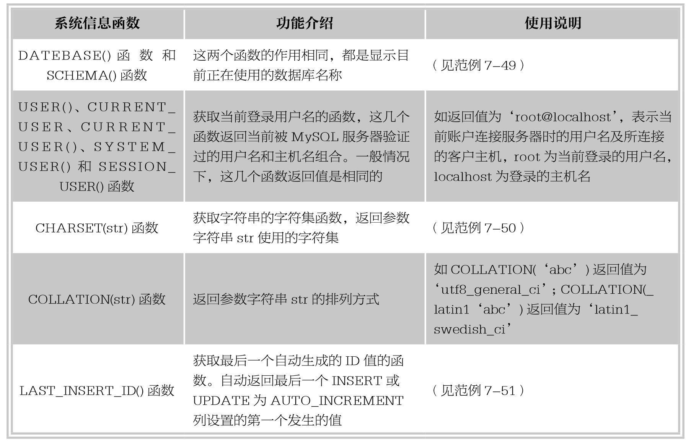

### 
  7.5 系统信息函数

本节视频教学录像：1分钟

MySQL的系统信息包含数据库的版本号、当前用户名和连接数、系统字符集、最后一个自动生成的值等，本节将介绍使用MySQL中的函数返回这些系统信息。

【范例7-49】

使用SHOW PROCESSLIST命令输出当前用户的连接信息的操作，输入语句如下。

&#13;
    mySQL> SHOW PROCESSLIST;&#13;
    +----+------+-----------------+------+---------+------+-------+------------------+&#13;
    |Id|User|Host      |db |Command|Time|State|Info      |&#13;
    +----+------+-----------------+------+---------+------+-------+------------------+&#13;
    | 4|root|localhost:49711|NULL|Query |  0|init |SHOW PROCESSLIST|&#13;
    +----+------+-----------------+------+---------+------+-------+------------------+&#13;

由执行结果可以看出，显示出连接信息的8列内容，各列的含义与用途详解如下。

⑴Id列:用户登录MySQL时，系统分配的“connection id”，标识一个用户。

⑵User列:显示当前用户。如果不是root，这个命令就只显示用户权限范围内的SQL语句。

⑶Host列:显示这个语句是从哪个IP的哪个端口上发出的。可用来追踪出现问题语句的用户。

⑷db列:显示这个进程目前连接的是哪个数据库。

⑸Command列:显示当前连接的执行的命令，一般就是休眠（Sleep）、查询（Query）、连接（Connect）。

⑹Time列:显示这个状态持续的时间，单位是秒。

⑺State 列:显示使用当前连接的SQL语句的状态，是很重要的列，后续会有所有状态的描述，请注意，State只是语句执行中的某一个状态。一个SQL语句，以查询为例，可能需要经过Copying to tmp table，Sorting result，Sending data等状态才可以完成。

⑻Info列:显示这个SQL语句，因为长度有限，所以长的SQL语句就显示不全，但是这是一个判断问题语句的重要依据。

使用另外的命令行登录MySQL，此时将会把所有连接显示出来，在后来登录的命令行下再次输入SHOW PROCESSLIST命令，结果如下。

&#13;
    mySQL> SHOW PROCESSLIST;&#13;
    +----+------+-----------------+------+---------+------+-------+------------------+&#13;
    |Id|User|Host      |db |Command|Time|State|Info      |&#13;
    +----+------+-----------------+------+---------+------+-------+------------------+&#13;
    | 4|root|localhost:49711|NULL|Sleep | 545|   |NULL      |&#13;
    | 7|root|localhost:50716|NULL|Sleep | 36|   |NULL      |&#13;
    | 8|root|localhost:50721|NULL|Query |  0|init |SHOW PROCESSLIST|&#13;
    +----+------+-----------------+------+---------+------+-------+------------------+&#13;

由执行结果可以看出，当年活动用户为登录连接为8的用户，正在执行的Command命令是Query （查询），使用的查询命令为SHOW PROCESSLIST；其余还有两个连接分别是4和7,这两个用户目前没有进行操作，处于Sleep状态，而且分别连接了545秒和36秒。

【范例7-50】

使用CHARSET(str)函数返回参数字符串str使用的字符集的操作，输入语句如下。

&#13;
    mySQL> select CHARSET('test'),CHARSET(CONVERT('test' USING latin1)),CHARSET(VERSION());&#13;
    +-----------------+---------------------------------------+--------------------+&#13;
    | CHARSET('test') | CHARSET(CONVERT('test' USING latin1)) | CHARSET(VERSION()) |&#13;
    +-----------------+---------------------------------------+--------------------+&#13;
    |utf8      |latin1                |utf8       |&#13;
    +-----------------+---------------------------------------+--------------------+&#13;

由执行结果可以看出，CHARSET('test')返回系统默认的字符集unf8；CHARSET(CONVERT('test' USING latin1))返回改变字符集函数CONVERT转换之后的字符集latin1；而VERSION()函数返回的字符串本身就是使用utf8字符集。

【范例7-51】

使用LAST_INSERT_ID()函数返回最后一个自动生成的ID值的操作，执行过程如下。

⑴一次插入一条记录。

使用数据库example，创建表student，其中ID字段带有AUTO_INCREMENT约束，输入语句如下。

&#13;
    mySQL> create table student(ID INT AUTO_INCREMENT NOT NULL PRIMARY KEY, NAME VARCHAR(40));&#13;
    Query OK, 0 rows affected (0.32 sec)&#13;

分别单独向表student中插入如下2条记录。

&#13;
    mySQL> insert into student values(NULL,'张三');&#13;
    Query OK, 1 row affected (0.07 sec)&#13;
    mySQL> insert into student values(NULL,'李四');&#13;
    Query OK, 1 row affected (0.06 sec)&#13;
    mySQL> select * from student;&#13;
    +----+--------+&#13;
    |ID|NAME |&#13;
    +----+--------+&#13;
    | 1|张三 |&#13;
    | 2|李四 |&#13;
    +----+--------+&#13;
    mySQL> select LAST_INSERT_ID();&#13;
    +------------------+&#13;
    | LAST_INSERT_ID() |&#13;
    +------------------+&#13;
    |        2|&#13;
    +------------------+&#13;

查看已经插入的数据可以发现，最后插入的一条记录的ID字段值为2，然后使用LAST_INSERT_ID()查看最后自动生成的ID值也为2。

可以看出，一次插入一条记录时，返回值为最后一条插入记录的ID值。

⑵一次同时插入多条记录。

再向表中插入多条记录，输入语句如下。

&#13;
    mySQL> insert into student values(NULL,'王五'),(NULL,'赵三'),(NULL,'周六');&#13;
    Query OK, 3 rows affected (0.03 sec)&#13;
    Records:3 Duplicates:0 Warnings:0&#13;
    mySQL> select * from student;&#13;
    +----+--------+&#13;
    |ID|NAME |&#13;
    +----+--------+&#13;
    | 1|张三 |&#13;
    | 2|李四 |&#13;
    | 3|王五 |&#13;
    | 4|赵三 |&#13;
    | 5|周六 |&#13;
    +----+--------+&#13;

执行结果可以看出，插入的最后一条记录的ID值为5，然后使用LAST_INSERT_ID()查看最后总共生成的ID值。

&#13;
    mySQL> select LAST_INSERT_ID();&#13;
    +------------------+&#13;
    | LAST_INSERT_ID() |&#13;
    +------------------+&#13;
    |        3|&#13;
    +------------------+&#13;

结果显示，使用函数LAST_INSERT_ID()得到的值是3而不是5。因为当使用一条INSERT语句插入多行记录时，LAST_INSERT_ID()函数只返回插入的第一行数据时产生的值，也就是第3行记录。

提示 
 LAST_INSERT_ID()函数返回结果与table无关，如果向表1中插入数据后，再向表2中插入数据，LAST_INSERT_ID()函数返回结果是表2中的ID值。

