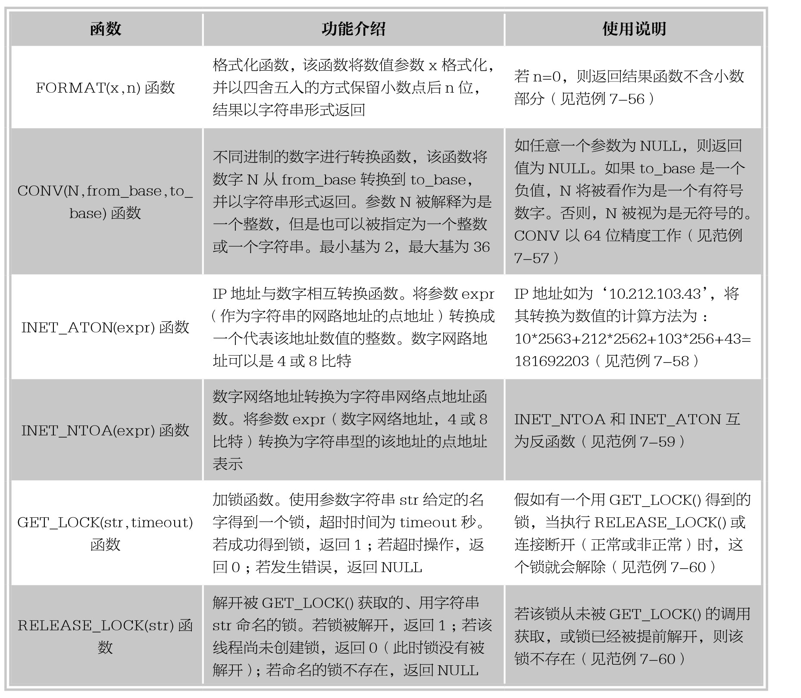
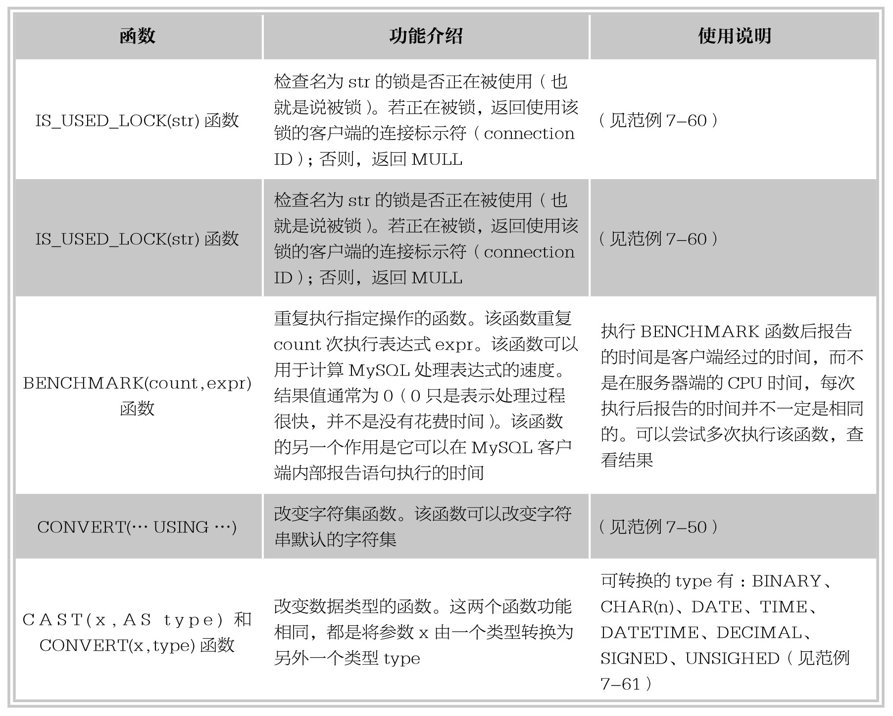

### 
  7.7 其他函数

本节视频教学录像：1分钟

MySQL中还有一些函数没有确定归类，但是也会使用到，本节将介绍这些函数的使用方法。

【范例7-56】

使用FORMAT(x,n)函数将数值参数x按照n的取值格式化的操作，输入语句如下。

&#13;
    mySQL> select FORMAT(897.567875,3),FORMAT(897.5,3),FORMAT(897.567875,0);&#13;
    +----------------------+-----------------+----------------------+&#13;
    | FORMAT(897.567875,3) | FORMAT(897.5,3) | FORMAT(897.567875,0) |&#13;
    +----------------------+-----------------+----------------------+&#13;
    |897.568       |897.500    |898         |&#13;
    +----------------------+-----------------+----------------------+&#13;

由执行结果可以看出，第1列中，FORMAT函数将数值897.567875四舍五入后保留小数点后面3位，结果得897.568；第2列中，该函数将数值897.5格式化为小数点后面3位，位数不够的以0补齐；第3列中，该函数将数值897.567875后面的小数部分去掉前也进行了四舍五入的操作。

【范例7-57】

使用CONV(N,from_base,to_base)函数进行不同进制数间的转换的操作，输入语句如下。

&#13;
    mySQL> select CONV('d',16,2),CONV(8,10,2),CONV(8,10,8),CONV(8,10,16);&#13;
    +----------------+--------------+--------------+---------------+&#13;
    | CONV('d',16,2) | CONV(8,10,2) | CONV(8,10,8) | CONV(8,10,16) |&#13;
    +----------------+--------------+--------------+---------------+&#13;
    |1101     |1000    |10     |8      |&#13;
    +----------------+--------------+--------------+---------------+&#13;

由执行结果可以看出，该函数可以将自变参数N从原来的进制数转换成另外的进制数。第1列中，16进制数的d是十进制的13，换算成二进制即1101；第2～4列中，分别将十进制的8转换为二进制数、八进制数、十六进制数。

【范例7-58】

使用INET_ATON(expr)函数将字符串网络点地址转换为数值网络地址的操作，输入语句如下。

&#13;
    mySQL> select INET_ATON('10.212.103.43');&#13;
    +----------------------------+&#13;
    | INET_ATON('10.212.103.43') |&#13;
    +----------------------------+&#13;
    |         181692203|&#13;
    +----------------------------+&#13;

【范例7-59】

使用INET_NTOA(expr)函数将数值网络地址转换为字符串网络点地址的操作，输入语句如下。

&#13;
    mySQL> select INET_NTOA(181692203);&#13;
    +----------------------+&#13;
    | INET_NTOA(181692203) |&#13;
    +----------------------+&#13;
    |10.212.103.43    |&#13;
    +----------------------+&#13;

由执行结果可以看出，将范例7-58中函数INET_ATON计算得到的数值网络地址使用函数INET_NTOA转换为字符串网络点IP地址为‘10.212.103.43’。该函数和INET_ATON函数互为反函数。

【范例7-60】

使用加锁和解锁函数的操作，输入语句如下。

&#13;
    mySQL> select GET_LOCK('test',30),IS_USED_LOCK('test'),IS_FREE_LOCK('test'),RELEASE_&#13;
    LOCK('test');&#13;
        +---------------------+----------------------+----------------------+----------------------+&#13;
        | GET_LOCK('test',30) | IS_USED_LOCK('test') | IS_FREE_LOCK('test') | RELEASE_LOCK('test') |&#13;
        +---------------------+----------------------+----------------------+----------------------+&#13;
        |         1|          2|          0|          1|&#13;
        +---------------------+----------------------+----------------------+----------------------+&#13;

由代码执行的结果可以得出如下结论。

⑴GET_LOCK('test',30)返回结果为1，说明成功得到了一个名称为‘test’的锁，持续时间为30秒。

⑵IS_USED_LOCK('test')返回结果为当前连接ID，表示名称为‘test’的锁正在被使用。

⑶IS_FREE_LOCK('test')返回结果为0，说明名称为‘test’的锁正在被使用。

⑷RELEASE_LOCK('test')返回值为1，说明解锁成功。

【范例7-61】

使用CAST(x,AS type)和CONVERT(x,type)函数转换数据类型的操作，输入语句如下。

&#13;
    mySQL> select CAST(6789 AS CHAR(3)),CONVERT('2015-04-13 15:09:30',TIME);&#13;
    +-----------------------+-------------------------------------+&#13;
    | CAST(6789 AS CHAR(3)) | CONVERT('2015-04-13 15:09:30',TIME) |&#13;
    +-----------------------+-------------------------------------+&#13;
    |678         |15:09:30              |&#13;
    +-----------------------+-------------------------------------+&#13;

由执行结果可以看出，函数CAST将DECIMAL类型的6789转换成了只有2个显示宽度的字符串型‘678’；函数CONVERT将DATETIME类型的值去掉了原有的日期，转换成了TIME类型。

