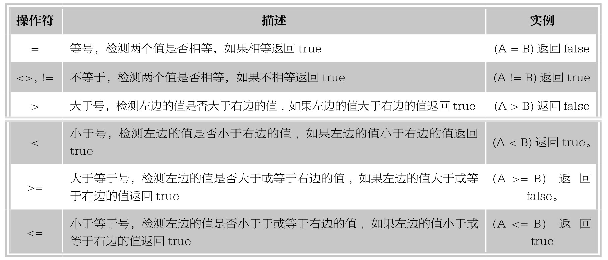
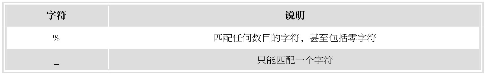
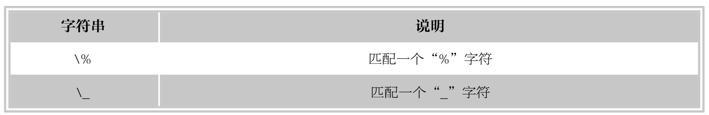

#### 
  8.2.5 查询表中的若干记录

1.清除取值重复的行

表中的记录没有重复，但查询后结果可能有相同的行，可以使用关键字DISTINCT来消除重复行。

【范例8-4】

查询学生来自哪些系。

&#13;
    MySQL> select sdept&#13;
    -> from student;&#13;

执行上面的语句，结果如下。

&#13;
    +--------+&#13;
    |sdept |&#13;
    +--------+&#13;
    | 计算机 |&#13;
    | 计算机 |&#13;
    |经贸 |&#13;
    |信管 |&#13;
    +--------+&#13;

查询结果包含重复的系的名称，如果想去掉结果中的重复行，必须使用DISTINCT关键字，SQL语句如下。

&#13;
    MySQL> select distinct sdept&#13;
    -> from student;&#13;

执行上面的语句，结果如下。

&#13;
    +--------+&#13;
    |sdept |&#13;
    +--------+&#13;
    | 计算机 |&#13;
    |经贸 |&#13;
    |信管 |&#13;
    +--------+&#13;

2.查询表中满足条件的记录

在查询过程中，可能只需要查询表中特定的数据，即满足一定条件的数据，该要求可以通过WHERE子句来实现，即在WHERE子句中指出查询的条件。

⑴比较大小。

下表为操作符列表，可用于 WHERE 子句中。下表中实例假定 A为5 、B为10。

【范例8-5】

查询全体女生的学号和姓名。

&#13;
    mysql> select sno,sname&#13;
    -> from student&#13;
    -> where ssex='女';&#13;

结果如下：

&#13;
    +-----+-------+&#13;
    | sno | sname |&#13;
    +-----+-------+&#13;
    | 1|刘敏 |&#13;
    | 4|孟欣 |&#13;
    +-----+-------+&#13;
    2 rows in set (0.03 sec)&#13;

【范例8-6】

查询分数大于80分的学生编号。

&#13;
    MySQL> select distinct sno&#13;
    -> from sc&#13;
    -> where grade>80;&#13;

在该查询中需要注意的是，每个学生选修多门课，可能有多门课程的成绩大于80，如果不加DISTINCT关键字，该学生的学号会重复多次，所有要使用DISTINCT来消除重复，结果如下。

&#13;
    +------+&#13;
    |sno |&#13;
    +------+&#13;
    |  1|&#13;
    |  2|&#13;
    +------+&#13;
    2 rows in set (0.04 sec)&#13;

⑵确定范围。

如果查询条件为某字段在或不在某个范围，可以使用谓词BETWEEN…AND或NOT BETWEEN…AND，其中BETWEEN后面为下限，AND后面为上限。

【范例8-7】

查询年龄在20～22岁之间的学生的学号、姓名和性别。

&#13;
    MySQL> select sno,sname,ssex&#13;
    -> from student&#13;
    -> where sage between 20 and 22;&#13;

结果如下。

&#13;
    +-----+-------+------+&#13;
    | sno | sname | ssex |&#13;
    +-----+-------+------+&#13;
    | 2|周松 |男 |&#13;
    | 3|张明 |男 |&#13;
    | 4|孟欣 |女 |&#13;
    +-----+-------+------+&#13;
    3 rows in set (0.03 sec)&#13;

⑶带IN关键字的查询。

使用谓词IN来确定查找的字段属于指定的集合记录。

【范例8-8】

查询年龄为18、20、23的学生信息。

&#13;
    MySQL> select *&#13;
    -> from student&#13;
    -> where sage in(18,20,23);&#13;

结果如下。

&#13;
    +-----+-------+------+------+-------+&#13;
    | sno | sname | ssex | sage | sdept |&#13;
    +-----+-------+------+------+-------+&#13;
    | 3|张明 |男 | 20|经贸 |&#13;
    +-----+-------+------+------+-------+&#13;
    1 row in set (0.03 sec)&#13;

与之相反，可以使用 NOT IN来查找不属于指定集合的记录。

【范例8-9】

查询年龄不为18、20、23的学生信息。

&#13;
    MySQL> select *&#13;
    -> from student&#13;
    -> where sage not in(18,20,23);&#13;

结果如下。

&#13;
    +-----+-------+------+------+--------+&#13;
    |sno|sname|ssex|sage|sdept |&#13;
    +-----+-------+------+------+--------+&#13;
    | 1|刘敏 |女 | 19|计算机|&#13;
    | 2|周松 |男 | 21|计算机|&#13;
    | 4|孟欣 |女 | 21|信管 |&#13;
    +-----+-------+------+------+--------+&#13;
    3 rows in set (0.00 sec)&#13;

⑷带LIKE的字符匹配查询。

可以使用“=”进行精确比较，但如果想查询姓“刘”的同学信息，简单的比较便不适用了。谓词LIKE可以用来进行字符串的匹配，其语法格式如下。

&#13;
    [not] like '<匹配串>' [escape '<换码字符>']&#13;

该语法的含义是查找指定的字段值与匹配串相匹配的行的信息。匹配串可以是一个完整的字符串，也可以包含通配符“%”和“_”。

【范例8-10】

查询姓“张”的学生编号和姓名。

&#13;
    MySQL> select sno,sname&#13;
    -> from student&#13;
    -> where sname like '张%';&#13;

姓张，即第1字符为“张”，而“张”后面有多少字符，不确定，所以“张”后面加通配符“%”，结果如下。

&#13;
    +-----+-------+&#13;
    | sno | sname |&#13;
    +-----+-------+&#13;
    | 3|张明 |&#13;
    +-----+-------+&#13;
    1 row in set (0.00 sec)&#13;

【范例8-11】

查询名字中第2个字符为“敏”的学生信息。

&#13;
    MySQL> select *&#13;
    -> from student&#13;
    -> where sname like '_敏%';&#13;

题目要求第2个字符为“敏”，即“敏”前面只有一个字符，所以“敏”字符前面加了“_”，而“敏”后面有多少字符，不确定，所以“敏”后面加了通配符“%”，结果如下。

&#13;
    +-----+-------+------+------+--------+&#13;
    |sno|sname|ssex|sage|sdept |&#13;
    +-----+-------+------+------+--------+&#13;
    | 1|刘敏 |女 | 19|计算机|&#13;
    +-----+-------+------+------+--------+&#13;
    1 row in set (0.00 sec)&#13;

若要对通配符的字符进行检验, 可将转义字符放在该字符前面。如果没有指定转义字符，则假设为“\”。

【范例8-12】

查询test表中aa列值以“a_”开头的行的信息。如果查询语句如下。

&#13;
    MySQL> select *&#13;
    -> from test&#13;
    -> where aa like 'a_%';&#13;

结果如下。

&#13;
    +-------+------+&#13;
    |aa  |bb |&#13;
    +-------+------+&#13;
    |a_ddd|  1|&#13;
    |akddd|  2|&#13;
    +-------+------+&#13;

like 'a_%'这种写法，系统会将“a”后面的“_”作为通配符对待，因为上述两行均满足要求。可以使用转移字符将通配符的性质转变，MySQL 默认使用“\”作为通配符。

【范例8-13】

查询要求正确的写法如下。

&#13;
    MySQL> select *&#13;
    -> from test&#13;
    -> where aa like 'a\_%';&#13;

结果如下。

&#13;
    +-------+------+&#13;
    |aa  |bb |&#13;
    +-------+------+&#13;
    |a_ddd|  1|&#13;
    +-------+------+&#13;

要指定一个不同的转义字符,可使用ESCAPE语句。

【范例8-14】

另一种查询写法如下。

&#13;
    MySQL> select *&#13;
    -> from test&#13;
    -> where aa like 'a*_%' escape '*';&#13;

（5）查询空值。

在WHERE子句中可以使用IS NULL来查询某字段内容为空的记录。

【范例8-15】

查询先行课为空的课程信息。

&#13;
    MySQL> select *&#13;
    -> from course&#13;
    -> where cpno is null;&#13;

结果如下。

&#13;
    MySQL> select *&#13;
    -> from course&#13;
    -> where cpno is null;&#13;

【范例8-16】

查询先行课不为空的课程信息。

&#13;
    MySQL> select *&#13;
    -> from course&#13;
    -> where cpno is not null;&#13;

结果如下。

&#13;
    +------+----------+------+&#13;
    |cno |cname  |cpno|&#13;
    +------+----------+------+&#13;
    |  1|数据库 |  4|&#13;
    |  2|操作系统|  3|&#13;
    |  4|数据结构|  2|&#13;
    +------+----------+------+&#13;

提示 
 IS NULL不能换成=NULL，如果换成=NULL,没有语法错误，但结果为空。

（6）多重条件查询。

可以使用逻辑运算符AND或OR来连接多个查询条件。AND的优先级要高于OR，可以使用括号来改变优先级的顺序。

【范例8-17】

查询选修了1号课程并且分数在80分以上的学生编号。

&#13;
    MySQL> select *&#13;
    -> from sc&#13;
    -> where cno=1 and grade>80;&#13;

结果如下。

&#13;
    +------+------+-------+&#13;
    |sno |cno |grade|&#13;
    +------+------+-------+&#13;
    |  1|  1|  89|&#13;
    +------+------+-------+&#13;
    1 row in set (0.09 sec)&#13;

【范例8-18】

查询计算机系或经贸系的学生信息。

&#13;
    MySQL> select *&#13;
    -> from student&#13;
    -> where sdept='计算机' or sdept='经贸系';&#13;

结果如下。

&#13;
    +-----+-------+------+------+--------+&#13;
    |sno|sname|ssex|sage|sdept |&#13;
    +-----+-------+------+------+--------+&#13;
    | 1|刘敏 |女 | 19|计算机|&#13;
    | 2|周松 |男 | 21|计算机|&#13;
    +-----+-------+------+------+--------+&#13;
    2 rows in set (0.01 sec)&#13;

