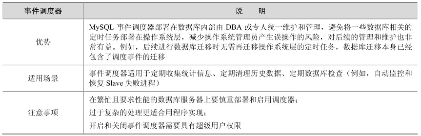

事件调度器是MySQL 5.1后新增的功能，可以将数据库按自定义的时间周期触发某种操作，可以理解为时间触发器，类似Linux系统下的任务调度器crontab。

下面是一个最简单的事件调度器：

CREATE EVENT myevent

ON SCHEDULE AT CURRENT_TIMESTAMP + INTERVAL 1 HOUR

DO

UPDATE myschema.mytable SET mycol = mycol + 1;

其中：

事件名称在 create event关键字后指定；

通过ON SCHEDULE子句指定事件在何时执行及执行频次；

通过DO子句指定要执行的具体操作或事件。

上述创建的调度事件首先创建了myevent调度事件，然后执行更新操作，起始执行时间为调度器创建时间，后续在起始时间的基础上每隔1小时触发一次。

下面通过一个完整的实例来熟悉事件调度器的使用。

（1）创建测试表test：

mysql> create table test(id1 varchar(10),create_time datetime);

Query OK, 0 rows affected (0.19 sec)

（2）创建事件调度器test_event_1，每隔5秒向test表插入一条记录：

mysql> CREATE EVENT test_event_1

-> ON SCHEDULE

-> EVERY 5 SECOND

-> DO

-> INSERT INTO test.test(id1,create_time)

-> VALUES ('test',now());

Query OK, 0 rows affected (0.05 sec)

（3）查看调度器状态：

mysql> show events \G;

*************************** 1. row ***************************

Db: test

Name: test_event_1

Definer: root@localhost

Time zone: SYSTEM

Type: RECURRING

Execute at: NULL

Interval value: 5

Interval field: SECOND

Starts: 2013-07-26 14:02:02

Ends: NULL

Status: ENABLED

Originator: 8306

character_set_client: latin1

collation_connection: latin1_swedish_ci

Database Collation: gbk_chinese_ci

1 row in set (0.00 sec)

（4）隔几秒后，查看test表，发现并没有数据插入：

mysql> select * from test;

Empty set (0.00 sec)

（5）查看事件调度器状态，发现默认是关闭的：

mysql> show variables like '%scheduler%';

+-----------------+-------+

| Variable_name | Value |

+-----------------+-------+

| event_scheduler | OFF |

+-----------------+-------+

1 row in set (0.01 sec)

（6）通过下面的命令打开调度器，同时 show processlist发现新产生一个后台进程：

mysql> SET GLOBAL event_scheduler = 1;

Query OK, 0 rows affected (0.00 sec)

mysql> show variables like '%scheduler%';

+-----------------+-------+

| Variable_name | Value |

+-----------------+-------+

| event_scheduler | ON |

+-----------------+-------+

1 row in set (0.01 sec)

mysql> show processlist \G;

…（前面省略）

*************************** 4. row ***************************

Id: 464905

User: event_scheduler

Host: localhost

db: NULL

Command: Daemon

Time: 1

State: Waiting for next activation

Info: NULL

Rows_sent: 0

Rows_examined: 0

Rows_read: 1

4 rows in set (0.00 sec)

（7）隔几秒后，再次查看test表，发现已经有了一些数据，且日期间隔都为5s：

mysql> select * from test;

+------+---------------------+

| id1 | create_time|

+------+---------------------+

| test | 2013-07-29 05:28:48 |

| test | 2013-07-29 05:28:53 |

| test | 2013-07-29 05:28:58 |

| test | 2013-07-29 05:29:03 |

（8）为了防止表变得很大，创建一个新的调度器，每隔1分钟清空一次test表：

CREATE EVENT trunc_test

ON SCHEDULE every 1 MINUTE

DO TRUNCATE TABLE test;

隔一段时间后，可以发现，test 表中数据会定期清空，这类触发器非常适合去定期清空临时表或者日志表。

（9）如果事件调度器不再使用，可以禁用（disable）或者删除（drop）掉：

--禁用event

mysql> alter event test_event_1 disable;

Query OK, 0 rows affected (0.00 sec)

--删除event

mysql> drop event test_event_1;

Query OK, 0 rows affected (0.05 sec)

对于事件调度器，还有很多选项，比如指定事件开始时间和结束时间，或者指定某个时间执行一次而不是循环执行，详细信息可以参考事件调度器的相关帮助，这里不再详述。

最后，我们总结一下事件调度器的优势、适用场景及使用中的注意事项，如表12-1所示。

表12-1 事件调度器的优势、适用场景及注意事项

