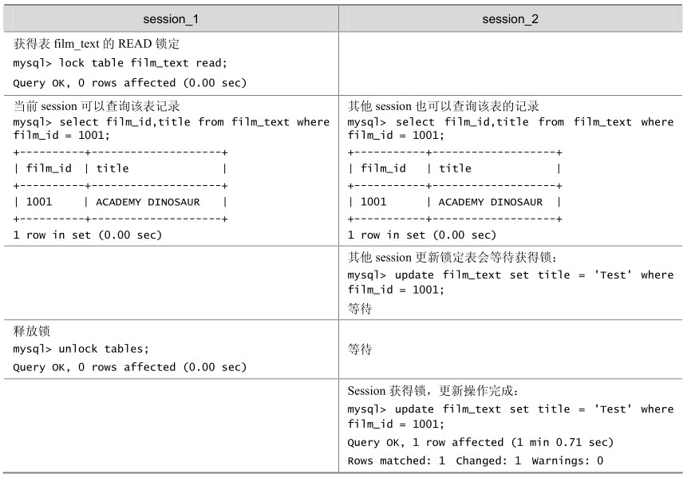

LOCK TABLES可以锁定用于当前线程的表。如果表被其他线程锁定，则当前线程会等待，直到可以获取所有锁定为止。

UNLOCK TABLES 可以释放当前线程获得的任何锁定。当前线程执行另一个 LOCK TABLES时，或当与服务器的连接被关闭时，所有由当前线程锁定的表被隐含地解锁，具体语法如下：

LOCK TABLES

tbl_name [AS alias] {READ [LOCAL] | [LOW_PRIORITY] WRITE}

[, tbl_name [AS alias] {READ [LOCAL] | [LOW_PRIORITY] WRITE}] . .

UNLOCK TABLES

如表 14-1 所示是一个获得表锁和释放表锁的简单例子，演示的是 film_text 表获得read锁的情况，其他session更新该表记录会等待锁，film_text表释放锁以后，其他session可以进行更新操作。其中 session1和 session2表示两个同时打开的 session，表格中的每一行表示同一时刻两个 session 的运行状况，后面的例子也都是同样格式，不再重复说明。

表14-1 一个获得表锁和释放表锁的简单例子

有关表锁的使用，可以参见“20.2 MyISAM表锁”小节以获得更详细的信息。

