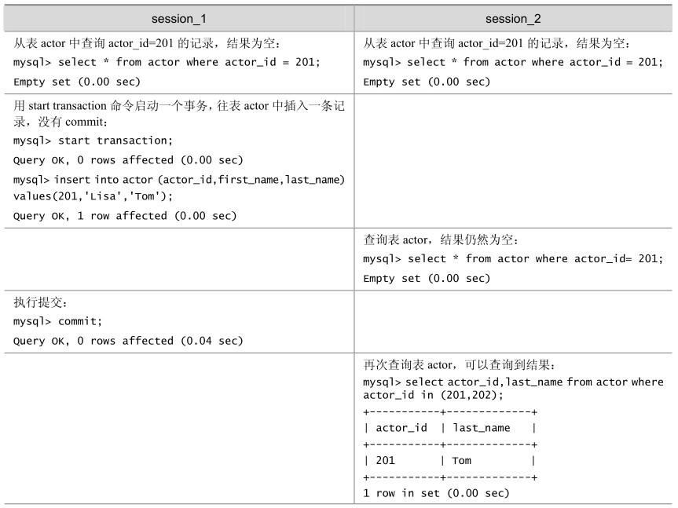
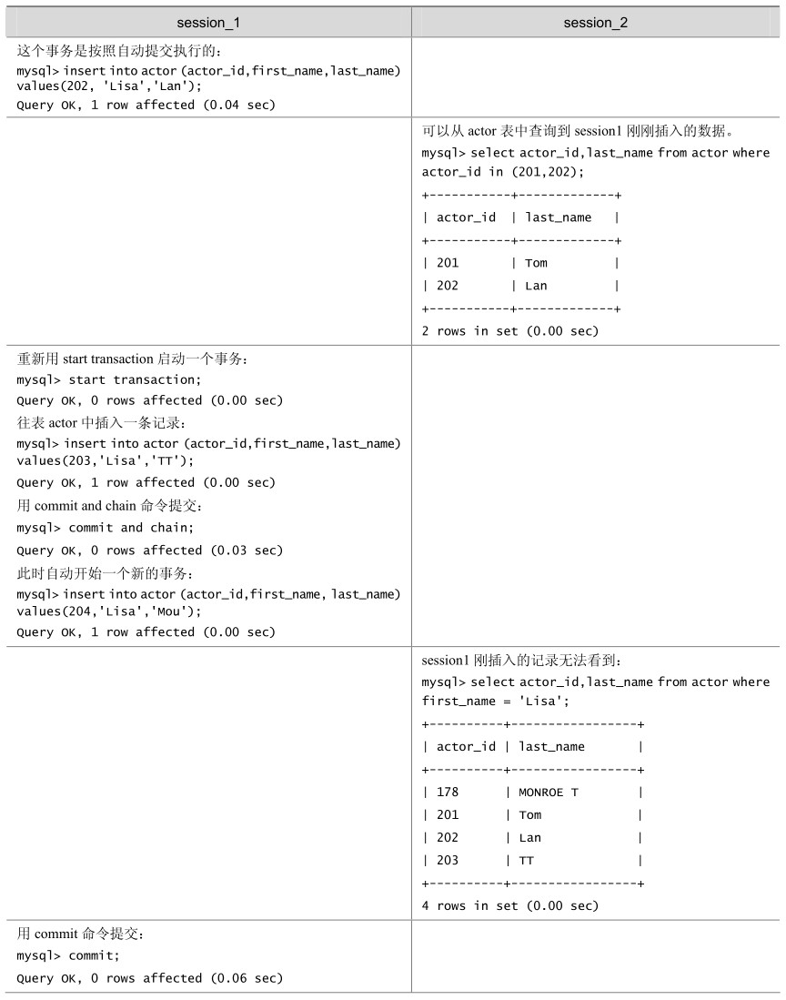
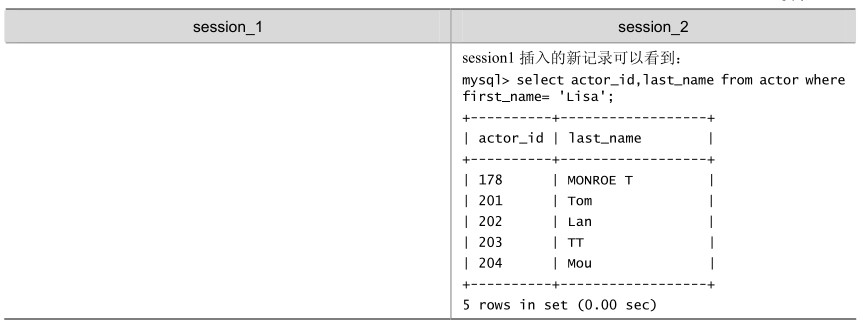
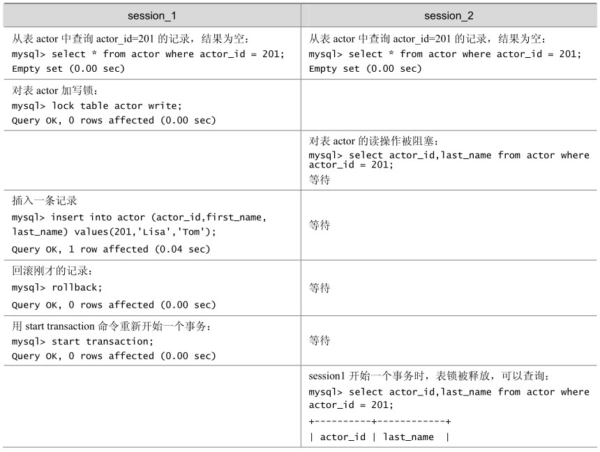
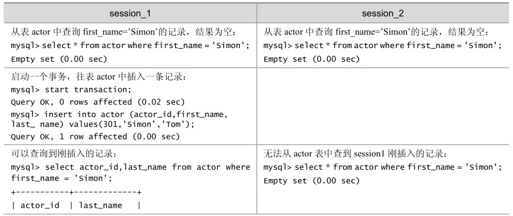
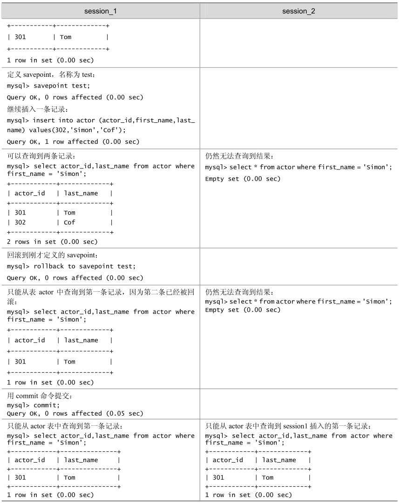

MySQL通过SET AUTOCOMMIT、START TRANSACTION、COMMIT和ROLLBACK等语句支持本地事务，具体语法如下。

START TRANSACTION | BEGIN [WORK]

COMMIT [WORK] [AND [NO] CHAIN] [[NO] RELEASE]

ROLLBACK [WORK] [AND [NO] CHAIN] [[NO] RELEASE]

SET AUTOCOMMIT = {0 | 1}

默认情况下，MySQL 是自动提交（Autocommit）的，如果需要通过明确的 Commit 和Rollback来提交和回滚事务，那么就需要通过明确的事务控制命令来开始事务，这是和Oracle的事务管理明显不同的地方。如果应用是从Oracle数据库迁移到MySQL数据库，则需要确保应用中是否对事务进行了明确的管理。

START TRANSACTION或BEGIN语句可以开始一项新的事务。

COMMIT和ROLLBACK用来提交或者回滚事务。

CHAIN和RELEASE子句分别用来定义在事务提交或者回滚之后的操作，CHAIN会立即启动一个新事物，并且和刚才的事务具有相同的隔离级别，RELEASE 则会断开和客户端的连接。

SET AUTOCOMMIT 可以修改当前连接的提交方式，如果设置了 SET AUTOC-OMMIT=0，则设置之后的所有事务都需要通过明确的命令进行提交或者回滚。

如果只是对某些语句需要进行事务控制，则使用START TRANSACTION语句开始一个事务比较方便，这样事务结束之后可以自动回到自动提交的方式，如果希望所有的事务都不是自动提交的，那么通过修改 AUTOCOMMIT 来控制事务比较方便，这样不用在每个事务开始的时候再执行START TRANSACTION语句。

如表14-2所示的例子演示了使用START TRANSACTION开始的事务在提交后自动回到自动提交的方式；如果在提交的时候使用COMMIT AND CHAIN，那么会在提交后立即开始一个新的事务。

表14-2 START TRANSACTION和COMMIT AND CHAIN的使用例子

续表

续表

如果在锁表期间，用 start transaction命令开始一个新事务，会造成一个隐含的 unlock tables被执行，如表14-3所示。

表14-3 start transaction导致的unlock tables

续表

因此，在同一个事务中，最好不使用不同存储引擎的表，否则ROLLBACK时需要对非事务类型的表进行特别的处理，因为 COMMIT、ROLLBACK 只能对事务类型的表进行提交和回滚。

通常情况下，只对提交的事务记录到二进制的日志中，但是如果一个事务中包含非事务类型的表，那么回滚操作也会被记录到二进制日志中，以确保非事务类型表的更新可以被复制到从数据库（Slave）中。

和Oracle的事务管理相同，所有的DDL语句是不能回滚的，并且部分的DDL语句会造成隐式的提交。

在事务中可以通过定义 SAVEPOINT，指定回滚事务的一个部分，但是不能指定提交事务的一个部分。对于复杂的应用，可以定义多个不同的 SAVEPOINT，满足不同的条件时，回滚不同的 SAVEPOINT。需要注意的是，如果定义了相同名字的 SAVEPOINT，则后面定义的SAVEPOINT 会覆盖之前的定义。对于不再需要使用的 SAVEPOINT，可以通过 RELEASE SAVEPOINT 命令删除 SAVEPOINT，删除后的 SAVEPOINT 不能再执行 ROLLBACK TO SAVEPOINT命令。

如表14-4所示的例子就是模拟回滚事务的一个部分，通过定义SAVEPOINT来指定需要回滚的事务的位置。

表14-4 模拟回滚事务

续表

