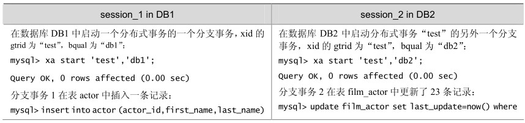
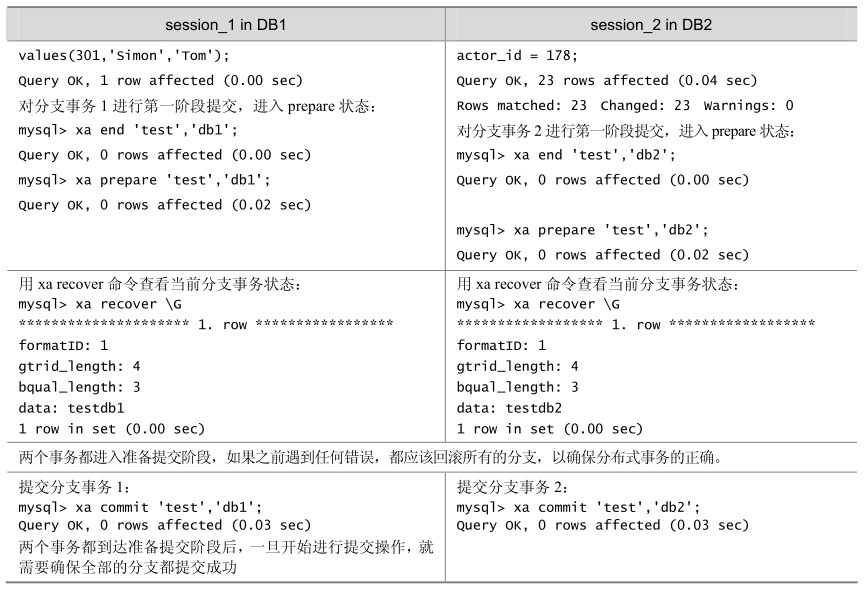

分布式事务（XA事务）的SQL语法主要包括：

XA {START|BEGIN} xid [JOIN|RESUME]

XA START xid用于启动一个带给定 xid值的XA事务。每个XA事务必须有一个唯一的xid值，因此该值当前不能被其他的XA事务使用。xid是一个XA事务标识符，用来唯一标识一个分布式事务。xid值由客户端提供，或由MySQL服务器生成。xid值包含1～3个部分：

xid: gtrid [, bqual [, formatID ]]

gtrid 是一个分布式事务标识符，相同的分布式事务应该使用相同的 gtrid，这样可以明确知道XA事务属于哪个分布式事务。

bqual 是一个分支限定符，默认值是空串。对于一个分布式事务中的每个分支事务， bqual值必须是唯一的。

formatID是一个数字，用于标识由gtrid和bqual值使用的格式，默认值是1。

下面其他XA语法中用到的xid值都必须和START操作使用的xid值相同，也就是表示对这个启动的XA事务进行操作。

XA END xid [SUSPEND [FOR MIGRATE]]

XA PREPARE xid

使事务进入PREPARE 状态，也就是两阶段提交的第一个提交阶段。

XA COMMIT xid [ONE PHASE]

XA ROLLBACK xid

这两个命令用来提交或者回滚具体的分支事务。也就是两阶段提交的第二个提交阶段，分支事务被实际地提交或者回滚。

XA RECOVER

XA RECOVER返回当前数据库中处于PREPARE状态的分支事务的详细信息。

分布式的关键在于如何确保分布式事务的完整性，以及在某个分支出现问题时的故障解决。XA 的相关命令就是提供给应用如何在多个独立的数据库之间进行分布式事务的管理，包括启动一个分支事务、使事务进入准备阶段以及事务的实际提交回滚操作等，如表 14-5 所示的例子演示了一个简单的分布式事务的执行，事务的内容是在 DB1 中插入一条记录，同时在DB2中更新一条记录，两个操作作为同一事务提交或者回滚。

表14-5 分布式事务例子

续表

