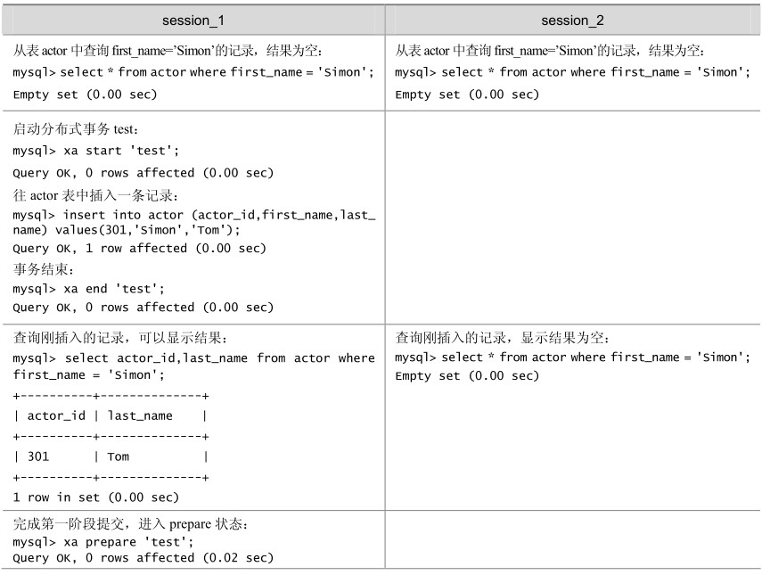
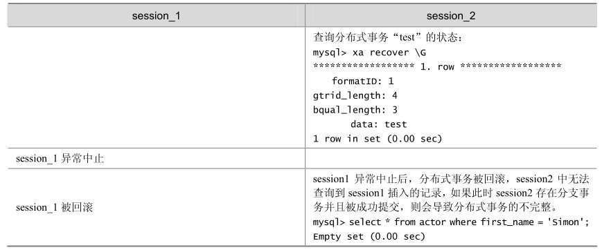

虽然MySQL支持分布式事务，但是在测试过程中，还是发现存在一些问题。

如果分支事务在达到 prepare 状态时，数据库异常重新启动，服务器重新启动以后，可以继续对分支事务进行提交或者回滚操作，但是提交的事务没有写binlog，存在一定的隐患，可能导致使用binlog恢复丢失部分数据。如果存在复制的数据库，则有可能导致主从数据库的数据不一致。以下演示了这个过程：

（1）从表 actor中查询 first_name = 'Simon'的记录，有一条。

mysql> select actor_id,last_name from actor where first_name = 'Simon';

+----------+-----------+

| actor_id | last_name |

+----------+-----------+

| 301 | Tom |

+----------+-----------+

1 row in set (0.00 sec)

（2）启动分布式事务“test”，删除刚才查询的记录。

mysql> xa start 'test';

Query OK, 0 rows affected (0.00 sec)

mysql> delete from actor where actor_id = 301;

Query OK, 1 row affected (0.00 sec)

mysql> select actor_id,last_name from actor where first_name = 'Simon';

Empty set (0.00 sec)

（3）完成第一阶段提交，进入prepare状态。

mysql> xa end 'test';

Query OK, 0 rows affected (0.00 sec)

mysql> xa prepare 'test';

Query OK, 0 rows affected (0.03 sec)

（4）此时，数据库异常终止，查询出错。

mysql> select actor_id,last_name from actor where first_name = 'Simon';

ERROR 2006 (HY000): MySQL server has gone away

No connection. Trying to reconnect...

ERROR 2002 (HY000): Can't connect to local MySQL server through socket '/mnt/db/mysqld.sock' (2)

ERROR:

Can't connect to the server

（5）启动数据库后，分支事务依然存在。

mysql> xa recover \G

*************************** 1. row ***************************

formatID: 1

gtrid_length: 4

bqual_length: 0

data: test

1 row in set (0.00 sec)

（6）表中记录并没有被删除。

mysql> select actor_id,last_name from actor where first_name = 'Simon';

+----------+-----------+

| actor_id | last_name |

+----------+-----------+

| 301 | Tom|

+----------+-----------+

1 row in set (0.00 sec)

（7）可以进行提交或者回滚。

mysql> xa commit 'test';

Query OK, 0 rows affected (0.02 sec)

mysql> select actor_id,last_name from actor where first_name = 'Simon';

Empty set (0.00 sec)

在上面的测试中，如果重新启动MySQL数据库以后，可以在MySQL的数据库日志中看到分布式事务的处理情况，数据库启动的时候发现有一个 prepare 状态的事务，提示需要进行处理：

InnoDB: Transaction 0 117471044 was in the XA prepared state.

InnoDB: 1 transaction(s) which must be rolled back or cleaned up

InnoDB: in total 0 row operations to undo

InnoDB: Trx id counter is 0 117471488

070710 16:55:41 InnoDB: Started; log sequence number 29 2758352865

070710 16:55:41 InnoDB: Starting recovery for XA transactions...

070710 16:55:41 InnoDB: Transaction 0 117471044 in prepared state after recovery

070710 16:55:41 InnoDB: Transaction contains changes to 1 rows

070710 16:55:41 InnoDB: 1 transactions in prepared state after recovery

070710 16:55:41 [Note] Found 1 prepared transaction(s) in InnoDB

070710 16:55:41 [Warning] Found 1 prepared XA transactions

使用mysqlbinlog查看binlog，可以确认最后提交的这个分支事务并没有记录到binlog中，因为复制和灾难恢复都是依赖于binlog的，所以binlog的缺失会导致复制环境的不同步，以及使用binlog恢复丢失部分数据。

如果分支事务的客户端连接异常中止，那么数据库会自动回滚未完成的分支事务，如果此时分支事务已经执行到 prepare 状态，那么这个分布式事务的其他分支可能已经成功提交，如果这个分支回滚，可能导致分布式事务的不完整，丢失部分分支事务的内容，如表14-6所示。

表14-6 客户端连接中止导致分布式事务失败例子

续表

如果分支事务在执行到 prepare 状态时，数据库异常，且不能再正常启动，需要使用备份和binlog来恢复数据，那么那些在prepare状态的分支事务因为并没有记录到binlog，所以不能通过binlog进行恢复，在数据库恢复后，将丢失这部分的数据。

总之，MySQL 的分布式事务还存在比较严重的缺陷，在数据库或者应用异常的情况下，可能会导致分布式事务的不完整。如果应用对于数据的完整性要求不是很高，则可以考虑使用。如果应用对事务的完整性有比较高的要求，那么对于当前的版本，则不推荐使用分布式事务。

