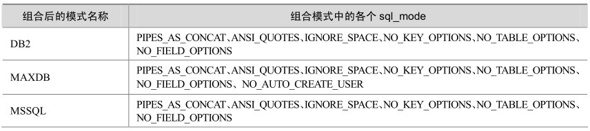
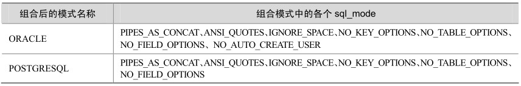

如果MySQL与其他异构数据库之间有数据迁移的需求，那么MySQL中提供的数据库组合模式就会对数据迁移过程有所帮助。

从表16-2可以看出，MySQL提供了很多数据库的组合模式名称，例如“ORACLE”、“DB2”等，这些模式组合是由很多小的 sql_mode 组合而成，在异构数据库之间迁移数据时可以尝试使用这些模式来导出适合于目标数据库格式的数据，这样就使得导出数据更容易导入目标数据库。

表16-2 MySQL中的常用数据库Mode

续表

在数据迁移过程中，可以设置SQL Mode为NO_TABLE_OPTIONS模式，这样将去掉 show create table中的“engine”关键字，获得通用的建表脚本。

测试实例如下：

mysql> show create table emp \G;

********************************* 1. row *********************************

Table: emp

Create Table: CREATE TABLE 'emp' (

'ename' varchar(20) DEFAULT NULL,

'hiredate' date DEFAULT NULL,

'sal' decimal(10,2) DEFAULT NULL,

'deptno' int(2) DEFAULT NULL

) ENGINE=InnoDB DEFAULT CHARSET=gbk

1 row in set (0.00 sec)

mysql> set session sql_mode='NO_TABLE_OPTIONS';

Query OK, 0 rows affected (0.00 sec)

mysql> show create table emp \G;

********************************* 1. row *********************************

Table: emp

Create Table: CREATE TABLE 'emp' (

'ename' varchar(20) DEFAULT NULL,

'hiredate' date DEFAULT NULL,

'sal' decimal(10,2) DEFAULT NULL,

'deptno' int(2) DEFAULT NULL

)

1 row in set (0.00 sec)

