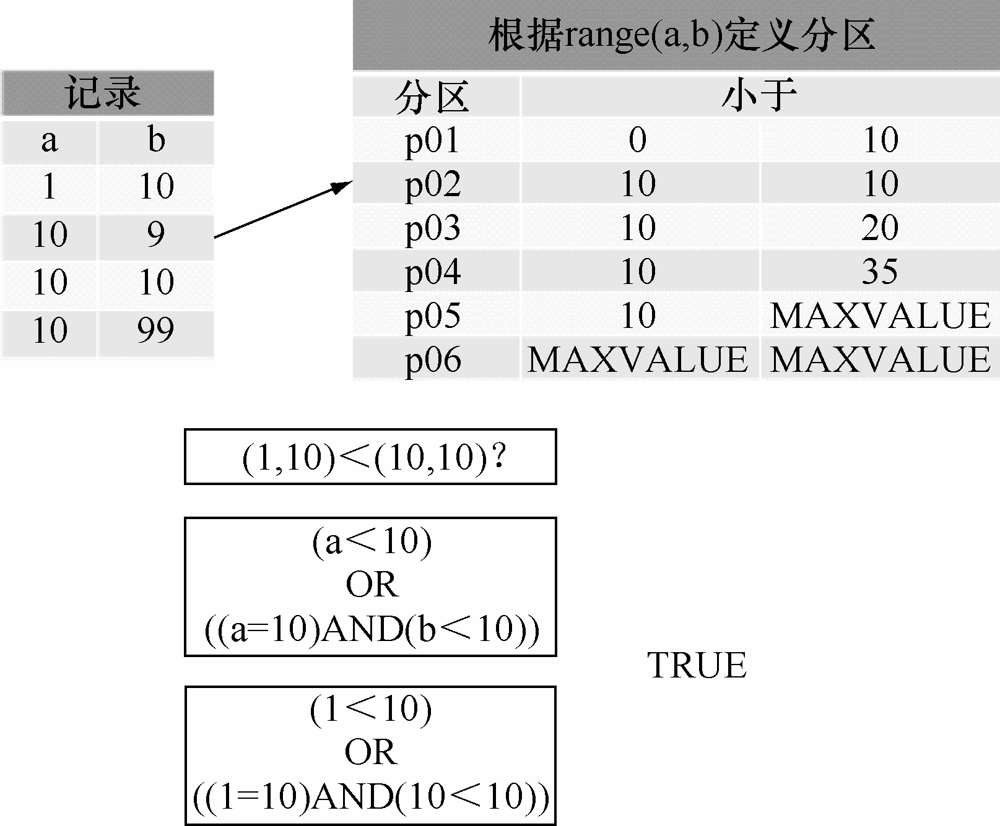
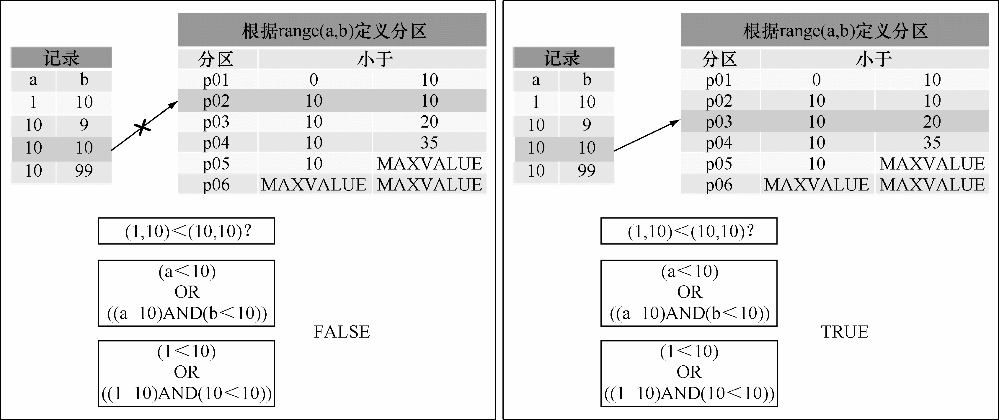

Columns分区是在MySQL 5.5引入的分区类型，引入Columns分区解决了MySQL 5.5版本之前RANGE分区和LIST分区只支持整数分区，从而导致需要额外的函数计算得到整数或者通过额外的转换表来转换为整数再分区的问题。Columns分区可以细分为RANGE Columns分区和LIST Columns分区，RANGE Columns分区和LIST Columns分区都支持整数、日期时间、字符串三大数据类型。

所有整数类型：tinyint、smallint、mediumint、int和bigint；其他数值类型都不支持，例如不支持Decimal和Float。

日期时间类型：date和datetime

字符类型：char、varchar、binary和varbinary；不支持text和blob类型作为分区键。

**注意：**MySQL 5.5中，Columns分区仅支持一个或者多个字段名作为分区键，不支持表达式作为分区键，区别于RANGE分区和LIST分区。

对比RANGE分区和LIST分区，Columns分区的亮点除了支持数据类型增加之外，另外一大亮点是 Columns 分区还支持多列分区。例如，创建了一个根据字段 a、b 组合的 RANGE COLUMNS分区：

mysql> CREATE TABLE rc3 (

->　a INT,

->　b INT

-> )

-> PARTITION BY RANGE COLUMNS(a, b) (

->　PARTITION p01 VALUES LESS THAN (0,10),

->　PARTITION p02 VALUES LESS THAN (10,10),

->　PARTITION p03 VALUES LESS THAN (10,20),

->　PARTITION p04 VALUES LESS THAN (10,35),

->　PARTITION p05 VALUES LESS THAN (10,MAXVALUE),

->　PARTITION p06 VALUES LESS THAN (MAXVALUE, MAXVALUE)

-> );

Query OK, 0 rows affected (0.07 sec)

需要注意的是，RANGE Columns分区键的比较是基于元组的比较，也就是基于字段组的比较，这和之前RANGE分区键的比较有些差异，我们写入几条测试数据并观察测试数据的分区分布情况来看一看。

写入a=1, b=10的记录，从 information_schema.partitions表发现数据实际上写入了p02分区，也就是说元组(1, 10) < (10, 10)，如图 17-1所示。

图17-1 写入Range columns分区测试一

mysql> insert into rc3 (a, b) values (1, 10);

Query OK, 1 row affected (0.00 sec)

mysql> select (1,10) < (10,10) from dual;

+------------------+

| (1,10) < (10,10) |

+------------------+

| 1 |

+------------------+

1 row in set (0.01 sec)

mysql> SELECT

->　partition_name part,

->　partition_expression expr,

->　partition_description descr,

->　table_rows

-> FROM

->　INFORMATION_SCHEMA.partitions

-> WHERE

->　TABLE_SCHEMA = schema()

->　AND TABLE_NAME='rc3';

+------+---------+-------------------+------------+

| part | expr | descr | table_rows |

+------+---------+-------------------+------------+

| p01 | `a`,`b` | 0,10| 0 |

| p02 | `a`,`b` | 10,10| 1 |

| p03 | `a`,`b` | 10,20| 0 |

| p04 | `a`,`b` | 10,35| 0 |

| p05 | `a`,`b` | 10,MAXVALUE | 0 |

| p06 | `a`,`b` | MAXVALUE,MAXVALUE | 0 |

+------+---------+-------------------+------------+

写入 a=10, b=9的记录，从 information_schema.partitions表能够发现数据实际上写入了 p02分区，也就是说元组(10, 9) < (10, 10)，元组(10, 9)的大小判断不是简单地通过元组的首字段进行的，如图17-2所示。

图17-2 写入Range columns分区测试二

mysql> insert into rc3(a, b) values(10, 9);

Query OK, 1 row affected (0.00 sec)

mysql> select (10,9) < (10,10) from dual;

+------------------+

| (10,9) < (10,10) |

+------------------+

|1|

+------------------+

1 row in set (0.00 sec)

mysql> SELECT

->　partition_name part,

->　partition_expression expr,

->　partition_description descr,

->　table_rows

-> FROM

->　INFORMATION_SCHEMA.partitions

-> WHERE

->　TABLE_SCHEMA = schema()

->　AND TABLE_NAME='rc3';

+------+---------+-------------------+------------+

| part | expr | descr| table_rows |

+------+---------+-------------------+------------+

| p01 | `a`,`b` | 0,10| 0 |

| p02 | `a`,`b` | 10,10| 2 |

| p03 | `a`,`b` | 10,20| 0 |

| p04 | `a`,`b` | 10,35| 0 |

| p05 | `a`,`b` | 10,MAXVALUE| 0 |

| p06 | `a`,`b` | MAXVALUE,MAXVALUE | 0 |

+------+---------+-------------------+------------+

6 rows in set (0.01 sec)

写入 a=10, b=10的记录，从 information_schema.partitions表能够发现数据实际上写入了 p03分区，也就是说元组(10, 10) <= (10, 10) <(10, 20)，如图 17-3所示。

图17-3 写入Range columns分区测试三

mysql> insert into rc3(a, b) values(10,10);

Query OK, 1 row affected (0.00 sec)

mysql> select (10,10) < (10,10) from dual;

+-------------------+

| (10,10) < (10,10) |

+-------------------+

|0|

+-------------------+

1 row in set (0.00 sec)

mysql> SELECT

->　partition_name part,

->　partition_expression expr,

->　partition_description descr,

->　table_rows

-> FROM

->　INFORMATION_SCHEMA.partitions

-> WHERE

->　TABLE_SCHEMA = schema()

->　AND TABLE_NAME='rc3';

+------+---------+-------------------+------------+

| part | expr | descr | table_rows |

+------+---------+-------------------+------------+

| p01 | `a`,`b` | 0,10| 0 |

| p02 | `a`,`b` | 10,10| 2 |

| p03 | `a`,`b` | 10,20|1|

| p04 | `a`,`b` | 10,35 | 0 |

| p05 | `a`,`b` | 10,MAXVALUE | 0 |

| p06 | `a`,`b` | MAXVALUE,MAXVALUE | 0 |

+------+---------+-------------------+------------+

6 rows in set (0.00 sec)

其实，RANGE Columns分区键的比较（元组的比较）其实就是多列排序，先根据 a字段排序再根据b字段排序，根据排序结果来分区存放数据。和RANGE单字段分区排序的规则实际上是一致的。

