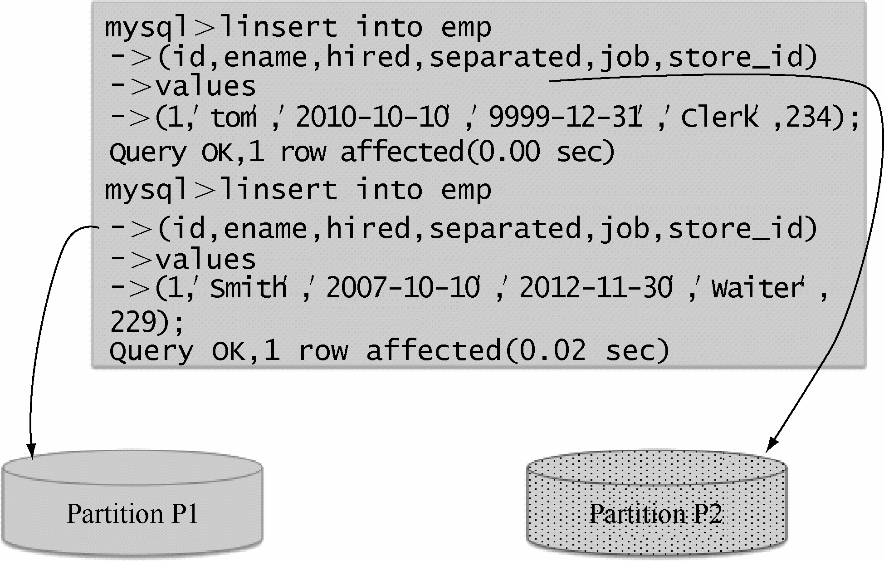

HASH分区主要用来分散热点读，确保数据在预先确定个数的分区中尽可能平均分布。对一个表执行HASH分区时，MySQL会对分区键应用一个散列函数，以此确定数据应当放在N个分区中的哪个分区中。

MySQL支持两种HASH分区，常规HASH分区和线性HASH分区（LINEAR HASH分区）；常规HASH使用的是取模算法，线性HASH分区使用的是一个线性的2的幂的运算法则。

在这里，我们将要创建一个常规HASH分区的散列表emp，使用PARTITION BY HASH(expr) PARTITIONS num 子句对分区类型、分区键和分区个数进行定义，其中expr是某列值或一个基于某列值返回一个整数值的表达式，num是一个非负的整数，表示分割成分区的数量，默认num为1。下面语句创建了一个基于store_id列HASH分区的表，表被分成了4个分区。

mysql> CREATE TABLE emp (

->　id INT NOT NULL,

->　ename VARCHAR(30),

->　hired DATE NOT NULL DEFAULT '1970-01-01',

->　separated DATE NOT NULL DEFAULT '9999-12-31',

->　job VARCHAR(30) NOT NULL,

->　store_id INT NOT NULL

-> )

-> PARTITION BY HASH (store_id) PARTITIONS 4;

Query OK, 0 rows affected (0.05 sec)

其实对于一个表达式“expr”，我们是可以计算出它会被保存在哪个分区中。假设将要保存记录的分区编号为N，那么“N = MOD(expr, num)”。例如，emp表有4个分区，插入一个 store_id列值为234的记录到emp表中：

mysql> insert into emp values (1, 'Tom', '2010-10-10', '9999-12-31', 'Clerk', 234);

Query OK, 0 rows affected (0.05 sec)

如果插入一个col3列值为'2005-09-15'的记录到表t1中，那么保存该条记录的分区确定如下：

MOD(234,4) = 2

也就是 store_id = 234这条记录将会被保存到第二个分区，图 17-4显示了MySQL会检查store_id中的值、计算散列、确定给定行会出现在哪个分区。

图17-4 MySQL写入Hash分区

通过执行计划可以确定 store_id = 234这条记录存储在第二个分区内：

sql> explain partitions select * from emp where store_id = 234\G

*************************** 1. row ***************************

id: 1

select_type: SIMPLE

table: emp

partitions: p2

type: ALL

possible_keys: NULL

key: NULL

key_len: NULL

ref: NULL

rows: 2

Extra: Using where

1 row in set (0.00 sec)

表达式“expr”可以是MySQL中有效的任何函数或者其他表达式，只要它们返回一个既非常数也非随机数的整数。每当插入/更新/删除一行数据时，这个表达式都需要计算一次，这意味着非常复杂的表达式可能会引起性能问题，MySQL也不推荐使用涉及多列的哈希表达式。

常规HASH分区方式看上去挺不错的，通过取模的方式来数据尽可能平均分布在每个分区中，让每个分区管理的数据都减少了，提高了查询的效率；可是当我们需要增加分区或者合并分区的时候，问题就出现了。假设原来是5个常规HASH分区，现在需要新增一个常规HASH分区，原来的取模算法是MOD(expr,5)，根据余数0～4分布在5个分区中，现在新增一个分区后，取模算法变成MOD(expr,6)，根据余数0～5分区在6个分区中，原来5个分区中的数据大部分都需要通过重新计算重新分区。常规HASH在分区管理上带来的代价太大了，不适合需要灵活变动分区的需求。为了降低分区管理上的代价，MySQL提供了线性HASH分区，分区函数是一个线性的2的幂的运算法则。

线性HASH分区和常规HASH分区在语法上的唯一区别是在“PARTITION BY”子句中添加“LINEAR”关键字，例如：

mysql> CREATE TABLE emp (

->　　id INT NOT NULL,

->　　ename VARCHAR(30),

->　　hired DATE NOT NULL DEFAULT '1970-01-01',

->　　separated DATE NOT NULL DEFAULT '9999-12-31',

->　　job VARCHAR(30) NOT NULL,

->　　store_id INT NOT NULL

->　)

->　PARTITION BY LINEAR HASH (store_id) PARTITIONS 4;

Query OK, 0 rows affected (0.02 sec)

同样的，使用线性HASH时，指定记录保存在哪个分区是可以计算出来的，假设将要保存记录的分区编号为N，num是一个非负的整数，表示分割成分区的数量，那么N可以通过以下算法得到。

首先，找到下一个大于等于num的2的幂，这个值设为V，V可以通过下面的公式得到：

V = Power (2, Ceiling (Log (2, num)))

例如，刚才创建的 emp表预先设定了 4个分区，也就是 num = 4。

V=Power (2, Ceiling (Log (2, num)))

= Power (2, Ceiling (Log (2,4)))

=Power (2, Ceiling (2))

=Power (2, 2)

=4

其次，设置N = F(column_list) & (V- 1)。

例如，我们刚才计算出V = 4，现在计算 store_id= 234对应的N值。

N =F (column_list) & (V- 1)

= 234 & (4- 1)

= 2

当 N >=num。

设置V =Ceiling(V/2)，设置N =N & (V- 1)。

对于 store_id = 234这条记录，由于N = 2 < 4，所以直接就能够判断这条记录会被存储在第二个分区中。

有意思的是，当线性HASH的分区个数是2的N次幂时，线性HASH的分区结果和常规HASH的分区结果是一致的。

**注意：**由于负数取模较复杂，仅以非负整数A举例，模数num为2幂次方，那么数值A对num取模能够转换为位与运算： MOD (A, num) = A & (num- 1)

假设分区个数num为2的幂次方，数值A（A为非负整数）的所在分区为N(A)：

常规HASH分区时，保存数值A所在分区N(A) = MOD(A, num) = A & (num - 1)；

线性HASH分区时，找到大于等于num的幂V = Power (2, Ceiling (Log (2, num))) = num， （num本身就是 2的幂次方），其次，计算N = A & (num- 1)，考虑到A为非负整数，N = A & (num - 1) = MOD(A, num)，也就是N为数值A对分区个数 num取模的结果，容易判定N <="" p="">

线性HASH分区的优点是，在分区维护（包含增加、删除、合并、拆分分区）时，MySQL能够处理得更加迅速；缺点是，对比常规HASH分区（取模）的时候，线性HASH各个分区之间数据的分布不太均衡。

