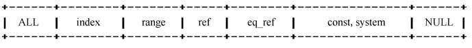

通过以上步骤查询到效率低的 SQL 语句后，可以通过 EXPLAIN 或者 DESC 命令获取MySQL如何执行SELECT语句的信息，包括在SELECT语句执行过程中表如何连接和连接的顺序，比如想统计某个email为租赁电影拷贝所支付的总金额，需要关联客户表customer和付款表payment，并且对付款金额amount字段做求和（sum）操作，相应SQL的执行计划如下：

mysql> explain select sum(amount) from customer a, payment b where 1=1 and a.customer_id= b.customer_id and email = 'JANE.BENNETT@sakilacustomer.org'\G

*************************** 1. row ***************************

id: 1

select_type: SIMPLE

table: a

type: ALL

possible_keys: PRIMARY

key: NULL

key_len: NULL

ref: NULL

rows: 583

Extra: Using where

*************************** 2. row ***************************

id: 1

select_type: SIMPLE

table: b

type: ref

possible_keys: idx_fk_customer_id

key: idx_fk_customer_id

key_len: 2

ref: sakila.a.customer_id

rows: 12

Extra:

2 rows in set (0.00 sec)

对每个列简单地进行一下说明。

select_type：表示SELECT的类型，常见的取值有SIMPLE（简单表，即不使用表连接或者子查询）、PRIMARY（主查询，即外层的查询）、UNION（UNION中的第二个或者后面的查询语句）、SUBQUERY（子查询中的第一个SELECT）等。

table：输出结果集的表。

type：表示MySQL在表中找到所需行的方式，或者叫访问类型，常见类型如图18-1所示。

图18-1 常见访问类型

从左至右，性能由最差到最好。

（1）type=ALL，全表扫描，MySQL遍历全表来找到匹配的行：

mysql> explain select * from film where rating >9\G

*************************** 1. row ***************************

id: 1

select_type: SIMPLE

table: film

type: ALL

possible_keys: NULL

key: NULL

key_len: NULL

ref: NULL

rows: 916

Extra: Using where

1 row in set (0.00 sec)

（2）type=index，索引全扫描，MySQL遍历整个索引来查询匹配的行：

mysql> explain select title from film\G

*************************** 1. row ***************************

id: 1

select_type: SIMPLE

table: film

type: index

possible_keys: NULL

key: idx_title

key_len: 767

ref: NULL

rows: 916

Extra: Using index

1 row in set (0.00 sec)

（3）type=range，索引范围扫描，常见于<、<=、>、>=、between等操作符：

mysql> explain select * from payment where customer_id >= 300 and customer_id <= 350\G

*************************** 1. row ***************************

id: 1

select_type: SIMPLE

table: payment

type: range

possible_keys: idx_fk_customer_id

key: idx_fk_customer_id

key_len: 2

ref: NULL

rows: 1349

Extra: Using where

1 row in set (0.00 sec)

（4）type=ref，使用非唯一索引扫描或唯一索引的前缀扫描，返回匹配某个单独值的记录行，例如：

mysql> explain select * from payment where customer_id =350\G

*************************** 1. row ***************************

id: 1

select_type: SIMPLE

table: payment

type: ref

possible_keys: idx_fk_customer_id

key: idx_fk_customer_id

key_len: 2

ref: const

rows: 23

Extra:

1 row in set (0.00 sec)

索引idx_fk_customer_id是非唯一索引，查询条件为等值查询条件customer_id=35，所以扫描索引的类型为ref。ref还经常出现在join操作中：

mysql> explain select b.*, a.* from payment a, customer b where a.customer_id =b.customer_id\G

*************************** 1. row ***************************

id: 1

select_type: SIMPLE

table: b

type: ALL

possible_keys: PRIMARY

key: NULL

key_len: NULL

ref: NULL

rows: 505

Extra:

*************************** 2. row ***************************

id: 1

select_type: SIMPLE

table: a

type: ref

possible_keys: idx_fk_customer_id

key: idx_fk_customer_id

key_len: 2

ref: sakila.b.customer_id

rows: 12

Extra:

2 rows in set (0.00 sec)

（5）type=eq_ref，类似ref，区别就在使用的索引是唯一索引，对于每个索引键值，表中只有一条记录匹配；简单来说，就是多表连接中使用 primary key或者 unique index作为关联条件。

mysql> explain select * from film a, film_text b where a.film_id = b.film_id\G

*************************** 1. row ***************************

id: 1

select_type: SIMPLE

table: a

type: ALL

possible_keys: PRIMARY

key: NULL

key_len: NULL

ref: NULL

rows: 916

Extra:

*************************** 2. row ***************************

id: 1

select_type: SIMPLE

table: b

type: eq_ref

possible_keys: PRIMARY

key: PRIMARY

key_len: 2

ref: sakila.a.film_id

rows: 1

Extra: Using where

2 rows in set (0.00 sec)

（6）type=const/system，单表中最多有一个匹配行，查询起来非常迅速，所以这个匹配行中的其他列的值可以被优化器在当前查询中当作常量来处理，例如，根据主键 primary key或者唯一索引 unique index进行的查询。

构造一个查询：

mysql> alter table customer drop index idx_email;

Query OK, 0 rows affected (0.08 sec)

Records: 0 Duplicates: 0 Warnings: 0

mysql> alter table customer add unique index uk_email (email);

Query OK, 0 rows affected (0.15 sec)

Records: 0 Duplicates: 0 Warnings: 0

mysql> explain select * from (select * from customer where email ='AARON.SELBY@sakilacustomer.org')a\G

*************************** 1. row ***************************

id: 1

select_type: PRIMARY

table: <derived2>

type: system

possible_keys: NULL

key: NULL

key_len: NULL

ref: NULL

rows: 1

Extra:

*************************** 2. row ***************************

id: 2

select_type: DERIVED

table: customer

type: const

possible_keys: uk_email

key: uk_email

key_len: 153

ref:

rows: 1

Extra:

2 rows in set (0.00 sec)

通过唯一索引uk_email访问的时候，类型type为const；而从我们构造的仅有一条记录的a表中检索时，类型type就为system。

（7）type=NULL，MySQL不用访问表或者索引，直接就能够得到结果，例如：

mysql> explain select 1 from dual where 1\G

*************************** 1. row ***************************

id: 1

select_type: SIMPLE

table: NULL

type: NULL

possible_keys: NULL

key: NULL

key_len: NULL

ref: NULL

rows: NULL

Extra: No tables used

1 row in set (0.00 sec)

类型type还有其他值，如ref_or_null（与ref类似，区别在于条件中包含对NULL的查询）、index_merge（索引合并优化）、unique_subquery（in 的后面是一个查询主键字段的子查询）、index_subquery（与 unique_subquery 类似，区别在于 in 的后面是查询非唯一索引字段的子查询）等。

possible_keys：表示查询时可能使用的索引。

key：表示实际使用的索引。

key_len：使用到索引字段的长度。

rows：扫描行的数量。

Extra：执行情况的说明和描述，包含不适合在其他列中显示但是对执行计划非常重要的额外信息。

MySQL 4.1开始引入了 explain extended命令，通过 explain extended加上 show warnings，我们能够看到在SQL真正被执行之前优化器做了哪些SQL改写：

mysql> explain extended select sum(amount) from customer a, payment b where 1=1 and a.customer_id = b.customer_id and email = 'JANE.BENNETT@sakilacustomer.org'\G

*************************** 1. row ***************************

id: 1

select_type: SIMPLE

table: a

type: ALL

possible_keys: PRIMARY

key: NULL

key_len: NULL

ref: NULL

rows: 583

filtered: 100.00

Extra: Using where

*************************** 2. row ***************************

id: 1

select_type: SIMPLE

table: b

type: ref

possible_keys: idx_fk_customer_id

key: idx_fk_customer_id

key_len: 2

ref: sakila.a.customer_id

rows: 12

filtered: 100.00

Extra:

2 rows in set, 1 warning (0.00 sec)

mysql> show warnings\G

*************************** 1. row ***************************

Level: Note

Code: 1003

Message: select sum(`sakila`.`b`.`amount`) AS `sum(amount)` from `sakila`.`customer` `a`join `sakila`.`payment` `b` where ((`sakila`.`b`.`customer_id` = `sakila`.`a`.`customer_id`) and (`sakila`.`a`.`email` = 'JANE.BENNETT@sakilacustomer.org'))

1 row in set (0.00 sec)

explain extended输出结果中多了 filtered字段，同时从warning的message字段能够看到优化器自动去除了1=1恒成立的条件，也就是说优化器在改写SQL时会自动去掉恒成立的条件。在遇到复杂的SQL时，我们可以利用 explain extended的结果来迅速地获取一个更清晰易读的SQL。

MySQL 5.1开始支持分区功能，同时 explain命令也增加了对分区的支持。可以通过 explain partitions命令查看SQL所访问的分区。例如，创建一个Hash分区的customer_part表，根据分区键查询的时候，能够看到 explain partitions的输出结果中有一列 partitions，其中显示了SQL所需要访问的分区名字p2：

mysql> create table customer_part (

-> `customer_id` smallint(5) unsigned NOT NULL AUTO_INCREMENT,

…

-> PRIMARY KEY (`customer_id`)

-> )partition by hash(customer_id) partitions 8;

Query OK, 0 rows affected (0.56 sec)

mysql> insert into customer_part select * from customer;

Query OK, 599 rows affected (0.08 sec)

Records: 599 Duplicates: 0 Warnings: 0

mysql> explain partitions select * from customer_part where customer_id = 130\G

*************************** 1. row ***************************

id: 1

select_type: SIMPLE

table: customer_part

partitions: p2

type: const

possible_keys: PRIMARY

key: PRIMARY

key_len: 2

ref: const

rows: 1

Extra:

1 row in set (0.00 sec)

有的时候，仅仅通过explain分析执行计划并不能很快地定位SQL的问题，这个时候我们还可以选择profile联合分析。

