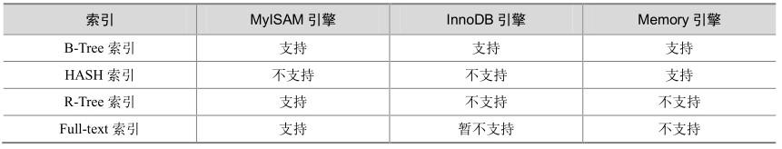

索引是在MySQL的存储引擎层中实现的，而不是在服务器层实现的。所以每种存储引擎的索引都不一定完全相同，也不是所有的存储引擎都支持所有的索引类型。MySQL 目前提供了以下4种索引。

B-Tree索引：最常见的索引类型，大部分引擎都支持B树索引。

HASH索引：只有Memory引擎支持，使用场景简单。

R-Tree索引（空间索引）：空间索引是MyISAM的一个特殊索引类型，主要用于地理空间数据类型，通常使用较少，不做特别介绍。

Full-text（全文索引）：全文索引也是 MyISAM 的一个特殊索引类型，主要用于全文索引，InnoDB从MySQL 5.6版本开始提供对全文索引的支持。

MySQL目前不支持函数索引，但是能对列的前面某一部分进行索引，例如标题title字段，可以只取title的前10个字符进行索引，这个特性可以大大缩小索引文件的大小，但前缀索引也有缺点，在排序Order By和分组Group By操作的时候无法使用。用户在设计表结构的时候也可以对文本列根据此特性进行灵活设计。

下面是创建前缀索引的一个例子：

mysql> create index idx_title on film(title(10));

Query OK, 0 rows affected (0.06 sec)

Records: 0 Duplicates: 0 Warnings: 0

下面列了一个表格，主要对比了MyISAM、InnoDB、Memory这3个常用引擎支持的索引类型，如表18-1所示。

表18-1 MyISAM、InnoDB、Memory三个常用引擎支持的索引类型比较

比较常用到的索引就是B-Tree索引和Hash索引。Hash索引相对简单，只有Memory/Heap引擎支持Hash索引。Hash索引适用于Key-Value查询，通过Hash索引要比通过B-Tree索引查询更迅速；Hash索引不适用范围查询，例如<、>、<=、>=这类操作。如果使用Memory/Heap引擎并且where条件中不使用“=”进行索引列，那么不会用到索引。Memory/Heap引擎只有在“=”的条件下才会使用索引。

B-Tree索引比较复杂，下面将详细分析MySQL是如何利用B-Tree索引的。

