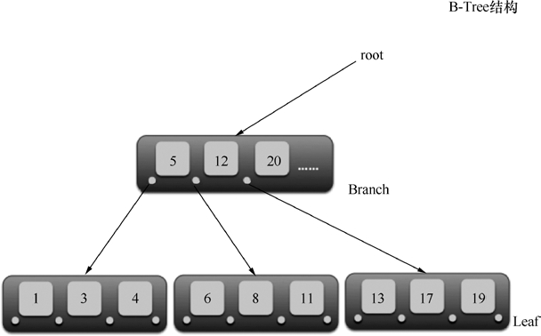
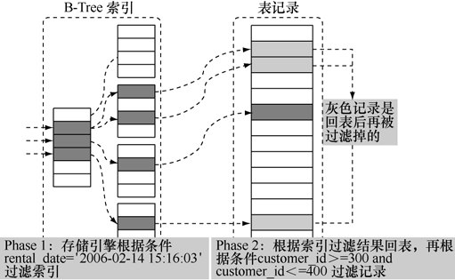
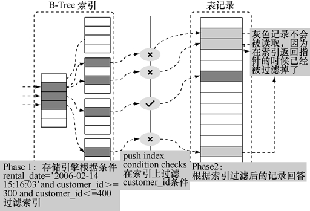

B-Tree索引是最常见的索引，构造类似二叉树，能根据键值提供一行或者一个行集的快速访问，通常只需要很少的读操作就可以找到正确的行。不过，需要注意B-Tree索引中的B 不代表二叉树（binary），而是代表平衡树（balanced）。B-Tree索引并不是一棵二叉树。

图 18-2 展示了经典的 B-Tree 的结构：根节点 root 下面有多个分支/Branch 节点，Branch节点下面就是明细的叶子/Leaf节点。

可以利用B-Tree索引进行全关键字、关键字范围和关键字前缀查询，以下例子如果没有特别说明都能够在MySQL 5.1/5.5版本上执行通过。

为了避免混淆，重命名租赁表rental上的索引rental_date为idx_rental_date:

mysql> alter table rental drop index rental_date;

Query OK, 0 rows affected (0.67 sec)

Records: 0 Duplicates: 0 Warnings: 0

mysql> alter table rental add index idx_rental_date (rental_date, inventory_id, customer_id);

Query OK, 0 rows affected (0.20 sec)

Records: 0 Duplicates: 0 Warnings: 0

图18-2 B-Tree索引的结构

**注意：**MySQL官方发布的版本目前还不支持 rename index的语法，所以暂时只能够通过重建索引的方式来重命名索引。

**1．MySQL中能够使用索引的典型场景**

（1）匹配全值（Match the full value），对索引中所有列都指定具体值，即是对索引中的所有列都有等值匹配的条件。例如，租赁表 rental 中通过指定出租日期 rental_date + 库存编号inventory_id + 客户编号 customer_id的组合条件进行查询，从执行计划的 key和 extra两字段的值看到优化器选择了复合索引idx_rental_date：

mysql> explain select * from rental where rental_date='2005-05-25 17:22:10' and inventory_id=373 and customer_id=343\G

*************************** 1. row ***************************

id: 1

select_type: SIMPLE

table: rental

type: const

possible_keys: idx_rental_date,idx_fk_inventory_id,idx_fk_customer_id

key: idx_rental_date

key_len: 13

ref: const,const,const

rows: 1

Extra:

1 row in set (0.00 sec)

explain输出结果中字段type的值为const，表示是常量；字段key的值为idx_rental_date，表示优化器选择索引idx_rental_date进行扫描。

（2）匹配值的范围查询（Match a range of values），对索引的值能够进行范围查找。例如，检索租赁表rental中客户编号customer_id在指定范围内的记录：

mysql> explain select * from rental where customer_id >= 373 and customer_id < 400\G

*************************** 1. row ***************************

id: 1

select_type: SIMPLE

table: rental

type: range

possible_keys: idx_fk_customer_id

key: idx_fk_customer_id

key_len: 2

ref: NULL

rows: 717

Extra: Using where

1 row in set (0.00 sec)

类型type为range说明优化器选择范围查询，索引key为idx_fk_customer_id说明优化器选择索引 idx_fk_customer_id来加速访问，注意到这个例子中Extra列为Using where，表示优化器除了利用索引来加速访问之外，还需要根据索引回表查询数据。

（3）匹配最左前缀（Match a leftmost prefix），仅仅使用索引中的最左边列进行查找，比如在 col1 + col2 + col3 字段上的联合索引能够被包含 col1、（col1 + col2）、（col1 + col2 + col3）的等值查询利用到，可是不能够被 col2、（col2 + col3）的等值查询利用到；以支付表 payment为例，如果查询条件中仅包含索引的第一列支付日期 payment_date 和索引的第三列更新时间last_update 的时候，从执行计划的 key 和 extra 看到优化器仍然能够使用复合索引idx_payment_date进行条件过滤：

mysql> alter table payment add index idx_payment_date (payment_date, amount, last_update);

Query OK, 0 rows affected (0.21 sec)

Records: 0 Duplicates: 0 Warnings: 0

mysql> explain select * from payment where payment_date = '2006-02-14 15:16:03'and last_update='2006-02-15 22:12:32'\G

*************************** 1. row ***************************

id: 1

select_type: SIMPLE

table: payment

type: ref

possible_keys: idx_payment_date

key: idx_payment_date

key_len: 8

ref: const

rows: 182

Extra: Using where

1 row in set (0.00 sec)

但是，如果仅仅选择复合索引 idx_payment_date 的第二列支付金额 amount 和第三列更新时间last_update进行查询时，那么执行计划显示并不会利用到索引idx_payment_date：

mysql> explain select * from payment where amount = 3.98 and last_update='2006-02-15 22:12:32'\G

*************************** 1. row ***************************

id: 1

select_type: SIMPLE

table: payment

type: ALL

possible_keys: NULL

key: NULL

key_len: NULL

ref: NULL

rows: 15422

Extra: Using where

1 row in set (0.01 sec)

最左匹配原则可以算是MySQL中B-Tree索引使用的首要原则。

（4）仅仅对索引进行查询（Index only query），当查询的列都在索引的字段中时，查询的效率更高；对比上一个例子使用Select *，本次选择查询的字段都包含在索引 idx_payment_date中时，能够看到查询计划有了一点变动：

mysql> explain select last_update from payment where payment_date = '2006-02-14 15:16:03' and amount = 3.98\G

*************************** 1. row ***************************

id: 1

select_type: SIMPLE

table: payment

type: ref

possible_keys: idx_payment_date

key: idx_payment_date

key_len: 11

ref: const,const

rows: 8

Extra: Using index

1 row in set (0.00 sec)

Extra部分变成了Using index，也就意味着，现在直接访问索引就足够获取到所需要的数据，不需要通过索引回表，Using index也就是平常说的覆盖索引扫描。只访问必须访问的数据，在一般情况下，减少不必要的数据访问能够提升效率。

（5）匹配列前缀（Match a column prefix），仅仅使用索引中的第一列，并且只包含索引第一列的开头一部分进行查找。例如，现在需要查询出标题title是以AFRICAN开头的电影信息，从执行计划能够清楚看到，idx_title_desc_part索引被利用上了：

mysql> create index idx_title_desc_part on film_text (title(10), description(20));

Query OK, 1000 rows affected (0.08 sec)

Records: 1000 Duplicates: 0 Warnings: 0

mysql> explain select title from film_text where title like 'AFRICAN%'\G

*************************** 1. row ***************************

id: 1

select_type: SIMPLE

table: film_text

type: range

possible_keys: idx_title_desc_part,idx_title_description

key: idx_title_desc_part

key_len: 32

ref: NULL

rows: 1

Extra: Using where

1 row in set (0.02 sec)

Extra值为Using where表示优化器需要通过索引回表查询数据。

（6）能够实现索引匹配部分精确而其他部分进行范围匹配（Match one part exactly and match a range on another part）。例如，需要查询出租日期 rental_date为指定日期且客户编号 customer_id为指定范围的库存：

mysql> explain select inventory_id from rental where rental_date='2006-02-14 15:16:03' and customer_id >= 300 and customer_id <= 400\G

*************************** 1. row ***************************

id: 1

select_type: SIMPLE

table: rental

type: ref

possible_keys: idx_fk_customer_id,idx_rental_date

key: idx_rental_date

key_len: 8

ref: const

rows: 182

Extra: Using where; Using index

1 row in set (0.00 sec)

类型type为range说明优化器选择范围查询，索引key为idx_rental_date说明优化器选择索引idx_rental_date帮助加速查询，同时由于只查询索引字段inventory_id的值，所以在Extra部分能看到Using index，表示查询使用了覆盖索引扫描。

（7）如果列名是索引，那么使用 column_name is null就会使用索引（区别于Oracle）。例如，查询支付表payment的租赁编号rental_id字段为空的记录就用到了索引：

mysql> explain select * from payment where rental_id is null\G

*************************** 1. row ***************************

id: 1

select_type: SIMPLE

table: payment

type: ref

possible_keys: fk_payment_rental

key: fk_payment_rental

key_len: 5

ref: const

rows: 5

Extra: Using where

1 row in set (0.00 sec)

（8）MySQL 5.6引入了 Index Condition Pushdown（ICP）的特性，进一步优化了查询。Pushdown表示操作下放，某些情况下的条件过滤操作下放到存储引擎。

例如，查询租赁表rental中租赁时间rental_date在某一指定时间点且客户编号customer_id在指定范围内的数据，MySQL 5.5/5.1 版本的执行计划显示：优化器首先使用复合索引idx_rental_date的首字段 rental_date过滤出符合条件 rental_date='2006-02-14 15:16:03'的记录（执行计划中key字段值显示为idx_rental_date），然后根据复合索引idx_rental_date回表获取记录后，最终根据条件 customer_id >= 300 and customer_id <= 300来过滤出最后的查询结果（执行计划中Extra字段值显示为Using where）。

mysql> select version();

+------------+

| version() |

+------------+

| 5.5.32-log |

+------------+

1 row in set (0.00 sec)

mysql> explain select * from rental where rental_date='2006-02-14 15:16:03' and customer_id >= 300 and customer_id <= 400\G

*************************** 1. row ***************************

id: 1

select_type: SIMPLE

table: rental

type: ref

possible_keys: idx_fk_customer_id,idx_rental_date

key: idx_rental_date

key_len: 8

ref: const

rows: 182

Extra: Using where

1 row in set (0.00 sec)

复合索引检索如图18-3所示。

图18-3 复合索引检索

在MySQL 5.6上做同样的案例，能够发现Explain执行计划的Extra部分从Using where变成了Using index condition的提示：

mysql> select version();

+------------+

| version() |

+------------+

| 5.6.12-log |

+------------+

1 row in set (0.00 sec)

mysql> explain select * from rental where rental_date='2006-02-14 15:16:03' and customer_id >= 300 and customer_id <= 400\G

*************************** 1. row ***************************

id: 1

select_type: SIMPLE

table: rental

type: ref

possible_keys: rental_date,idx_fk_customer_id

key: rental_date

key_len: 5

ref: const

rows: 181

Extra: Using index condition

1 row in set (0.00 sec)

Using index condition就表示MySQL使用了 ICP来进一步优化查询，在检索的时候，把条件customer_id的过滤操作下推到存储引擎层来完成，这样能够降低不必要的IO访问，如图18-4所示。

图18-4 Index Condition Pushdown

**2．存在索引但不能使用索引的典型场景**

有些时候虽然有索引，但是并不被优化器选择使用，下面例举几个不能使用索引的常见场景。

（1）以%开头的LIKE查询不能够利用B-Tree索引，执行计划中key的值为NULL表示没有使用索引：

mysql> explain select * from actor where last_name like '%NI%'\G

*************************** 1. row ***************************

id: 1

select_type: SIMPLE

table: actor

type: ALL

possible_keys: NULL

key: NULL

key_len: NULL

ref: NULL

rows: 200

Extra: Using where

1 row in set (0.00 sec)

因为B-Tree索引的结构，所以以%开头的查询很自然就没法利用索引了，一般都推荐使用全文索引（Fulltext）来解决类似的全文检索问题。或者考虑利用 InnoDB 的表都是聚簇表的特点，采取一种轻量级别的解决方式：一般情况下，索引都会比表小，扫描索引要比扫描表更快（某些特殊情况下，索引比表更大，不在本例讨论范围内），而InnoDB表上二级索引idx_last_name实际上存储字段last_name还有主键actor_id，那么理想的访问方式应该是首先扫描二级索引 idx_last_name获得满足条件 last_name like '%NI%'的主键 actor_id列表，之后根据主键回表去检索记录，这样访问避开了全表扫描演员表actor产生的大量IO请求。验证一下：

mysql> explain select * from (select actor_id from actor where last_name like '%NI%')a, actor b where a.actor_id = b.actor_id\G

*************************** 1. row ***************************

id: 1

select_type: PRIMARY

table: <derived2>

type: ALL

possible_keys: NULL

key: NULL

key_len: NULL

ref: NULL

rows: 4

Extra:

*************************** 2. row ***************************

id: 1

select_type: PRIMARY

table: b

type: eq_ref

possible_keys: PRIMARY

key: PRIMARY

key_len: 2

ref: a.actor_id

rows: 1

Extra:

*************************** 3. row ***************************

id: 2

select_type: DERIVED

table: actor

type: index

possible_keys: NULL

key: idx_actor_last_name

key_len: 137

ref: NULL

rows: 200

Extra: Using where; Using index

3 rows in set (0.00 sec)

从执行计划中能够看到，内层查询的 Using index代表索引覆盖扫描，之后通过主键 join操作去演员表actor中获取最终查询结果，理论上是能够比直接全表扫描更快一些。

（2）数据类型出现隐式转换的时候也不会使用索引，特别是当列类型是字符串，那么一定记得在 where 条件中把字符常量值用引号引起来，否则即便这个列上有索引，MySQL 也不会用到，因为MySQL默认把输入的常量值进行转换以后才进行检索。例如，演员表actor中的姓氏字段last_name是字符型的，但是SQL语句中的条件值1是一个数值型值，因此即便存在索引idx_last_name，MySQL也不能正确地用上索引，而是继续进行全表扫描：

mysql> explain select * from actor where last_name = 1\G

*************************** 1. row ***************************

id: 1

select_type: SIMPLE

table: actor

type: ALL

possible_keys: idx_actor_last_name

key: NULL

key_len: NULL

ref: NULL

rows: 200

Extra: Using where

1 row in set (0.00 sec)

加上引号之后，再次检查执行计划，就发现使用上索引了：

mysql> explain select * from actor where last_name = '1'\G

*************************** 1. row ***************************

id: 1

select_type: SIMPLE

table: actor

type: ref

possible_keys: idx_actor_last_name

key: idx_actor_last_name

key_len: 137

ref: const

rows: 1

Extra: Using where

1 row in set (0.00 sec)

（3）复合索引的情况下，假如查询条件不包含索引列最左边部分，即不满足最左原则Leftmost，是不会使用复合索引的：

mysql> explain select * from payment where amount = 3.98 and last_update='2006-02-15 22:12:32'\G

*************************** 1. row ***************************

id: 1

select_type: SIMPLE

table: payment

type: ALL

possible_keys: NULL

key: NULL

key_len: NULL

ref: NULL

rows: 15422

Extra: Using where

1 row in set (0.01 sec)

（4）如果 MySQL 估计使用索引比全表扫描更慢，则不使用索引。例如，查询以“S”开头的标题的电影，需要返回的记录比例较大，MySQL就预估索引扫描还不如全表扫描更快：

mysql> update film_text set title = concat('S', title);

Query OK, 1000 rows affected (0.19 sec)

Rows matched: 1000 Changed: 1000 Warnings: 0

mysql> explain select * from film_text where title like 'S%'\G

*************************** 1. row ***************************

id: 1

select_type: SIMPLE

table: film_text

type: ALL

possible_keys: idx_title_desc_part,idx_title_description

key: NULL

key_len: NULL

ref: NULL

rows: 1000

Extra: Using where

1 row in set (0.00 sec)

在MySQL 5.6版本中，能够通过Trace清晰地看到优化器选择的过程，全表扫描 table scan需要访问的记录rows为1000，代价cost计算为233.53：

"table_scan": {

"rows": 1000,

"cost": 233.53

} /* table_scan */,

而对应 idx_title_desc_part 索引过滤条件时，优化器预估需要返回 998 条记录，访问代价cost为1198.6，远高于全表扫描的代价，索引优化器倾向于选择全表扫描：

{

"index": "idx_title_desc_part",

"ranges": [

"S\u0000\u0000\u0000\u0000\u0000\u0000\u0000\u0000\u0000 <= title <= S?????????"

] /* ranges */,

"index_dives_for_eq_ranges": true,

"rowid_ordered": false,

"using_mrr": false,

"index_only": false,

"rows": 998,

"cost": 1198.6,

"chosen": false,

"cause": "cost"

}

更换查询的值为一个选择率更高的值，就能发现优化器更倾向于选择索引扫描：

mysql> explain select * from film_text where title like 'SW%'\G

*************************** 1. row ***************************

id: 1

select_type: SIMPLE

table: film_text

type: range

possible_keys: idx_title_desc_part,idx_title_description

key: idx_title_desc_part

key_len: 32

ref: NULL

rows: 66

Extra: Using where

1 row in set (0.00 sec)

同样通过 trace能够看到，title like 'SW%'优化器预估需要返回66条记录，代价cost为80.21，远小于全表扫描的代价，所以优化器倾向于选择索引扫描：

{

"index": "idx_title_desc_part",

"ranges": [

"SW\u0000\u0000\u0000\u0000\u0000\u0000\u0000\u0000 <= title <= SW????????"

] /* ranges */,

"index_dives_for_eq_ranges": true,

"rowid_ordered": false,

"using_mrr": false,

"index_only": false,

"rows": 66,

"cost": 80.21,

"chosen": true

}

也就是在查询的时候，筛选性越高越容易使用到索引，筛选性越低越不容易使用索引。

（5）用or分割开的条件，如果or前的条件中的列有索引，而后面的列中没有索引，那么涉及的索引都不会被用到，例如：

mysql> explain select * from payment where customer_id = 203 or amount = 3.96\G

*************************** 1. row ***************************

id: 1

select_type: SIMPLE

table: payment

type: ALL

possible_keys: idx_fk_customer_id

key: NULL

key_len: NULL

ref: NULL

rows: 16451

Extra: Using where

1 row in set (0.00 sec)

因为 or 后面的条件列中没有索引，那么后面的查询肯定要走全表扫描，在存在全表扫描的情况下，就没有必要多一次索引扫描增加I/O访问，一次全表扫描过滤条件就足够了。

