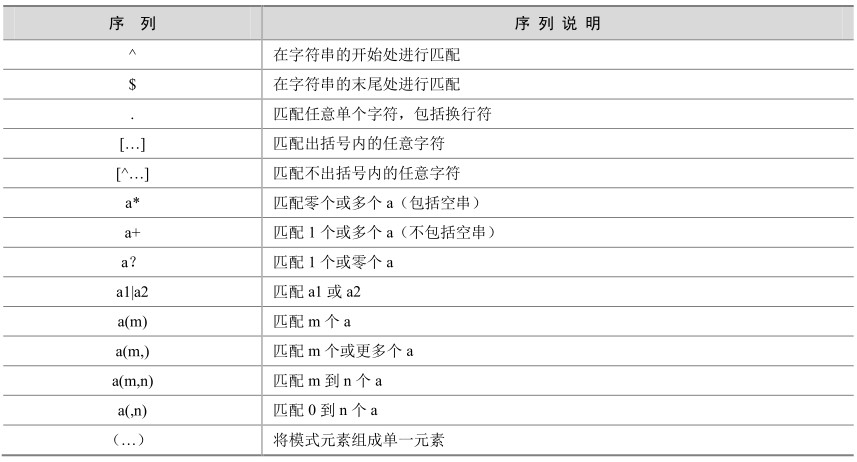

**正则表达式**（Regular Expression）是指一个用来描述或者匹配一系列符合某个句法规则的字符串的单个字符串。在很多文本编辑器或其他工具里，正则表达式通常被用来检索和/或替换那些符合某个模式的文本内容。许多程序设计语言都支持利用正则表达式进行字符串操作。例如，在 Perl中就内建了一个功能强大的正则表达式引擎。正则表达式这个概念最初是由UNIX中的工具软件（例如SED和GREP）普及开的，通常缩写成“REGEX”或者“REG EXP”。

MySQL利用REGEXP命令提供给用户扩展的正则表达式功能，REGEXP实现的功能类似UNIX上GREP和SED的功能，并且REGEXP在进行模式匹配时是区分大小写的。熟悉并掌握REGEXP的功能可以使模式匹配工作事半功倍。

MySQL 5.0中可以使用的模式序列如表 18-2所示。

表18-2 正则表达式中的模式

下面举一些例子来介绍常用正则表达式的使用方法。

“^”在字符串的开始处进行匹配，返回结果为1表示匹配，返回结果为0表示不匹配。下例中尝试匹配字符串“abcdefg”是否以字符“a”开始。

mysql> select 'abcdefg' REGEXP '^a';

+-----------------------+

| 'abcdefg' REGEXP '^a' |

+-----------------------+

| 1 |

+-----------------------+

1 row in set (0.39 sec)

“$”在字符串的末尾处进行匹配，下例中尝试匹配字符串“abcdefg”是否以字符“g”结束。

mysql> select 'abcdefg' REGEXP 'g$';

+-----------------------+

| 'abcdefg' REGEXP 'g$' |

+-----------------------+

| 1 |

+-----------------------+

1 row in set (0.01 sec)

“.”匹配任意单个字符，包括换行符。下例中字符串“abcdefg”尝试匹配单字符“h”和“f”。

mysql> select 'abcdefg' REGEXP '.h', 'abcdefg' REGEXP '.f';

+-----------------------+-----------------------+

| 'abcdefg' REGEXP '.h' | 'abcdefg' REGEXP '.f' |

+-----------------------+-----------------------+

| 0 | 1 |

+-----------------------+-----------------------+

1 row in set (0.00 sec)

“[…]”匹配出括号内的任意字符。下例中字符串“abcdefg”尝试匹配“fhk”中的任意一个字符，如果有一个字符能匹配上，则返回1。

mysql> select 'abcdefg' REGEXP "[fhk]";

+--------------------------+

| 'abcdefg' REGEXP "[fhk]" |

+--------------------------+

| 1 |

+--------------------------+

1 row in set (0.01 sec)

“[^…]”匹配不出括号内的任意字符。和“[…]”刚好相反。下例中字符串“efg”和“X”中如果有任何一个字符匹配不上“[XYZ]”中的任意一个字符，则返回 0；如果全部都能匹配上，则返回1。

mysql> select 'efg' REGEXP "[^XYZ]",'X' REGEXP "[^XYZ]";

+-----------------------+---------------------+

| 'efg' REGEXP "[^XYZ]" | 'X' REGEXP "[^XYZ]" |

+-----------------------+---------------------+

| 1 | 0 |

+-----------------------+---------------------+

1 row in set (0.00 sec)

上面我们介绍了正则表达式的常见使用方法。但是在实际工作中正则表达式到底什么地方会用到呢？下面举一个实际的例子，使用正则表达式查询出使用163.com邮箱的用户和邮箱。

（1）创建测试数据：

mysql> insert into customer (store_id, first_name, last_name, address_id, email) values (1, '188mail', 'beijing', 605, 'beijing@188.com');

Query OK, 1 row affected, 1 warning (0.06 sec)

mysql> insert into customer (store_id, first_name, last_name, address_id, email) values (1, '126mail', 'beijing', 605, 'beijing@126.com');

Query OK, 1 row affected, 1 warning (0.05 sec)

mysql> insert into customer (store_id, first_name, last_name, address_id, email) values (1, '163mail', 'beijing', 605, 'beijing@163.com');

Query OK, 1 row affected, 1 warning (0.03 sec)

（2）使用正则表达式“$”和“[...]”进行匹配：

mysql> select first_name, email from customer where email regexp "@163[,.]com$";

+------------+-----------------+

| first_name | email|

+------------+-----------------+

| 163mail | beijing@163.com |

+------------+-----------------+

1 row in set (0.00 sec)

从上例中可以看出，如果不使用正则表达式而使用普通的LIKE语句，则WHERE条件需要写成如下格式：

email like "@163%.com" or email like "@163%,com"

显然，采用正则表达式使得我们的代码更加简单易读。

