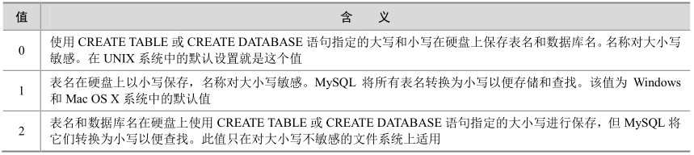

在MySQL中，数据库对应操作系统下的数据目录。数据库中的每个表至少对应数据库目录中的一个文件（也可能是多个，这取决于存储引擎）。因此，所使用操作系统的大小写敏感性决定了数据库名和表名的大小写敏感性。在大多数UNIX环境中，由于操作系统对大小写的敏感性导致了数据库名和表名对大小写敏感性，而在 Windows中，由于操作系统本身对大小写不敏感，因此在Windows下的MySQL数据库名和表名对大小写也不敏感。

列、索引、存储子程序和触发器名在任何平台上对大小写不敏感。默认情况下，表别名在UNIX中对大小写敏感，但在Windows或Mac OS X中对大小写不敏感。下面的查询在UNIX中会报错，因为它同时引用了别名a和A：

mysql> select id from order_rab a where A.id = 1;

ERROR 1054 (42S22): Unknown column 'A.id' in 'where clause'

然而，该查询在Windows中是可以的。要想避免出现差别，最好采用一致的转换，例如，总是用小写创建并引用数据库名和表名。

在MySQL中，如何在硬盘上保存、使用表名和数据库名是由lower_case_tables_name系统变量决定的，用户可以在启动MySQL服务时设置这个系统变量。lower_case_tables_name可以采用如表18-3所示的任一值。

表18-3 lower_case_tables_name的取值范围

如果只在一个平台上使用MySQL，通常不需要更改lower_case_tables_name变量。然而，如果用户想要在对大小写敏感性不同的文件系统的平台之间转移表，就会遇到困难。例如，在UNIX中，my_tables和MY_tables是两个不同的表，但在Windows中，这两个表名相同。

在 UNIX 中使用 lower_case_tables_name=0，而在 Windows 中使用 lower_case_tables_name=2，这样可以保留数据库名和表名的大小写。不利之处是必须确保在 Windows 中的所有SQL语句总是正确地使用大小写来引用数据库名和表名，如果SQL语句中没有正确引用数据库名和表名的大小写，那么虽然在Windows中能正确执行，但是如果将查询转移到UNIX中，大小写不正确，将会导致查询失败。

**注意：**在UNIX中将lower_case_tables_name设置为1并且重启mysqld之前，必须先将旧的数据库名和表名转换为小写。尽管在某些平台中数据库名和表名对大小写不敏感，但是最好养成在同一查询中使用相同的大小写来引用给定的数据库名或表名的习惯。

