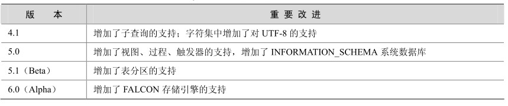

用户通常可以到官方网站www.mysql.com下载最新版本的MySQL数据库。按照用户群分类，MySQL数据库目前分为社区版（Community Server）和企业版（Enterprise），它们最重要的区别在于：社区版是自由下载而且完全免费的，但是官方不提供任何技术支持，适用于大多数普通用户；企业版是收费的，不能在线下载，相应地，它提供了更多的功能和更完备的技术支持，更适合于对数据库的功能和可靠性要求较高的企业客户。

MySQL的版本更新很快，目前可以下载的版本包括4.1、5.0、5.1和6.0。其中4.1和5.0是发行版，5.1和6.0都还是测试版。这些不同版本之间的主要区别如表1-1所示。

表1-1 MySQL不同版本的重要改进

针对每个版本，还分为3个类型。

Standard：推荐大多数用户下载。

Max：除Standard的所有内容外，还有一些附加的新特性，这些特性还没有通过正式的测试发布，主要用于提升用户的认识和体验。

Debug：和Standard类似，但是包括了一些调试信息，会影响系统性能，所以不推荐用户下载。

对于不同的操作系统平台，MySQL提供了相应的版本。本章将以Windows平台下的noinstall包和图形化安装包以及Linux平台下的RPM包为例，说明MySQL的下载、安装、配置、启动和关闭过程。本章的测试环境分别是32位的Windows XP和x86平台上的RedHat Linux AS3。

