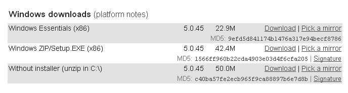

打开浏览器，在地址栏中输入 http://dev.mysql.com/downloads/mysql/5.0.html#linux，打开MySQL下载页面，单击“Windows downloads”下“Without installer（unzip in C:\）”后面的“Download”或者“Pick a mirror”链接来选择一个镜像站点进行下载，如图 1-1所示。

图1-1 下载Without installer（unzip in C:\）

